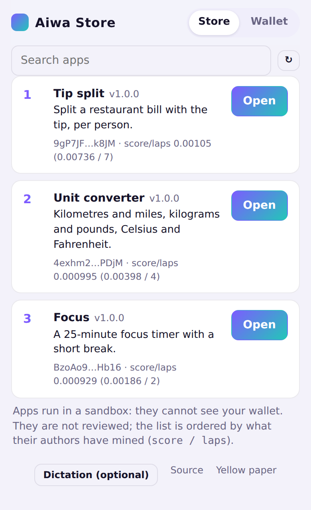
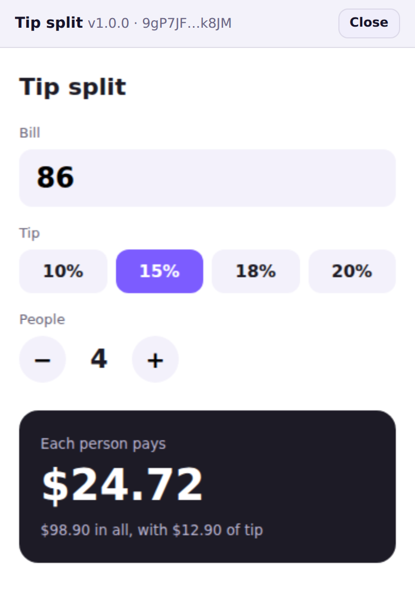
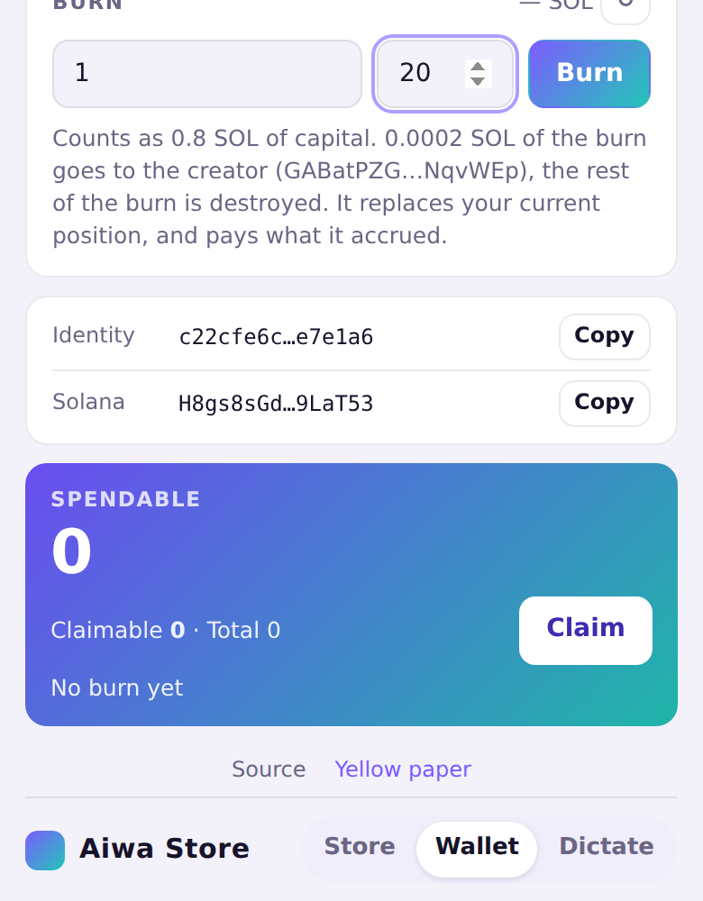
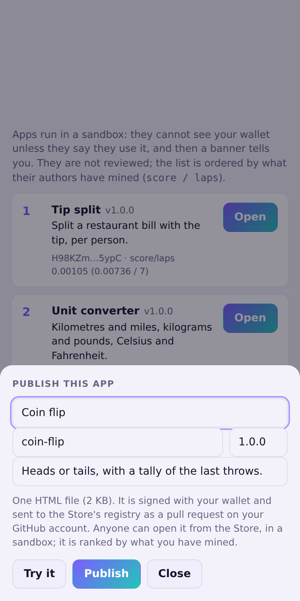
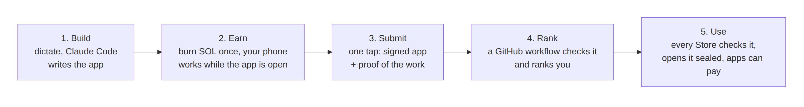
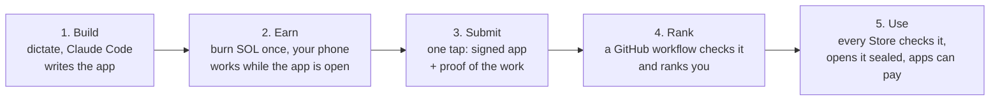
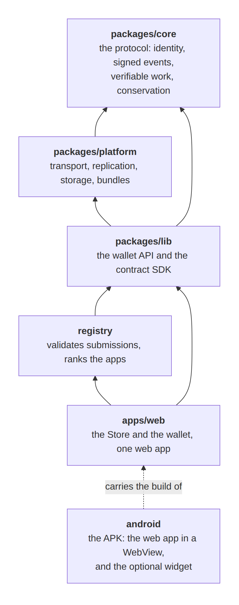
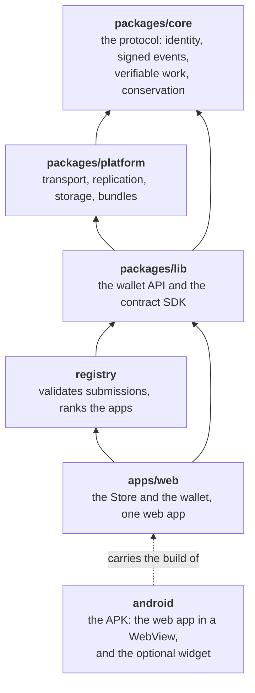

# Aiwa Store

**A distributed app ecosystem in your pocket: build an app by talking to it, publish it in one tap, get ranked by the work behind it, and pay people directly. No server of ours, no shared ledger.**

<p align="center">
  
  
  
  
</p>
<p align="center"><sub>The Store · an app, open · the wallet's burn, showing what the creator receives before you sign · the publish sheet.<br>
The real screens at phone size. The apps and the Solana network are demo stand-ins.</sub></p>

> **Where it stands.** Pre-release. Everything is tested in CI, but it has **never run on a phone** and **never on the real Solana network**.
> [What that means exactly](#where-it-stands).

## One Android app, five things

| | |
|---|---|
| **Build** | Dictate to Claude Code with the home-screen widget. It writes the app; you read it and try it before anything leaves the phone. *(Optional: needs Termux and your own Claude account.)* |
| **Submit** | One tap. The Store signs the app with your wallet, adds proof of the work you have done, and opens the pull request on your GitHub account. No form, no file to carry. |
| **Store** | A list ranked by what each author has *mined*, not by ads or ratings, and nobody edits it. Every app is checked against its author's signature before it opens, and runs in a sealed box. Works offline. |
| **Token** | **AIWA** is created by your phone doing verifiable work, after one burn of SOL: no miners' network, no exchange. Send it by QR code or text, even with no connection. |
| **Link and see** | *Link with another phone*: two codes, then the phones exchange what each lacks, directly. Each signs a receipt for what it received, and the wallet shows where every identity it holds anything of stands: what is proven, the vote, a fork, its pace against yours. |
| **Play and pay** | An app can use your wallet. [Click duel](docs/demo-apps/click-duel.html): two phones, a price per click, 20 seconds, whoever clicked less pays what they clicked, and nothing is signed per click. |

**Underneath, a distributed system with no central part.** Each phone keeps its own history of signed events and shows it to others when it
matters. Because anyone can check a stranger's work in milliseconds, an ordinary GitHub repository can be the registry and the ranking, a
payment can be a file, and two phones can settle a game with nothing in between. Solana is used once, for the burn. The pieces are known
(signed logs, proofs of sequential work, burning as a cost); putting them together this way is the point.

## How it works

<!-- diagram: readme-01-8fe5005d.png -->


<details>
<summary>The source of this diagram (Mermaid)</summary>



</details>
<!-- /diagram -->

1. **Build.** The widget sends your voice to Claude Code, which writes one self-contained app (or one published through Aiwa, signed and pinned by hash).
2. **Earn.** The only thing that costs anything, and the only thing that needs Solana, is the burn. 0.1 % of the part you choose to set aside
   (called T) goes to the creator of the software, in the same transaction, shown before you sign. At T = 0, nothing. Then each unit of work is
   signed, anyone can check it in milliseconds, and what you can claim grows with time.
3. **Submit.** Your app, signed with your wallet, with proof of your work, as a pull request.
4. **Rank.** The registry is a GitHub workflow: it checks the signature, the proof and the burn on Solana itself, then ranks you by
   `score / laps` (what you can claim, over the epochs since your last action).
5. **Use.** Each Store checks every app against its author's signature before it opens it. An app that says it uses your wallet gets a banner,
   and can ask it to pay.

GitHub keeps the list, Solana keeps the burns, each phone keeps its own signed history. All of it, with pictures, in
[docs/EXPLAINED.md](docs/EXPLAINED.md) ([en français](docs/EXPLICATION.md)).

## Install (Android)

### The Store and the wallet

1. On the phone, open the [latest release](https://github.com/theodoreyong9/Aiwa_store/releases/tag/android-latest) and download **Aiwa_store.apk**.
2. Open it from Downloads and tap **Install**. Android asks once to allow installs from your browser or Files app. A new version installs over
   the old one.
   You will not need a new APK for the Store itself: the app follows [the site](https://theodoreyong9.github.io/Aiwa_store/), downloads a new
   page when there is one, and starts it the next time you open the app. A new APK is for the widget and the app around the page.
3. Open **Aiwa Store**, tap **Wallet**, then **Create my wallet**. Write down the 12 words: they are the only way back on another phone.

That is all the Store needs. The widget below is optional.

### The widget, to dictate an app (optional)

The widget talks to Claude Code, which runs in **Termux** on the same phone. You need your own Claude account.

1. Install **Termux from F-Droid** (the Play Store version is no longer maintained).
2. In Termux, paste this one line and wait: it installs the backend, and it also downloads the latest APK into Downloads (so it can replace step 1 above).
   ```sh
   curl -fsSL https://raw.githubusercontent.com/theodoreyong9/Aiwa_store/main/android/backend/bootstrap.sh | bash
   ```
   Run the same line again later to update.
3. On the home screen: press and hold → **Widgets** → **Aiwa Store** → drag the 4×2 widget. Android opens a short setup: allow Aiwa to run
   Termux commands, and notifications.
4. Tap **Connecter Claude** on the widget and log in with your Claude account (a page opens, the code goes back into the same window).
5. Tap **Dicter un message** and say what the app should do. When Claude has written it, press **▦** on the widget: the Store opens its publish sheet.

The widget's logo opens the app. Inside the app, the **Dictate** tab opens the dictation screen (the same one the widget uses).

If Termux or the backend is missing, the widget says so ("Termux manquant" or "Installation manquante") and a tap copies the line above and opens Termux (or the page to download it). It does not keep saying "starting".

The widget is in French for now. Not verified on a real phone: Claude Code has no Android build, so the backend installs it in a Linux layer
inside Termux, which the script itself marks as experimental. More in [docs/ANDROID.md](docs/ANDROID.md).

## Try it from source

```sh
npm install
npm test                                  # protocol, registry, web app (needs Chromium: npx -w aiwa-store-web playwright install chromium)
npm run build -w aiwa-store-web           # apps/web/dist
npx http-server apps/web/dist -p 8080     # open http://localhost:8080
node scripts/devnet-check.mjs --fake      # the whole path against a stand-in Solana
```

The Store lists nothing until the registry has accepted an app. To publish from a plain browser, the same sheet hands over the signed file to
add to a pull request yourself (`submissions/`, see [registry/README.md](registry/README.md)).

## What only the repository's owner can do

These are settings and accounts. Until they are done, the matching workflow is **red**, with the reason on its page.

| To get | Do this |
|---|---|
| The site served (workflow *Pages*) | [Settings → Pages](https://github.com/theodoreyong9/Aiwa_store/settings/pages) → Source: **GitHub Actions**. Then re-run *Pages* |
| GitHub sign-in in the publish sheet | Create a GitHub OAuth App named *Aiwa Store* with **Device Flow** enabled, put its Client ID in `deployment.json` (`github.clientId`) |
| A burn on the real network (workflow *Devnet check*) | Fund a devnet wallet once (faucet.solana.com) and add its 12 words as the secret [`DEVNET_PHRASE`](https://github.com/theodoreyong9/Aiwa_store/settings/secrets/actions) |
| A first real run | Install the APK on a phone and try it: it is the main thing nobody has done |
| Legal peace of mind | Advice on the creator's share and on running a store, before launch |

## Where it stands

| Tested in CI | Not verified |
|---|---|
| The protocol: identity, signed events, proofs of work, accrual, claims, double spend (421 tests, with a cross-check against an independent Rust implementation) | A real burn on Solana |
| The wallet, the creator's share, backup and restore (113 + 88 tests) | The Android app on a real phone: keystore, GitHub sign-in, Android's backup, the widget, the page updating itself from the site (compiled in CI, its checks unit-tested, never run) |
| The registry: signatures, proofs, burns, ranking (17 tests) | A real pull request through the registry workflow |
| The web app in a real Chromium: ranking, sandbox, tampering, offline, restore, burn, publishing of both kinds, an app using the wallet, a click duel between two pages, two phones linking by two codes, a scan against a fake camera, the description of the site's release (46 tests) | The legal status of the creator's share |
| The whole path against a stand-in Solana (`devnet-check --fake`) | The economic parameters in the field |
| | The click duel and the *Link with another phone* card between two real phones, and the camera in the APK (the code that grants it is written and compiled in CI, never run) |

[docs/PLAN.md](docs/PLAN.md) has the full list.

## Read more

| | |
|---|---|
| [docs/EXPLAINED.md](docs/EXPLAINED.md) · [EXPLICATION.md](docs/EXPLICATION.md) | how everything works, in plain words, with pictures |
| [docs/YELLOWPAPER.md](docs/YELLOWPAPER.md) | the formal protocol, in the same order |
| [docs/CONTRACTS.md](docs/CONTRACTS.md) | how to write a contract: a vote in 20 lines, the three rules, sharing events between phones |
| [docs/ANDROID.md](docs/ANDROID.md) | the Android app and the widget |
| [docs/BUSINESS.md](docs/BUSINESS.md) | the business model, with numbers and limits |
| [docs/PLAN.md](docs/PLAN.md) | what version 1 contains and leaves out |

<details>
<summary>The GitHub workflows</summary>

| Workflow | When | What it does |
|---|---|---|
| **CI** | each push | the whole test suite, the dry run of the real-network check, and the documents (every diagram renders) |
| **Android** | a push touching the app | builds the APK; from `main`, publishes it as the `android-latest` release |
| **Registry** | a pull request adding `submissions/*.json` | validates the submission as data, writes `store/` if accepted, closes the pull request with the verdict |
| **Pages** | a push to `main`, or after the registry | publishes the site, which the Android app also follows for its page. **Red until Pages is switched on** (see above) |
| **Devnet check** | by hand | a burn with the creator's share on the real devnet. **Red until `DEVNET_PHRASE` exists** |

</details>

<details>
<summary>What is in the repository</summary>

<!-- diagram: readme-02-3be74b70.png -->


<details>
<summary>The source of this diagram (Mermaid)</summary>



</details>
<!-- /diagram -->

An arrow means "uses". Nothing in `core` knows about anything above it.

| | |
|---|---|
| [`packages/core`](packages/core) | the protocol: identity, signed events, verifiable work, accrual, conservation, canonical fold order, creator fee |
| [`packages/platform`](packages/platform) | transport, replication, storage, bundles, the archive node |
| [`packages/lib`](packages/lib) | the wallet API (12-word recovery, backup, restore, burn, payments) and the contract SDK |
| [`registry`](registry) | what decides which apps are listed and in what order |
| [`apps/web`](apps/web) | the Store and the wallet as one web app |
| [`android`](android) | the APK: the web app in a WebView (kept up to date from the site, with a copy inside), plus the optional widget |
| [`deployment.json`](deployment.json) | the parameters the wallet and the registry share, including the creator fee and its address |
| [`docs/demo-apps`](docs/demo-apps) | the demo apps of the screenshots (`node scripts/screenshots.mjs` redraws them) |

</details>

## License

MIT, see [LICENSE](LICENSE).
