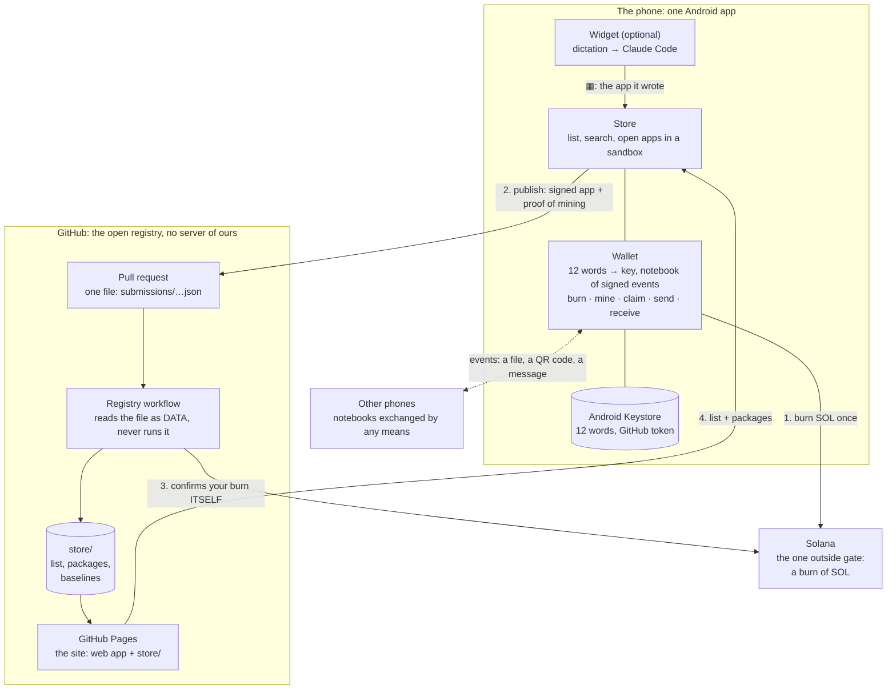
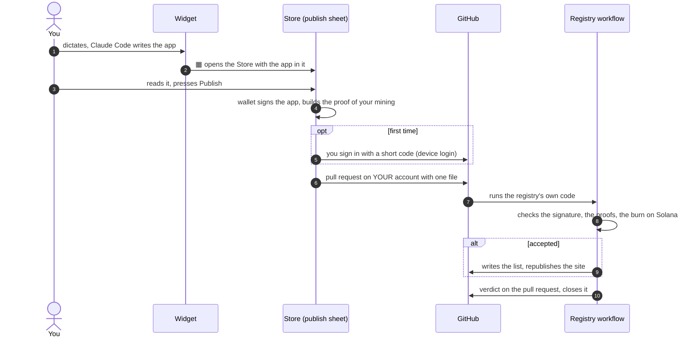

# Aiwa Store

**An app store you carry in your pocket, with its own wallet, on a protocol that needs no shared ledger.**

One Android app, three parts:

- **A Store** of small apps. Each app is signed by its author, checked before it opens, and runs in a sandbox that cannot reach your
  wallet. The list is ranked by what each author has *mined*; nobody edits it.
- **A wallet** that makes itself on the first tap. Burn SOL once, and your phone mines AIWA by doing verifiable work, offline, while the app
  is open. Everyone keeps their own notebook of signed events: there is no shared ledger, and anyone can check what they are shown.
- **A widget** (optional, not specific to Aiwa) to dictate to Claude Code. Press ▦, read the app it wrote, press **Publish**: the Store signs it
  with your wallet and opens the pull request on your GitHub account. No form, no file to carry.

**The business model, in one line:** 0.1 % of the T share of each burn goes to one fixed creator address, in the same transaction, in
plain sight, enforced by every reader; at T = 0 nothing is paid ([docs/BUSINESS.md](docs/BUSINESS.md), with its numbers and its limits).

> **Status, honestly.** Everything is tested in CI except the Android app, which is compiled in CI but has never run on a phone. Nothing has
> run against the real Solana network or with real money: Solana is a stand-in that decodes the real transaction the wallet builds. The first
> real run is a prerequisite for any claim. [What was and was not verified](#what-has-been-verified).

---

## How it works



1. **Burn.** The wallet burns SOL on Solana. In the same transaction a small share goes to the creator. The burn is the only price of creating
   AIWA, and the only thing that needs Solana.
2. **Mine.** While the app is open, the wallet does a sequential computation (an *epoch*) and signs a proof anyone checks in ~3.6 ms. What you
   can claim grows with capital and with time since your last action.
3. **Publish.** The Store signs your app with your wallet and sends your proof of mining. The registry checks both and ranks you by
   `score / laps`.
4. **Read.** Anyone's Store lists the apps, verifies each one against its author's signature, and opens it in a sandbox.

### From a dictated idea to a listed app



Two kinds of app are submitted on GitHub: **`code`** (the HTML file travels in the submission) or **`aiwa`** (the submission only *points* to a
bundle published through Aiwa, signed and pinned by hash, which the registry and the Store each verify themselves).

**Where to learn the details, in order of depth:** [docs/EXPLAINED.md](docs/EXPLAINED.md) (plain words, with pictures, [en français](docs/EXPLICATION.md)) →
[docs/YELLOWPAPER.md](docs/YELLOWPAPER.md) (the formal protocol, with the same pictures in precise form).

---

## Try it

```sh
npm install
npm test                                  # protocol, registry and web app (a real Chromium: npx -w aiwa-store-web playwright install chromium)
npm run build -w aiwa-store-web           # apps/web/dist
node scripts/devnet-check.mjs --fake      # the whole path against a stand-in Solana; without --fake it burns devnet SOL (see below)
npx http-server apps/web/dist -p 8080     # open http://localhost:8080
```

The store lists nothing until the registry has accepted an app (`store/index.json` is empty at the start). To publish: the wallet makes
itself, burn a little SOL in it and leave the app open while it mines (an app is only listed for an author who has something claimable), then
publish from the widget (▦). In a plain browser the same sheet hands over the signed file to add to a pull request yourself
(`submissions/`). See [`registry/README.md`](registry/README.md).

**On Android:** the APK is built by the *Android* workflow and published at
`https://github.com/theodoreyong9/Aiwa_store/releases/download/android-latest/Aiwa_store.apk` (installed by hand, outside Google Play). The
dictation module is optional and needs Termux: see [docs/ANDROID.md](docs/ANDROID.md).

## What only the repository's owner can do

These are settings and accounts, not code:

| To get | Do this |
|---|---|
| The site served | GitHub → Settings → Pages → Source: **GitHub Actions**. Until then the *Pages* workflow says so and stops with a warning instead of failing |
| GitHub login in the publish sheet | Create a GitHub OAuth App named *Aiwa Store* with **Device Flow** enabled, and put its Client ID in `deployment.json` (`github.clientId`) |
| A real-network check | Fund a devnet wallet once (faucet.solana.com) and store its 12 words as the repository secret `DEVNET_PHRASE`. Without it, *Devnet check* runs the dry run and says the real burn was skipped |
| A real run on a phone | Install the APK from the release above and try it: it is the main thing nobody has done |
| Legal peace of mind | Advice on the creator's share and on running a store, before launch |

## The GitHub workflows

| Workflow | When | What it does | A warning or red means |
|---|---|---|---|
| **CI** | each push | the whole test suite and the dry run of the real-network check | a real failure |
| **Android** | a push touching the app | builds the APK; from `main`, publishes it as `android-latest` | a real failure (it never ran on a phone, only compiles) |
| **Registry** | a pull request adding `submissions/*.json` | validates the submission as data, writes `store/` if accepted, closes the pull request with the verdict | the verdict is on the pull request |
| **Pages** | a push to `main`, or after the registry | publishes the site | *Pages is not enabled*: see the table above |
| **Devnet check** | by hand | burn with the creator's share on real devnet, verified by the registry's own code | *no funded wallet*: see the table above |

## What has been verified

- **Tested in CI:** the protocol (421 tests, including a cross-check against an independent Rust implementation of its core computations), the
  distribution layer (85), the wallet API (99), the registry (17), the web app (35, of which 18 in a real Chromium), the dictation backend (73), the
  whole path against a stand-in Solana.
- **Not verified:** a real burn on Solana · the Android app on a real phone (keystore, GitHub's device login, Android's backup) · a real pull request
  through the registry workflow · the legal status of the creator's share · the economic parameters in the field. [docs/PLAN.md](docs/PLAN.md) says
  exactly what exists and what does not.

## What is in the repository

| | |
|---|---|
| [`packages/core`](packages/core) | the protocol: identity, signed events, verifiable work, accrual, conservation, canonical fold order, creator fee |
| [`packages/platform`](packages/platform) | transport, replication, storage, bundles, the archive node |
| [`packages/lib`](packages/lib) | the wallet API (12-word recovery, backup, restore, burn, payments) and the contract SDK |
| [`registry`](registry) | what decides which apps are listed and in what order |
| [`apps/web`](apps/web) | the store and the wallet as one web app, tested in Chromium |
| [`android`](android) | the APK: the web app in a WebView, plus the optional dictation module |
| [`deployment.json`](deployment.json) | the parameters the wallet and the registry share, including the creator fee and its address |
| [`docs`](docs) | below |

| Document | What it is |
|---|---|
| [EXPLAINED.md](docs/EXPLAINED.md) · [EXPLICATION.md](docs/EXPLICATION.md) | how everything works, in plain words, with pictures |
| [YELLOWPAPER.md](docs/YELLOWPAPER.md) | the formal protocol, in the same order |
| [PLAN.md](docs/PLAN.md) | what version 1 contains, leaves out, and what was verified |
| [BUSINESS.md](docs/BUSINESS.md) | the business model, with numbers and limits |
| [ANDROID.md](docs/ANDROID.md) | the Android app and the dictation module |

## License

MIT, see [LICENSE](LICENSE).
