# Aiwa, explained

*For anyone: no cryptography needed. This page says in plain words how everything works, from the key to the app store, and says
what is not solved. The same thing, formally, is in the [yellow paper](YELLOWPAPER.md). Français : [EXPLICATION.md](EXPLICATION.md).*

## The whole thing in one minute

**Aiwa Store** is one Android app that does five things. You can **build** an app by dictating to Claude Code (with an optional widget),
**submit** it in one tap, find it in a **Store** ranked by the work behind each app, earn the **AIWA** token by letting your phone
compute, and let apps **pay** people directly. Behind it is a protocol with **no shared ledger**: everyone keeps their own notebook of
signed events, shows it to others when useful, and anyone can check what they are shown, by themselves.

Three outside things are used, each for one job:

<!-- diagram: explained-01-ffae117f.png -->
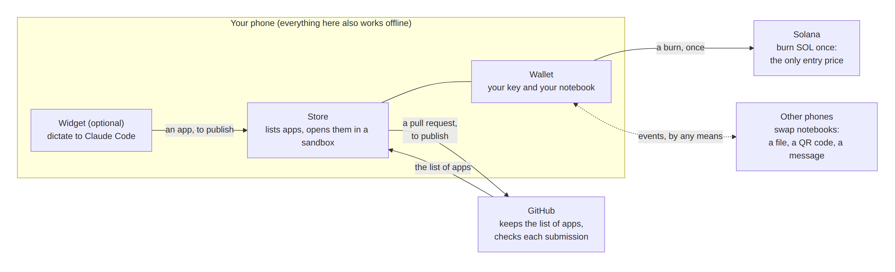

The source of this diagram (Mermaid)

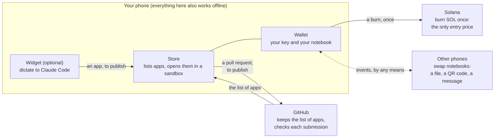
```mermaid
flowchart LR
  subgraph phone["Your phone (everything here also works offline)"]
    ST["Store<br/>lists apps, opens them in a sandbox"]
    WA["Wallet<br/>your key and your notebook"]
    WI["Widget (optional)<br/>dictate to Claude Code"]
    WI -- "an app, to publish" --> ST
    ST --- WA
  end
  SOL["Solana<br/>burn SOL once:<br/>the only entry price"]
  GH["GitHub<br/>keeps the list of apps,<br/>checks each submission"]
  OTH["Other phones<br/>swap notebooks:<br/>a file, a QR code, a message"]
  WA -- "a burn, once" --> SOL
  ST -- "a pull request,<br/>to publish" --> GH
  GH -- "the list of apps" --> ST
  WA <-. "events, by any means" .-> OTH
```

<!-- /diagram -->

| | Needs the internet? |
|---|---|
| Your key, your notebook | no |
| Mining (the wallet working while it is open) | no |
| Receiving and sending AIWA | only to carry the events from one person to the other, by any means |
| **The burn** (the one way to create new AIWA) | **yes**, once, on Solana |
| Opening an app you already have | no |
| Seeing new apps, publishing | yes |

---

## 1. Your key and your notebook

**Your key.** You get 12 words. They make a secret key, and from it a public identity: your *address*. It is also a Solana address:
the same 12 words open the same account in any Solana wallet. There is no account, no sign-up, nothing is sent anywhere.

**Your notebook.** Everything you do is written as an *event*, signed with your key. An event has:

- a **number**, which is the fingerprint of its content (change one letter and the number changes);
- its **parents**: the events it follows, which it names by their numbers.

<!-- diagram: explained-02-6db318c2.png -->
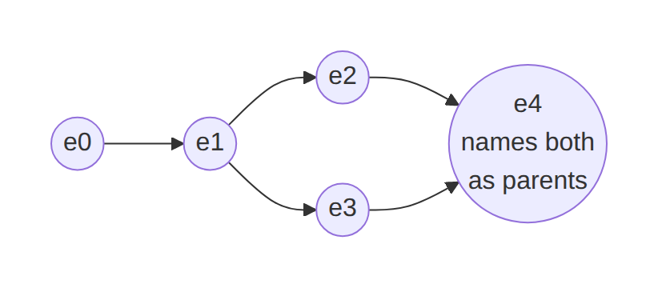

The source of this diagram (Mermaid)

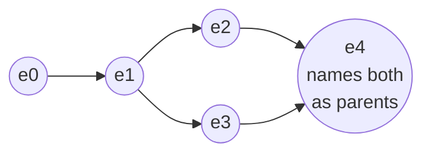
```mermaid
flowchart LR
  e0(("e0")) --> e1(("e1")) --> e2(("e2"))
  e1 --> e3(("e3"))
  e2 --> e4(("e4<br/>names both<br/>as parents"))
  e3 --> e4
```

<!-- /diagram -->

Because each event contains its parents' numbers, **changing the past breaks everything after it**. Two events that do not know of each
other (`e2` and `e3`) are two *branches*: that is ordinary, it simply means two things happened on two devices. They meet again as soon
as a later event cites both.

**What the signature proves, and what it does not.** It proves that whoever holds the key wrote this event, and that nobody changed it.
It does not prove that the key belongs to one person, and it does not stop a key holder from signing two different continuations of
the same event (section 4 is about exactly that).

Nobody keeps everyone's notebook. You keep what concerns you; others keep what concerns them.

---

## 2. The three jobs of the notebook

Everything the notebook does is one of three jobs. Each answers one question:

<!-- diagram: explained-03-a5c0623d.png -->
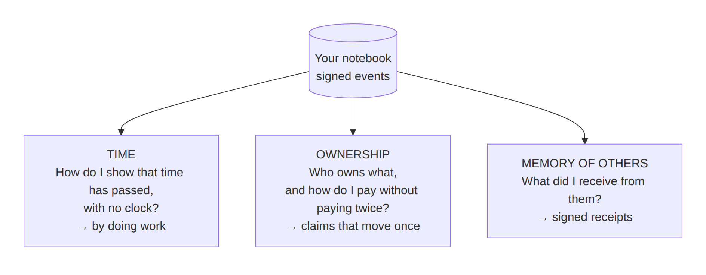

The source of this diagram (Mermaid)

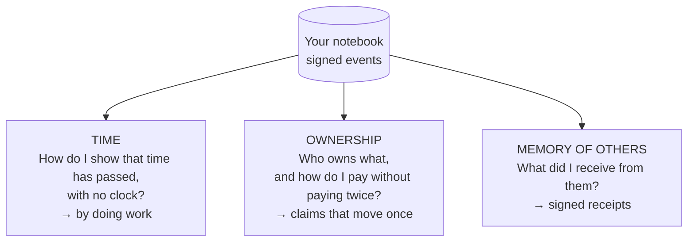
```mermaid
flowchart TB
  N[("Your notebook<br/>signed events")]
  N --> P["TIME<br/>How do I show that time has passed,<br/>with no clock?<br/>→ by doing work"]
  N --> C["OWNERSHIP<br/>Who owns what,<br/>and how do I pay without paying twice?<br/>→ claims that move once"]
  N --> M["MEMORY OF OTHERS<br/>What did I receive from them?<br/>→ signed receipts"]
```

<!-- /diagram -->

### 2.1 Time, without a clock: work

There is no common clock, so time is shown by **work**: your device does a computation that cannot be made faster by spreading it over
many machines. One piece of work is an **epoch** (about half a second on an ordinary machine). Each time you do some, you sign an event
with a **proof** of the work, and anyone can check that proof in about 3.6 thousandths of a second, however long the work took you.

<!-- diagram: explained-04-239e61fb.png -->
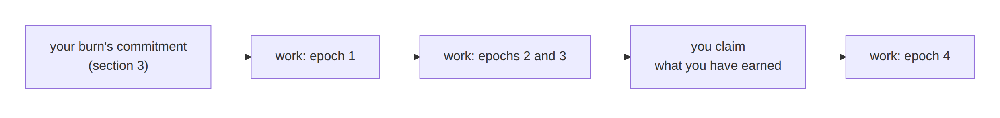

The source of this diagram (Mermaid)

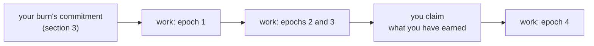
```mermaid
flowchart LR
  A["your burn's commitment<br/>(section 3)"] --> W1["work: epoch 1"] --> W2["work: epochs 2 and 3"] --> C["you claim<br/>what you have earned"] --> W3["work: epoch 4"]
```

<!-- /diagram -->

Three details matter:

- **Each step is signed by you and names the step before it.** So nobody else can do your work for you (that would let them slow your
  future rewards), and you cannot quietly leave an action out of your history: the work that follows is tied to it, and a history without
  it would have to redo that work.
- **The reference wallet works for you** while it is open, without waiting between epochs, and once you have committed. Closed, it does nothing; time does not run for it.
- **A faster machine makes more epochs.** The proof makes work cheap to *check*, not equal to *do*.

### 2.2 Ownership: a claim moves once

AIWA is held as **claims**. A claim is an amount owned by one key. To pay Bob, you sign "claim X goes to Bob". Behind that one signature,
the claim goes through a fixed sequence, and each step must succeed for the next:

<!-- diagram: explained-05-75236a2a.png -->
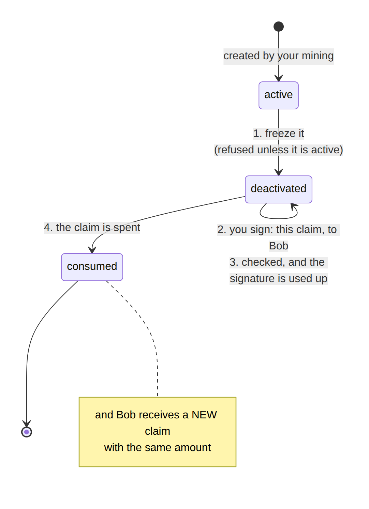

The source of this diagram (Mermaid)

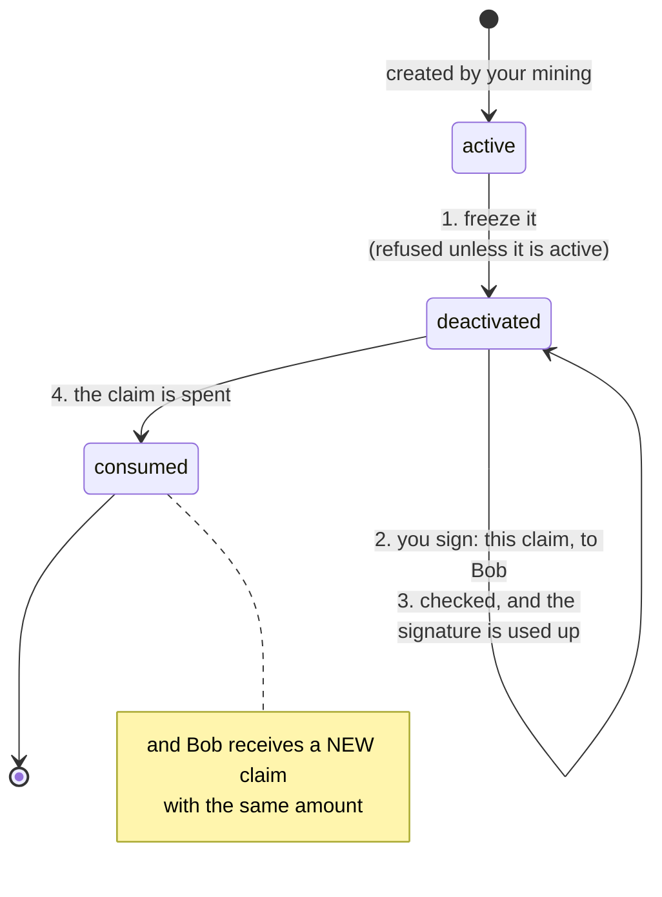
```mermaid
stateDiagram-v2
  [*] --> active: created by your mining
  active --> deactivated: 1. freeze it<br/>(refused unless it is active)
  deactivated --> deactivated: 2. you sign: this claim, to Bob<br/>3. checked, and the signature is used up
  deactivated --> consumed: 4. the claim is spent
  consumed --> [*]
  note right of consumed
    and Bob receives a NEW claim<br/>with the same amount
  end note
```

<!-- /diagram -->

The value is **moved, never copied**. A second try with the same signature is refused, and so is moving a claim that is no longer active.
You can also **split** a claim in two (the parts always add up to the original).

**A QR code that holds money (a voucher).** Sometimes you do not know the recipient yet, for instance a withdrawal code. You move the
claim to an address that is the fingerprint of a secret. Whoever shows the secret *and* signs with their own key gets the claim, once:

<!-- diagram: explained-06-77304cf0.png -->
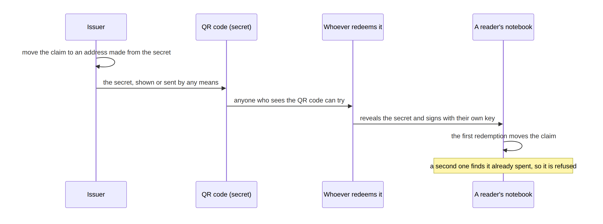

The source of this diagram (Mermaid)

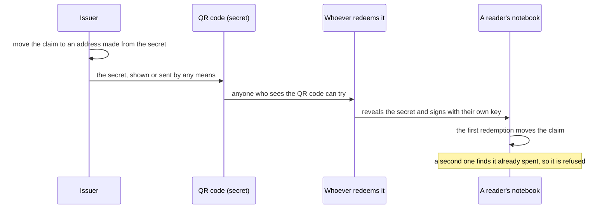
```mermaid
sequenceDiagram
  participant I as Issuer
  participant Q as QR code (secret)
  participant R as Whoever redeems it
  participant L as A reader's notebook
  I->>I: move the claim to an address made from the secret
  I->>Q: the secret, shown or sent by any means
  Q->>R: anyone who sees the QR code can try
  R->>L: reveals the secret and signs with their own key
  L->>L: the first redemption moves the claim
  Note over L: a second one finds it already spent, so it is refused
```

<!-- /diagram -->

**Sign once, click many times.** You can sign one statement that authorises a second key (a "session key") to move your claims. After
that, each click is signed by the session key and you do not use your main key again. It does not lock any money in advance, and it has
no amount limit and no expiry by design: a limit is something an application adds on top if it wants one.

### 2.3 Memory of others: the signed receipt (Mirror)

When events from someone else reach you, you can sign a **receipt**: "I received X's events, up to their epoch 20". It is not a copy
and not a merge: X's notebook and yours stay as they were, only linked. Rules: a receipt must name events that really exist, and the
next one may never say you saw *less* than before. The wallet writes these receipts by itself when events arrive.

What it is for: keeping an identity is a recurring signed act, not a one-time registration, and receipts are **witnesses**: they let
others check where someone stands (section 4.4). What it is not: proof that two identities are two different people.

---

## 3. Creating value

### 3.1 Why it has a cost

With no central authority, one more identity must cost something, otherwise anyone could make a thousand identities and create money for
free. The cost is **burning SOL**: sending it to Solana's incinerator, irreversibly and publicly. It is the only price of creating
AIWA. Your key, notebook, receiving and sending AIWA, contracts and apps cost nothing.

### 3.2 The four steps

<!-- diagram: explained-07-04130fbb.png -->
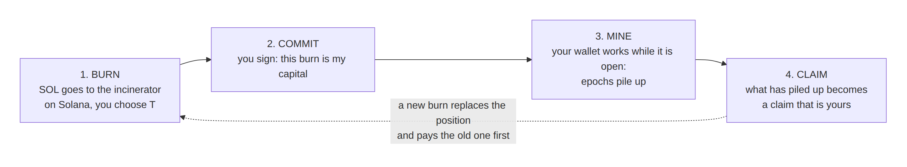

The source of this diagram (Mermaid)

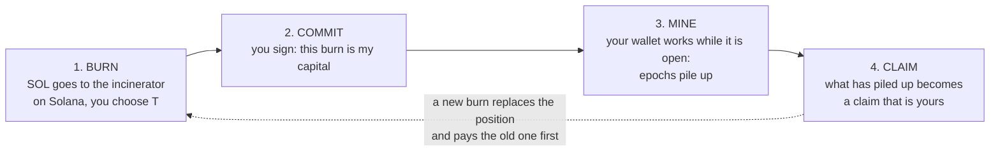
```mermaid
flowchart LR
  A["1. BURN<br/>SOL goes to the incinerator<br/>on Solana, you choose T"] --> B["2. COMMIT<br/>you sign: this burn is my capital"]
  B --> C["3. MINE<br/>your wallet works while it is open:<br/>epochs pile up"]
  C --> D["4. CLAIM<br/>what has piled up becomes<br/>a claim that is yours"]
  D -. "a new burn replaces the position<br/>and pays the old one first" .-> A
```

<!-- /diagram -->

1. **Burn.** The wallet sends SOL to the incinerator and, in the same transaction, a small share to the creator (3.6). You see the split
   before you sign.
2. **Commit.** The wallet records which burn it was (just its Solana signature) and signs your *capital*: the part of the burn that counts.
3. **Mine.** Epochs pile up. The longer since your last action, the more you can claim.
4. **Claim.** You turn what has piled up into a claim you own, which you can spend like any other.

### 3.3 What T is

T is a share of the burn, between 0 % and 40 %, that **you choose at the burn**. That share is not counted as capital: your capital is
`burned × (1 − T)`. In exchange, the reward curve is more generous later. It is a choice, because it pays only for someone who stays: with a
small T you earn more at the start, with a large T you earn more after a while. If you give no T, it is 0.

### 3.4 A real example

One burn of **1 SOL at T = 20 %**: the creator gets 0.0002 SOL, the capital that counts is **0.8**. The wallet is left open (counted at one epoch
every 30 seconds; the real wallet works faster than that, so the same numbers come sooner) and nothing is claimed along the way. These numbers come from the actual reward formula with this repository's
parameters (`deployment.json`):

| Wallet open for | Claimable AIWA | Same burn at T = 0 | Same burn at T = 40 % |
|---|---|---|---|
| 1 hour | 0.130 | 0.138 | 0.100 |
| 1 day | 1.84 | 1.19 | 2.73 |
| 7 days | 8.19 | 5.24 | 14.3 |
| 30 days | 26.9 | 17.2 | 47.7 |
| 1 year | 231 | 148 | 412 |

Read it like this: at the start a small T wins; after a day the larger T has overtaken it, though only 60 % of the burn counted. Claiming
does not restart your age, and claiming in the middle gives about the same total as waiting, so there is nothing clever to do: leave the
app open. **These are quantities of AIWA, not prices.** Nothing here says AIWA is worth anything.

### 3.5 The "last action" rule

Your position is what your **last action** left it:

- A new **burn replaces** your position: the capital that mines is the new one. A small burn after a big one lowers your capital: that is
  the rule.
- Before it is replaced, the old position is **paid first**: what it had earned becomes a real claim of yours. A new burn never loses what
  the old one earned.
- A **claim** does not change T: it costs nothing, so it cannot buy a better one.
- Epochs you work **before** your first burn earn nothing and slow you down afterwards (your age counts in the formula and never
  resets). Burn first, then mine.

### 3.6 The creator's share

The burn is **one transaction with two transfers**: almost everything to the incinerator, and a small part to one fixed address, the
creator's.

<!-- diagram: explained-08-b483f691.png -->
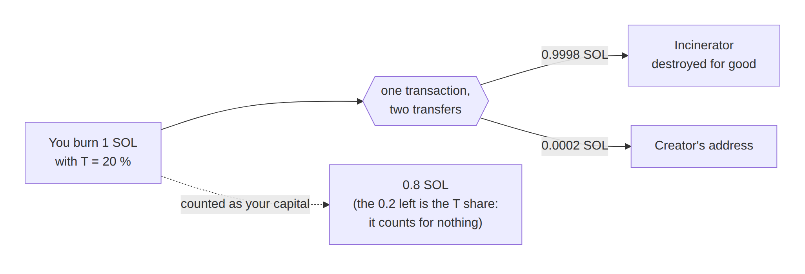

The source of this diagram (Mermaid)

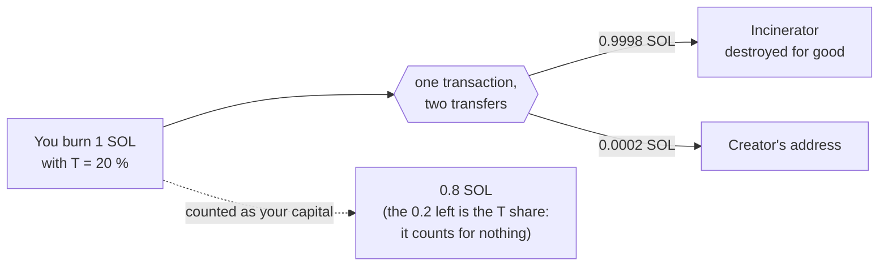
```mermaid
flowchart LR
  U["You burn 1 SOL<br/>with T = 20 %"] --> TX{{"one transaction,<br/>two transfers"}}
  TX -- "0.9998 SOL" --> I["Incinerator<br/>destroyed for good"]
  TX -- "0.0002 SOL" --> CR["Creator's address"]
  U -. "counted as your capital" .-> CAP["0.8 SOL<br/>(the 0.2 left is the T share:<br/>it counts for nothing)"]
```

<!-- /diagram -->

The part is **0.1 % of the T share**: at T = 40 %, 0.0004 SOL per SOL burned. At T = 0 (the default), nothing. You do not choose who is
paid. The address and the rate are written in the protocol's rules, not in a setting, and they change only with a new version of the rules.
Everyone who reads your history checks that the creator's part was paid: a commitment at T above 0 whose burn skipped it **does not count**.

### 3.7 How others know your burn is real

Nobody takes your word for it. The notebook only says *which* burn (its Solana signature), never what it was worth. Every reader asks
Solana **by itself** for that finalized transaction, and counts it only if: it succeeded, it reached the incinerator, **it was paid by your
own key**, and it was not already used for an earlier commitment. Quoting someone else's burn earns nothing. A reader that cannot reach Solana
counts nothing yet, and counts it as soon as it can.

---

## 4. When notebooks meet

### 4.1 How events travel

Aiwa asks for one thing: that someone else's events reach you, **by any means**: a file, pasted text, a QR code, a GitHub pull request, an
archive node, a direct connection. Each event checks out on its own, so the route does not matter. The store app has no direct connection;
the files and the registry are enough.

### 4.2 A branch is not a conflict

Two events that do not cite each other are two branches, and that is fine. It only matters when they **contradict**: the same claim
spent twice, the same voucher redeemed twice. A reader keeps one and refuses the other, and writes down the refusal.

### 4.3 The double spend, step by step

Alice holds a claim. Offline, she signs two payments of that same claim, to Bob and to Carol. Each one believes they were paid.

<!-- diagram: explained-09-0a1270cf.png -->
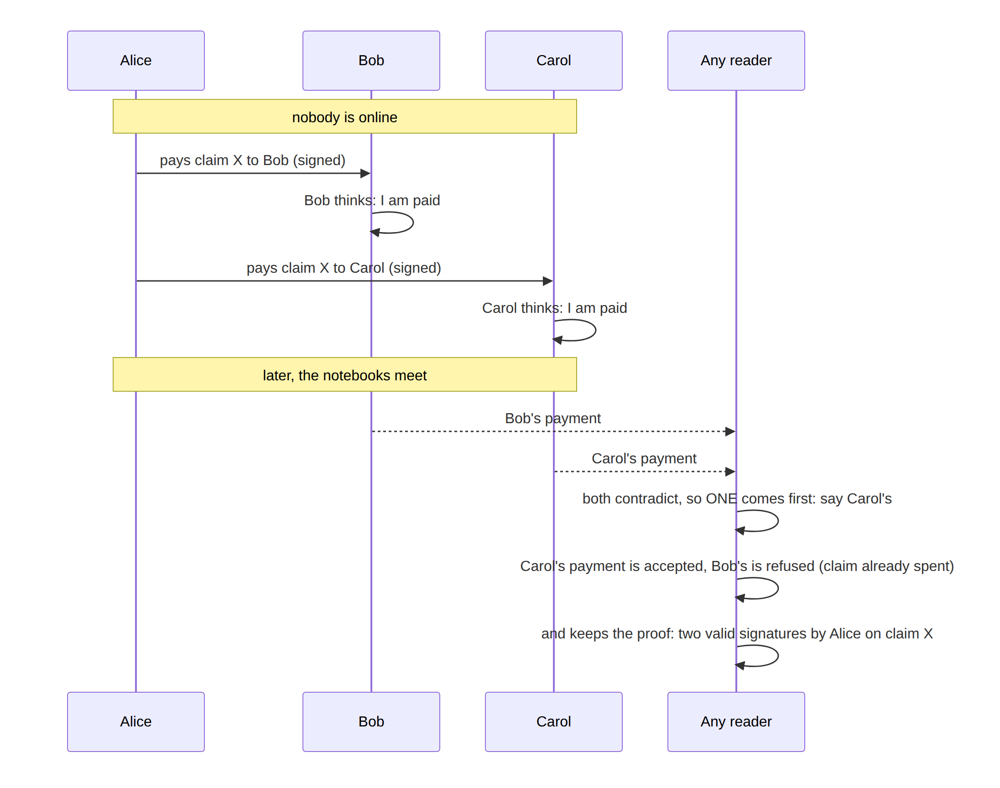

The source of this diagram (Mermaid)

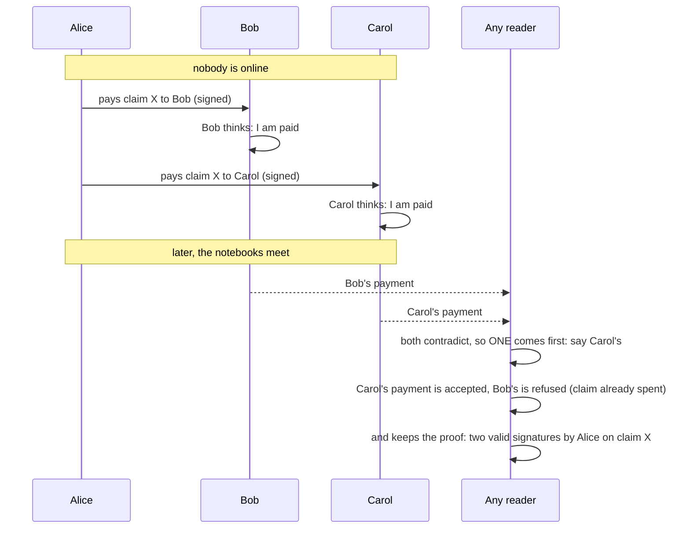
```mermaid
sequenceDiagram
  participant A as Alice
  participant B as Bob
  participant C as Carol
  participant R as Any reader
  Note over A,C: nobody is online
  A->>B: pays claim X to Bob (signed)
  B->>B: Bob thinks: I am paid
  A->>C: pays claim X to Carol (signed)
  C->>C: Carol thinks: I am paid
  Note over A,C: later, the notebooks meet
  B-->>R: Bob's payment
  C-->>R: Carol's payment
  R->>R: both contradict, so ONE comes first: say Carol's
  R->>R: Carol's payment is accepted, Bob's is refused (claim already spent)
  R->>R: and keeps the proof: two valid signatures by Alice on claim X
```

<!-- /diagram -->

Three things to understand.

**The value is never duplicated.** In every reader's view the claim has one owner.

**Every reader picks the same winner.** If readers kept the one they received first, two readers with the same events could keep different
winners forever. So all readers put events in the same order: parents first, and among events that could come next, **the smallest
number first**. Same events, same order, same winner, whatever order they arrived in.

**It is agreement, not fairness.** The winner is the one with the smaller number: arbitrary, not "first in time" (there is no clock). A
cheater can try variants of their event until the one they want has the smaller number. So the rule does not protect Bob; it makes
everyone agree. What stays is the **proof**: two valid signatures by the same key on one claim, which anyone can check.

**What cannot be prevented while offline.** Someone who holds their key can sign two payments, and nobody sees it until the notebooks
meet. Preventing it would need a common authority or a clock, which Aiwa does not have. What remains: limit the amount you accept from
someone you do not trust, let the notebooks meet before relying on a payment, and use the proof afterwards. An anchor on Solana would help
only someone who can go online *before* handing over what they give, and it is not built.

### 4.4 Showing a made-up history

Your own mining history is protected differently: each step names the previous one in its signed part, so showing another history means
**redoing the work**. Someone could still keep two histories (and redo the work) and show the better one. That is closed by
**witnesses**: anyone who received an event you signed can show it, and the registry then requires that your next submission contains
it. Without any witness, the only protection is the work it costs. A submission is also a snapshot: an action after the last epoch shown,
followed by nothing, can be left out.

**Seeing it yourself.** The wallet page has a *Network* line: the wallets that are open find each other by themselves (a public relay introduces
them and sees only that someone looks), and from then on they exchange what each lacks, directly. *Link with another phone* does the same by hand,
with two codes, for when no relay can be reached. Each signs a receipt for what it received, so each
now holds proof of where the other is. *Who this phone has seen* lists every identity this phone holds anything of: where it stands (never
below what is proven), what is proven, the vote of the observers it knows, whether it signed two histories, and how fast it progresses compared
with you (two of your own receipts and your own epoch at each; no clock). It is information: it changes nobody's earnings.

---

## 5. Losing your phone

The 12 words give back your key. They do **not** give back your notebook: nobody keeps everyone's notebooks, so after a loss the history
has to come from somewhere. In the app, none of this is a button. Once you type your 12 words on the new phone:

<!-- diagram: explained-10-8a77d7e7.png -->
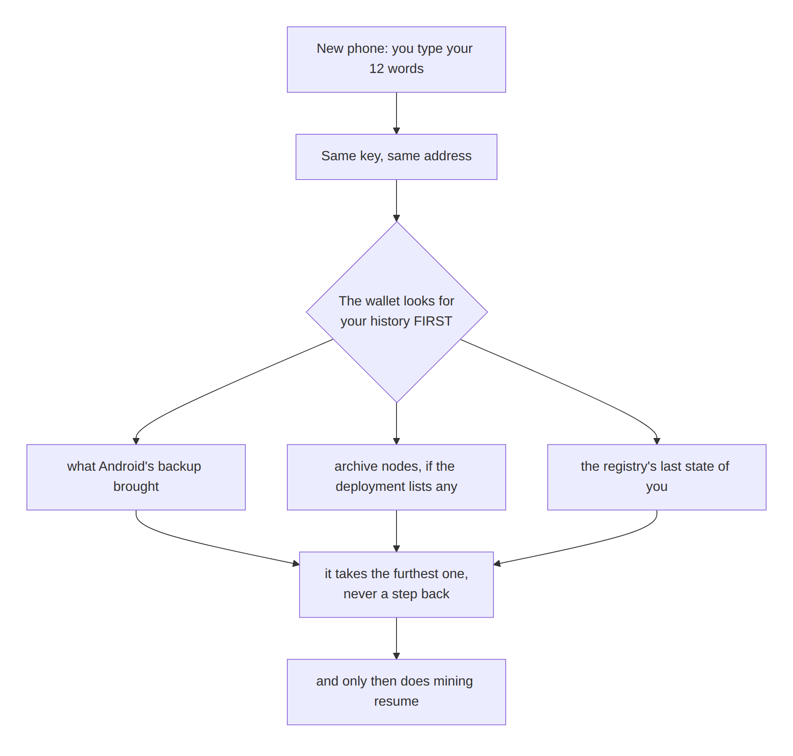

The source of this diagram (Mermaid)

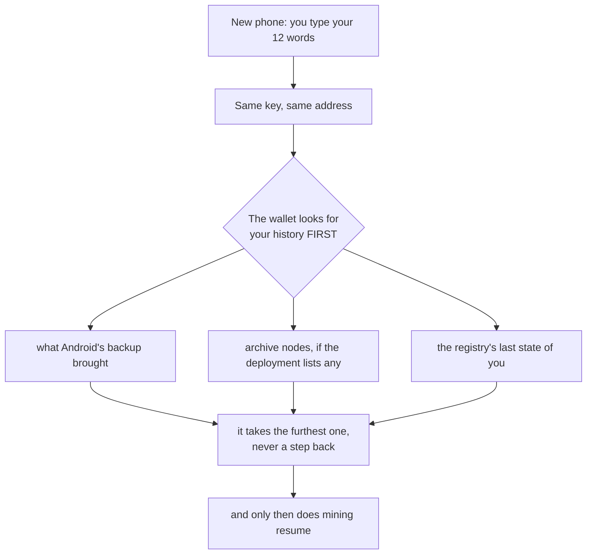
```mermaid
flowchart TB
  P["New phone: you type your 12 words"] --> K["Same key, same address"]
  K --> L{"The wallet looks for<br/>your history FIRST"}
  L --> S1["what Android's backup brought"]
  L --> S2["archive nodes, if the deployment lists any"]
  L --> S3["the registry's last state of you"]
  S1 --> M["it takes the furthest one,<br/>never a step back"]
  S2 --> M
  S3 --> M
  M --> G["and only then does mining resume"]
```

<!-- /diagram -->

It never starts mining before it has looked: a history started from nothing would fork the one that was about to come back. Each source is
a state signed by your own key (or derived by the registry from your submissions), so a source can forget but cannot invent. **Not claimed:**
a wallet with no backup, no node and no registry state that loses its phone loses its journal (the burns stay on Solana, the key stays in
the 12 words, the epochs and their proofs are gone).

---

## 6. The life of an app

### 6.1 What an app is

An app is **one HTML file** (or a small set of files) that its author *signed*. There are two ways to submit one, both on GitHub:

| | What GitHub holds | Who checks the code |
|---|---|---|
| **`code`** | the file itself, in the submission | anyone, by recomputing its fingerprint |
| **`aiwa`** | two files: the **package**, whose content is only a **pointer** (the number of a signed manifest published through Aiwa, which pins every file by its fingerprint), and the **bundle**, the signed events that carry the files themselves | the registry and the Store, each on its own, so whoever served the files, they are exactly what the author published |

### 6.2 Publishing

You dictate to Claude Code, which writes the app. From the widget you press ▦ and the Store opens a single sheet showing the app. You
read it, try it, and press **Publish**. Nothing is signed or sent before.

<!-- diagram: explained-11-76b9c28e.png -->
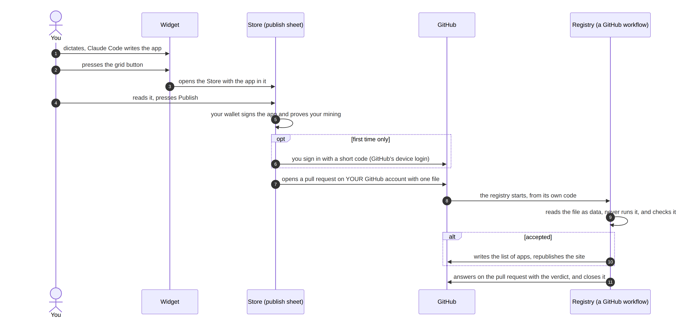

The source of this diagram (Mermaid)

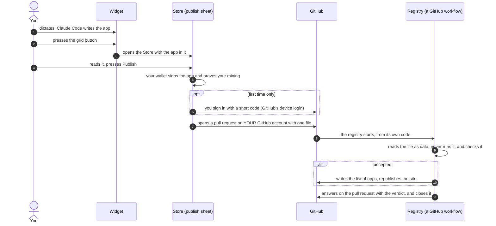
```mermaid
sequenceDiagram
  autonumber
  actor U as You
  participant W as Widget
  participant S as Store (publish sheet)
  participant H as GitHub
  participant R as Registry (a GitHub workflow)
  U->>W: dictates, Claude Code writes the app
  U->>W: presses the grid button
  W->>S: opens the Store with the app in it
  U->>S: reads it, presses Publish
  S->>S: your wallet signs the app and proves your mining
  opt first time only
    S->>H: you sign in with a short code (GitHub's device login)
  end
  S->>H: opens a pull request on YOUR GitHub account with one file
  H->>R: the registry starts, from its own code
  R->>R: reads the file as data, never runs it, and checks it
  alt accepted
    R->>H: writes the list of apps, republishes the site
  end
  R->>H: answers on the pull request with the verdict, and closes it
```

<!-- /diagram -->

### 6.3 What the registry checks

- the file is well formed, its fingerprint matches its content, and **the signature is the author's**, over this app and this version;
- the signature is less than 24 hours old (an old signed file cannot be replayed);
- the app id was not taken by someone else, and the version is higher than the last;
- for `aiwa` apps, the bundle matches the manifest the package points to;
- the author's mining, checked as in section 3.7: proofs verified, burns confirmed on Solana **by the registry itself**, creator's share included;
- a **new** app needs something claimable, one new app per author every 5 minutes, at most 20 per author, and the author's current
  `score / laps` must not be below that of their last publication.

A refused submission changes nothing, and the verdict says why.

### 6.4 The order of the list

Apps are ranked by **`score / laps`**: *score* is what the author can claim, *laps* the number of epochs since their last action (at least 1).
Both are frozen when the registry accepted the submission. There is no editorial override and nobody edits the list. The ranking favours
capital and time, not quality: that is a limit, not a feature.

### 6.5 Opening an app

<!-- diagram: explained-12-5630e206.png -->
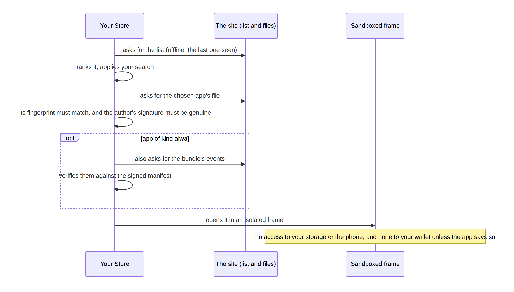

The source of this diagram (Mermaid)

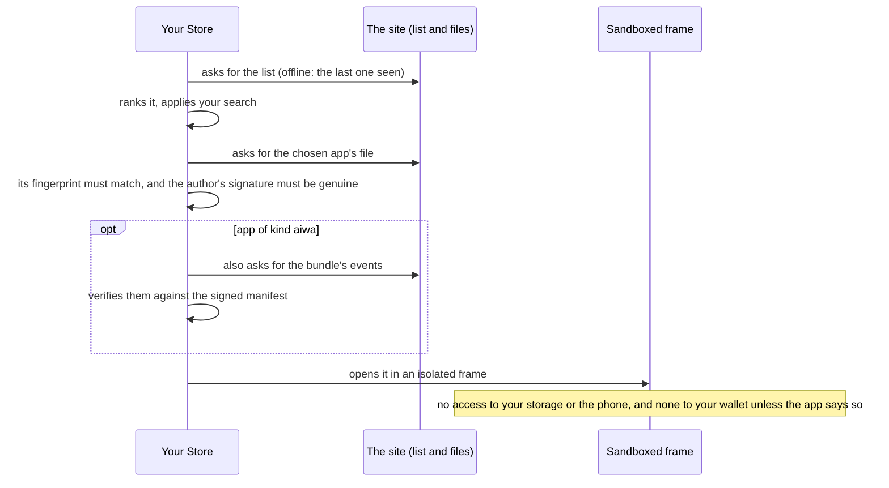
```mermaid
sequenceDiagram
  participant R as Your Store
  participant P as The site (list and files)
  participant F as Sandboxed frame
  R->>P: asks for the list (offline: the last one seen)
  R->>R: ranks it, applies your search
  R->>P: asks for the chosen app's file
  R->>R: its fingerprint must match, and the author's signature must be genuine
  opt app of kind aiwa
    R->>P: also asks for the bundle's events
    R->>R: verifies them against the signed manifest
  end
  R->>F: opens it in an isolated frame
  Note over F: no access to your storage or the phone, and none to your wallet unless the app says so
```

<!-- /diagram -->

The frame is a standard browser sandbox with its own empty identity: whatever the app does, it **cannot reach your wallet by itself**, and
this does not depend on the author behaving. One exception, below: an app that says it uses the wallet. A host that serves another file than the one signed is refused. It can use the network, and it is not
reviewed.

### 6.6 The Android app around it

The Store and wallet are one web app inside an Android WebView. Only the page itself may ask the phone for a few things, through one
channel: keep the 12 words and the GitHub token encrypted with a key the phone's Keystore holds, run GitHub's device login, save a file,
open the dictation screen. **The frame an app runs in does not get that channel.** Android's own backup carries the wallet's journal to a
new phone; the secrets are left out on purpose (a Keystore key does not move), so you type your 12 words once.

The page itself is not frozen in the app: the app follows the site and updates its page by itself, with no new APK. It keeps a new page only
once every file has arrived exactly as the site's list says, so the page is always one whole version. It starts the next time you open the
app. What the site publishes is what the phones run, and the site is published by the repository's GitHub account.

The dictation widget is optional: it needs Termux and your own Claude login, and nothing about the Store or the wallet needs it.

---

### 6.7 An app that uses the wallet: the click duel

An app can say it uses your wallet. The Store then shows a banner, and the app can ask a few things of it: who you are, to pay someone (the Store asks you first), to
receive a payment, to show or read a code. **Click duel** is such an app: two phones side by side, a price per click, 20 seconds of
clicking. Whoever clicked less pays what they clicked.

<!-- diagram: explained-13-84714632.png -->
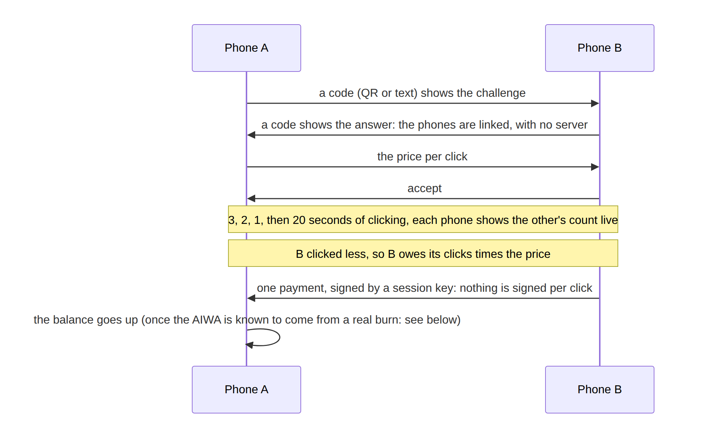

The source of this diagram (Mermaid)

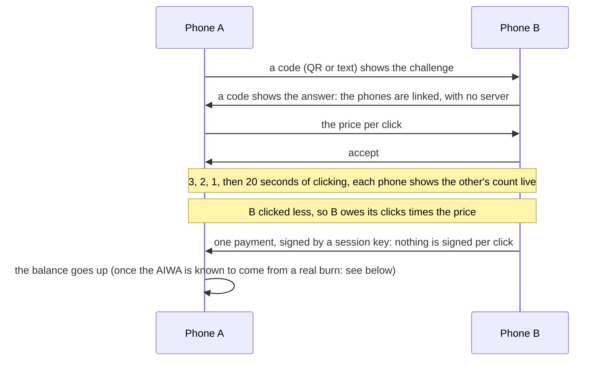
```mermaid
sequenceDiagram
  participant A as Phone A
  participant B as Phone B
  A->>B: a code (QR or text) shows the challenge
  B->>A: a code shows the answer: the phones are linked, with no server
  A->>B: the price per click
  B->>A: accept
  Note over A,B: 3, 2, 1, then 20 seconds of clicking, each phone shows the other's count live
  Note over A,B: B clicked less, so B owes its clicks times the price
  B->>A: one payment, signed by a session key: nothing is signed per click
  A->>A: the balance goes up (once the AIWA is known to come from a real burn: see below)
```

<!-- /diagram -->

What it shows: nothing is signed per click. The first payment to someone signs one delegation (section 2.2), and the payment itself is
signed by a session key. The game itself never touches Solana. The wallet does, once, for any AIWA it receives: it checks that the burn it
was created from is real (section 3.7), otherwise anyone could invent AIWA and pay you with it. With no internet at that moment, the payment
is received and counts as soon as the phone has been online. What it does not do, on purpose for now: each phone counts its own clicks, so a modified app can lie; the money
is not set aside before the race, so the loser could spend it elsewhere first; there is no search for players nearby. It has been tried
between two pages of a computer's browser, not between two real phones.

## 7. What is new, and what is not

The building blocks are known: a signed, hash-linked log (like git or Secure Scuttlebutt), a sequential-work proof (Wesolowski), burning as a
cost, hash-locked vouchers, session keys. No prior-art search has been done. What is unusual is the combination:

- **Creating value without consensus.** Each identity creates its AIWA on its own, from checkable work, with one outside gate (the
  burn). Most systems tie issuance to consensus; here it is not, which suits partitions and offline use.
- **Work as each identity's own clock.** Hiding or reordering an action costs computation.
- **A proof anyone checks in milliseconds.** A registry can read someone's mining without trusting them.

## 8. What is not solved

- Nothing proves that two identities are two people.
- Nobody is paid to keep other people's data; a lost notebook with no copy is lost.
- A double spend between people who never exchange events cannot be prevented, only detected and resolved identically for everyone.
- There is no automatic way for strangers to find each other.
- Apps are not reviewed, and can use the network. An app that says it uses your wallet can pay from it only once you allow it: a sheet of the Store asks (that payment, or a budget until you close the app), and what you allow is spent as the app wishes.
- A faster machine earns epochs faster.
- Solana is the only outside dependency of the protocol (GitHub hosts this deployment's registry and site).

## 9. What has been verified, and what has not

**Verified by tests** (all run in CI): the protocol (421 tests, including a cross-check against an independent Rust implementation of its
core computations), the distribution layer (107), the wallet API (113), the registry (17), the web app (54, 30 of them in a real Chromium:
ranking, sandbox, tampering, offline, wallet restore, burn with its fee, publishing of both kinds, an app using the wallet, a click duel between two pages, two phones linking by two codes, a QR code read from a fake camera), the dictation backend (119), the Android app's checks of a downloaded page (14, on a plain JVM), and a whole
dry run against a stand-in Solana (`node scripts/devnet-check.mjs --fake`).

**Not verified:** a real burn on Solana (it needs a funded devnet wallet); the Android app on a real phone (it is compiled in CI only),
GitHub's device login against the real GitHub, Android's backup carrying the journal; a real pull request through the whole registry
workflow; the legal status of the creator's share; the economic parameters in the field.

## Where to read more

[Yellow paper](YELLOWPAPER.md) (the formal protocol, same order) · [README](../README.md) · [plan](PLAN.md) · [business model](BUSINESS.md) ·
[Android](ANDROID.md).
