# Aiwa, expliqué

*Pour tout le monde : pas besoin de connaître la cryptographie. Cette page dit en mots simples comment tout fonctionne, de la clé
jusqu'au store d'applications, et dit ce qui n'est pas résolu. Le même contenu, de façon formelle, est dans le
[yellow paper](YELLOWPAPER.md) (en anglais). English : [EXPLAINED.md](EXPLAINED.md).*

## Tout en une minute

**Aiwa Store** est une seule application Android qui fait cinq choses. Tu peux **construire** une app en dictant à Claude Code (avec un widget
optionnel), la **soumettre** en un geste, la retrouver dans un **Store** classé selon le travail derrière chaque app, gagner le jeton **AIWA**
en laissant ton téléphone calculer, et laisser des apps **payer** des gens directement. Derrière, il y a un protocole **sans registre commun** :
chacun garde son propre carnet d'événements signés, le montre aux autres quand c'est utile, et chacun peut vérifier seul ce qu'on lui montre.

Trois choses extérieures servent, chacune pour un seul travail :

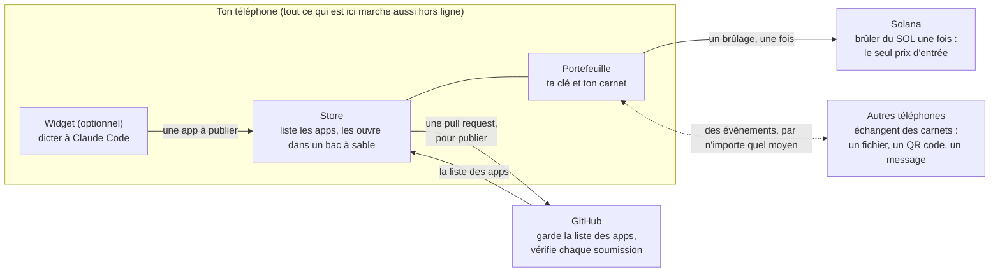

| | Internet nécessaire ? |
|---|---|
| Ta clé, ton carnet | non |
| Miner (le portefeuille qui travaille tant qu'il est ouvert) | non |
| Recevoir et envoyer des AIWA | seulement pour faire passer les événements d'une personne à l'autre, par n'importe quel moyen |
| **Le brûlage** (la seule façon de créer de nouveaux AIWA) | **oui**, une fois, sur Solana |
| Ouvrir une app que tu as déjà | non |
| Voir de nouvelles apps, publier | oui |

---

## 1. Ta clé et ton carnet

**Ta clé.** Tu obtiens 12 mots. Ils fabriquent une clé secrète, et de celle-ci une identité publique : ton *adresse*. C'est aussi une
adresse Solana : les mêmes 12 mots ouvrent le même compte dans n'importe quel portefeuille Solana. Il n'y a ni compte, ni inscription,
rien n'est envoyé nulle part.

**Ton carnet.** Tout ce que tu fais est écrit comme un *événement*, signé avec ta clé. Un événement a :

- un **numéro**, qui est l'empreinte de son contenu (change une lettre et le numéro change) ;
- ses **parents** : les événements qu'il suit, qu'il désigne par leurs numéros.

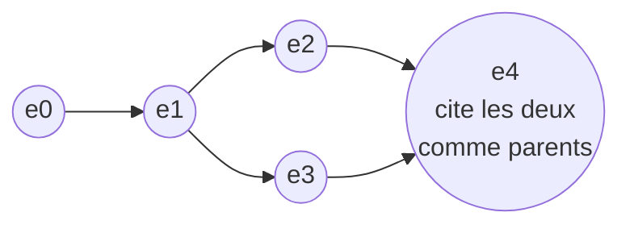

Comme chaque événement contient les numéros de ses parents, **modifier le passé casse tout ce qui suit**. Deux événements qui ne se
connaissent pas (`e2` et `e3`) sont deux *branches* : c'est ordinaire, cela veut simplement dire que deux choses se sont passées sur
deux appareils. Elles se rejoignent dès qu'un événement plus tard cite les deux.

**Ce que la signature prouve, et ne prouve pas.** Elle prouve que celui qui détient la clé a écrit cet événement, et que personne ne l'a
modifié. Elle ne prouve pas que la clé appartient à une seule personne, et elle n'empêche pas un détenteur de clé de signer deux suites
différentes du même événement (la section 4 parle exactement de cela).

Personne ne garde le carnet de tout le monde. Tu gardes ce qui te concerne ; les autres gardent ce qui les concerne.

---

## 2. Les trois travaux du carnet

Tout ce que fait le carnet est l'un de trois travaux. Chacun répond à une question :

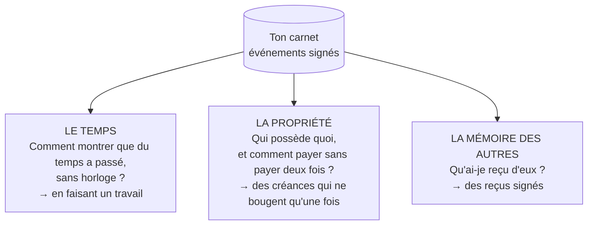

### 2.1 Le temps, sans horloge : le travail

Il n'y a pas d'horloge commune, donc le temps se montre par du **travail** : ton appareil fait un calcul qu'on ne peut pas accélérer en
le répartissant sur plusieurs machines. Un morceau de travail est une **époque** (environ une demi-seconde sur une machine ordinaire).
Chaque fois que tu en fais, tu signes un événement avec une **preuve** du travail, et n'importe qui vérifie cette preuve en environ 3,6
millièmes de seconde, quelle qu'ait été la durée de ton travail.

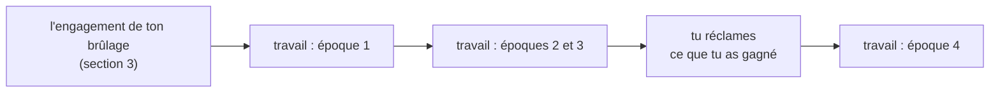

Trois détails comptent :

- **Chaque étape est signée par toi et nomme l'étape d'avant.** Personne d'autre ne peut donc faire ton travail à ta place (ce qui
  ralentirait tes gains futurs), et tu ne peux pas écarter discrètement une action de ton historique : le travail qui suit lui est lié,
  et un historique sans elle devrait refaire ce travail.
- **Le portefeuille de référence travaille pour toi** tant qu'il est ouvert : une époque toutes les 30 secondes. Fermé, il ne fait
  rien ; le temps ne court pas pour lui.
- **Une machine plus rapide fait plus d'époques.** La preuve rend le travail peu coûteux à *vérifier*, pas égal à *faire*.

### 2.2 La propriété : une créance ne bouge qu'une fois

Les AIWA se détiennent sous forme de **créances**. Une créance est un montant qui appartient à une clé. Pour payer Bob, tu signes « la
créance X va à Bob ». Derrière cette unique signature, la créance suit une suite fixe d'étapes, chacune devant réussir pour que la
suivante ait lieu :

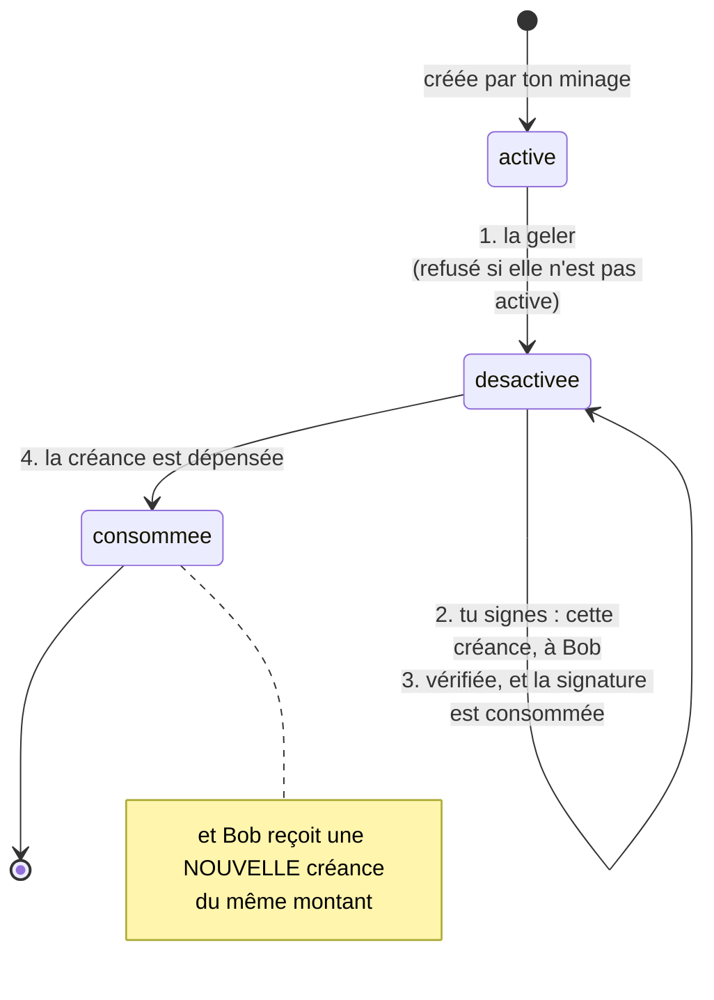

La valeur est **déplacée, jamais copiée**. Un deuxième essai avec la même signature est refusé, et déplacer une créance qui n'est plus
active l'est aussi. Tu peux aussi **découper** une créance en deux (les parts font toujours le total d'origine).

**Un QR code qui contient de l'argent (un bon).** Parfois on ne connaît pas encore le destinataire, par exemple un code de retrait. Tu
déplaces la créance vers une adresse qui est l'empreinte d'un secret. Celui qui montre le secret *et* signe avec sa propre clé reçoit la
créance, une seule fois :

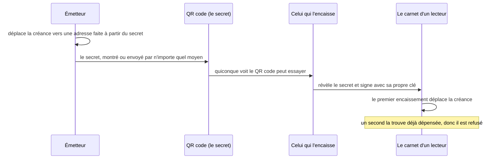

**Signer une fois, cliquer autant que tu veux.** Tu peux signer une seule déclaration qui autorise une seconde clé (une « clé de
session ») à déplacer tes créances. Ensuite, chaque clic est signé par la clé de session et tu n'utilises plus ta clé principale. Cela ne
bloque aucun argent à l'avance, et n'a ni plafond ni expiration, volontairement : une limite, c'est une application qui l'ajoute par-dessus
si elle en veut une.

### 2.3 La mémoire des autres : le reçu signé (Mirror)

Quand des événements de quelqu'un d'autre te parviennent, tu peux signer un **reçu** : « j'ai reçu les événements de X, jusqu'à son époque
20 ». Ce n'est ni une copie ni une fusion : le carnet de X et le tien restent tels quels, simplement reliés. Règles : un reçu doit nommer
des événements qui existent vraiment, et le suivant ne peut jamais dire que tu en as vu *moins* qu'avant. Le portefeuille écrit ces reçus
tout seul quand des événements arrivent.

À quoi ça sert : garder une identité devient un acte signé qui se répète, pas une inscription unique, et les reçus sont des **témoins** : ils
permettent aux autres de vérifier où en est quelqu'un (section 4.4). Ce que ce n'est pas : une preuve que deux identités sont deux personnes
différentes.

---

## 3. Créer de la valeur

### 3.1 Pourquoi cela a un coût

Sans autorité centrale, une identité de plus doit coûter quelque chose, sinon n'importe qui pourrait fabriquer mille identités et créer de
l'argent gratuitement. Le coût, c'est **brûler du SOL** : l'envoyer à l'adresse d'incinération de Solana, de façon irréversible et publique.
C'est le seul prix de la création d'AIWA. Ta clé, ton carnet, recevoir et envoyer des AIWA, les contrats et les apps ne coûtent rien.

### 3.2 Les quatre étapes

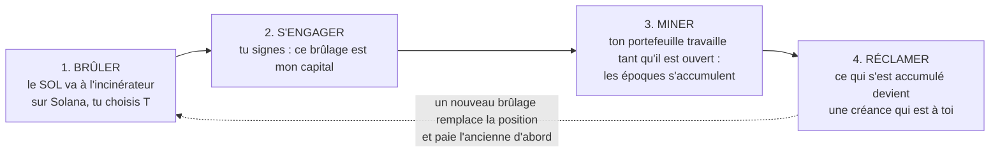

1. **Brûler.** Le portefeuille envoie du SOL à l'incinérateur et, dans la même transaction, une petite part au créateur (3.6). Tu vois la
   répartition avant de signer.
2. **S'engager.** Le portefeuille note de quel brûlage il s'agit (seulement sa signature Solana) et signe ton *capital* : la part du brûlage
   qui compte.
3. **Miner.** Les époques s'accumulent. Plus il s'est écoulé de temps depuis ta dernière action, plus tu peux réclamer.
4. **Réclamer.** Tu transformes ce qui s'est accumulé en une créance à toi, que tu peux dépenser comme n'importe quelle autre.

### 3.3 Ce qu'est T

T est une part du brûlage, entre 0 % et 40 %, que **tu choisis au moment du brûlage**. Cette part ne compte pas comme capital : ton capital
est `brûlé × (1 − T)`. En échange, la courbe de gain est plus généreuse plus tard. C'est un choix, parce qu'il ne paie que pour quelqu'un qui
reste : avec un petit T tu gagnes plus au début, avec un grand T tu gagnes plus au bout d'un moment. Sans T donné, il vaut 0.

### 3.4 Un exemple réel

Un brûlage de **1 SOL avec T = 20 %** : le créateur reçoit 0,0002 SOL, le capital qui compte est **0,8**. Le portefeuille reste ouvert
(une époque toutes les 30 secondes) et rien n'est réclamé en route. Ces chiffres viennent de la vraie formule de gain avec les paramètres de
ce dépôt (`deployment.json`) :

| Portefeuille ouvert depuis | AIWA réclamables | Même brûlage à T = 0 | Même brûlage à T = 40 % |
|---|---|---|---|
| 1 heure | 0,130 | 0,138 | 0,100 |
| 1 jour | 1,84 | 1,19 | 2,73 |
| 7 jours | 8,19 | 5,24 | 14,3 |
| 30 jours | 26,9 | 17,2 | 47,7 |
| 1 an | 231 | 148 | 412 |

Lecture : au début un petit T gagne ; après un jour, le grand T l'a dépassé, alors que 60 % seulement du brûlage comptait. Réclamer ne
remet pas ton âge à zéro, et réclamer en cours de route donne à peu près le même total qu'attendre : il n'y a donc rien de malin à faire,
laisse l'app ouverte. **Ce sont des quantités d'AIWA, pas des prix.** Rien ici ne dit que l'AIWA vaut quelque chose.

### 3.5 La règle de « dernière action »

Ta position est ce que ta **dernière action** en a fait :

- Un nouveau **brûlage remplace** ta position : le capital qui mine est le nouveau. Un petit brûlage après un gros baisse ton capital :
  c'est la règle.
- Avant d'être remplacée, l'ancienne position est **payée d'abord** : ce qu'elle avait gagné devient une vraie créance à toi. Un nouveau
  brûlage ne fait jamais perdre ce que l'ancien avait gagné.
- Une **réclamation** ne change pas T : elle ne coûte rien, donc elle ne peut pas en acheter un meilleur.
- Les époques travaillées **avant** ton premier brûlage ne rapportent rien et te ralentissent ensuite (ton âge compte dans la formule et ne
  se remet jamais à zéro). Brûle d'abord, mine ensuite.

### 3.6 La part du créateur

Le brûlage est **une transaction avec deux transferts** : presque tout à l'incinérateur, et une petite part à une adresse fixe, celle du
créateur.

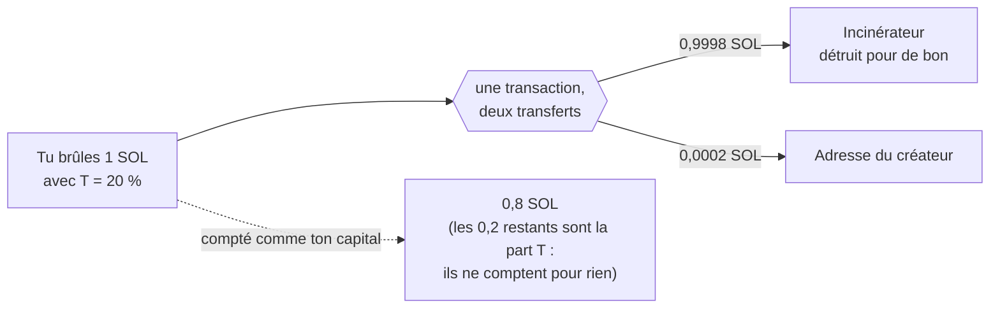

La part est de **0,1 % de la part T** : à T = 40 %, 0,0004 SOL par SOL brûlé. À T = 0 (le défaut), rien. Tu ne choisis pas qui est payé.
L'adresse et le taux sont écrits dans les règles du protocole, pas dans un réglage, et ne changent qu'avec une nouvelle version des règles.
Tous ceux qui lisent ton historique vérifient que la part du créateur a été payée : un engagement à T supérieur à 0 dont le brûlage l'a
sautée **ne compte pas**.

### 3.7 Comment les autres savent que ton brûlage est réel

Personne ne te croit sur parole. Le carnet dit seulement *quel* brûlage (sa signature Solana), jamais ce qu'il valait. Chaque lecteur demande
à Solana **lui-même** cette transaction finalisée, et ne la compte que si : elle a réussi, elle est arrivée à l'incinérateur, **elle a été
payée par ta propre clé**, et elle n'a pas déjà servi à un engagement précédent. Citer le brûlage de quelqu'un d'autre ne rapporte rien. Un
lecteur qui ne peut pas joindre Solana ne compte rien pour l'instant, et le compte dès qu'il le peut.

---

## 4. Quand les carnets se rencontrent

### 4.1 Comment les événements voyagent

Aiwa demande une seule chose : que les événements de quelqu'un d'autre te parviennent, **par n'importe quel moyen** : un fichier, un texte
collé, un QR code, une pull request GitHub, un nœud d'archive, une connexion directe. Chaque événement se vérifie tout seul, donc le chemin
n'a pas d'importance. L'application du store n'a pas de connexion directe ; les fichiers et le registre suffisent.

### 4.2 Une branche n'est pas un conflit

Deux événements qui ne se citent pas sont deux branches, et c'est normal. Cela ne compte que lorsqu'ils se **contredisent** : la même
créance dépensée deux fois, le même bon encaissé deux fois. Un lecteur en garde un, refuse l'autre, et note le refus.

### 4.3 La double dépense, pas à pas

Alice détient une créance. Hors ligne, elle signe deux paiements de cette même créance, à Bob et à Carol. Chacun croit avoir été payé.

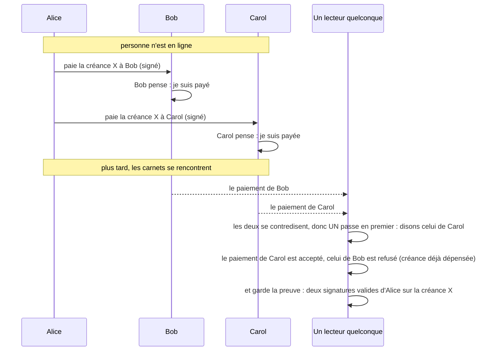

Trois choses à comprendre.

**La valeur n'est jamais dupliquée.** Dans la vue de chaque lecteur, la créance a un seul propriétaire.

**Tous les lecteurs choisissent le même gagnant.** Si les lecteurs gardaient celui qu'ils ont reçu en premier, deux lecteurs avec les mêmes
événements pourraient garder des gagnants différents pour toujours. Tous les lecteurs rangent donc les événements dans le même ordre : les
parents d'abord, et parmi les événements qui pourraient venir ensuite, **le plus petit numéro d'abord**. Mêmes événements, même ordre, même
gagnant, quel que soit l'ordre dans lequel ils sont arrivés.

**C'est un accord, pas de l'équité.** Le gagnant est celui qui a le plus petit numéro : arbitraire, pas « le premier dans le temps » (il n'y
a pas d'horloge). Un tricheur peut essayer des variantes de son événement jusqu'à ce que celui qu'il veut ait le plus petit numéro. La
règle ne protège donc pas Bob ; elle fait que tout le monde est d'accord. Ce qui reste, c'est la **preuve** : deux signatures valides de la
même clé sur une même créance, que n'importe qui peut vérifier.

**Ce qu'on ne peut pas empêcher hors ligne.** Quelqu'un qui détient sa clé peut signer deux paiements, et personne ne le voit tant que les
carnets ne se rencontrent pas. L'empêcher demanderait une autorité commune ou une horloge, qu'Aiwa n'a pas. Ce qui reste : limiter le
montant que tu acceptes de quelqu'un en qui tu n'as pas confiance, laisser les carnets se rencontrer avant de compter sur un paiement, et
utiliser la preuve après coup. Un ancrage sur Solana n'aiderait que quelqu'un qui peut se connecter *avant* de remettre ce qu'il donne, et
il n'est pas construit.

### 4.4 Montrer un historique inventé

Ton propre historique de minage est protégé autrement : chaque étape nomme la précédente dans sa partie signée, donc montrer un autre
historique oblige à **refaire le travail**. Quelqu'un pourrait quand même garder deux historiques (en refaisant le travail) et montrer le
meilleur. Cela se ferme avec les **témoins** : quiconque a reçu un événement que tu as signé peut le montrer, et le registre exige alors que
ta prochaine soumission le contienne. Sans aucun témoin, la seule protection est le travail que cela coûte. Une soumission est aussi un
instantané : une action après la dernière époque montrée, suivie de rien, peut être omise.

---

## 5. Perdre son téléphone

Les 12 mots redonnent ta clé. Ils ne redonnent **pas** ton carnet : personne ne garde les carnets de tout le monde, donc après une perte
l'historique doit revenir de quelque part. Dans l'application, rien de tout cela n'est un bouton. Une fois que tu as tapé tes 12 mots sur le
nouveau téléphone :

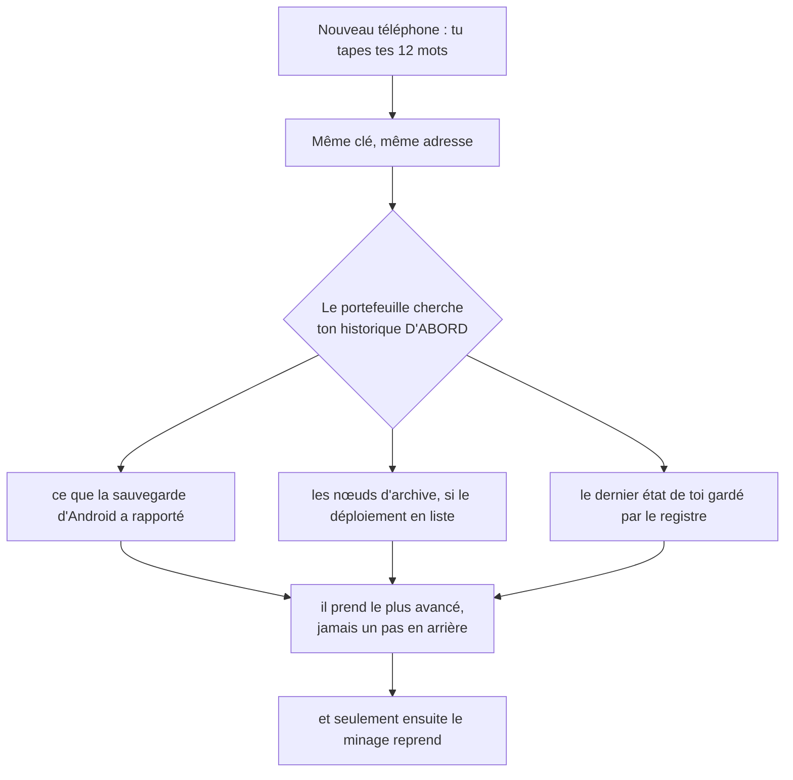

Il ne commence jamais à miner avant d'avoir cherché : un historique parti de rien ferait bifurquer celui qui allait revenir. Chaque source
est un état signé par ta propre clé (ou déduit par le registre de tes soumissions), donc une source peut oublier mais pas inventer. **Non
garanti :** un portefeuille sans sauvegarde, sans nœud et sans état dans le registre qui perd son téléphone perd son journal (les brûlages
restent sur Solana, la clé reste dans les 12 mots, les époques et leurs preuves sont perdues).

---

## 6. La vie d'une application

### 6.1 Ce qu'est une application

Une application est **un fichier HTML** (ou un petit ensemble de fichiers) que son auteur a *signé*. Il y a deux façons d'en soumettre
une, toutes deux sur GitHub :

| | Ce que GitHub contient | Qui vérifie le code |
|---|---|---|
| **`code`** | le fichier lui-même, dans la soumission | n'importe qui, en recalculant son empreinte |
| **`aiwa`** | seulement un **pointeur** : le numéro d'un manifeste signé publié par Aiwa, qui épingle chaque fichier par son empreinte | le registre et le Store, chacun de son côté ; quel que soit celui qui a servi les fichiers, ce sont exactement ceux que l'auteur a publiés |

### 6.2 Publier

Tu dictes à Claude Code, qui écrit l'application. Depuis le widget tu appuies sur ▦ et le Store ouvre une feuille unique qui montre
l'application. Tu la lis, tu l'essaies, et tu appuies sur **Publier**. Rien n'est signé ni envoyé avant.

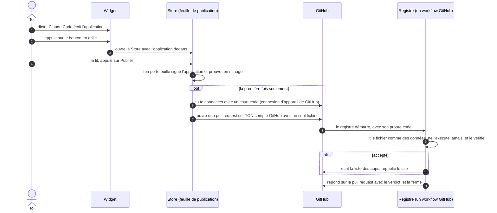

### 6.3 Ce que le registre vérifie

- le fichier est bien formé, son empreinte correspond à son contenu, et **la signature est celle de l'auteur**, pour cette app et cette
  version ;
- la signature a moins de 24 heures (un vieux fichier signé ne peut pas être rejoué) ;
- l'identifiant de l'app n'est pas pris par quelqu'un d'autre, et la version est supérieure à la dernière ;
- pour les apps `aiwa`, le paquet de fichiers correspond au manifeste que le paquet désigne ;
- le minage de l'auteur, vérifié comme à la section 3.7 : preuves vérifiées, brûlages confirmés sur Solana **par le registre lui-même**,
  part du créateur comprise ;
- une **nouvelle** app demande quelque chose de réclamable, une nouvelle app par auteur toutes les 5 minutes, au plus 20 par auteur, et le
  `score / laps` actuel de l'auteur ne doit pas être inférieur à celui de sa dernière publication.

Une soumission refusée ne change rien, et le verdict dit pourquoi.

### 6.4 L'ordre de la liste

Les apps sont classées par **`score / laps`** : le *score* est ce que l'auteur peut réclamer, les *laps* le nombre d'époques depuis sa
dernière action (au moins 1). Les deux sont figés au moment où le registre a accepté la soumission. Il n'y a aucune intervention
éditoriale et personne ne modifie la liste. Le classement favorise le capital et le temps, pas la qualité : c'est une limite, pas une
qualité.

### 6.5 Ouvrir une application

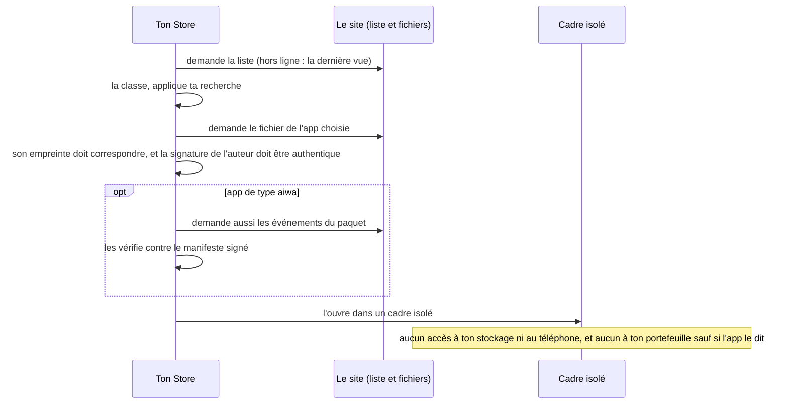

Le cadre est un bac à sable standard du navigateur, avec sa propre identité vide : quoi que fasse l'app, elle **ne peut pas atteindre ton
portefeuille toute seule**, et cela ne dépend pas du bon comportement de l'auteur. Une exception, plus bas : une app qui dit utiliser le portefeuille. Un hébergeur qui sert un autre fichier que celui qui a été signé est
refusé. Une app peut utiliser le réseau, et elle n'est pas relue.

### 6.6 L'application Android autour

Le Store et le portefeuille sont une seule application web dans une WebView Android. Seule la page elle-même peut demander quelques choses
au téléphone, par un seul canal : garder les 12 mots et le jeton GitHub chiffrés avec une clé que le Keystore du téléphone détient,
lancer la connexion d'appareil de GitHub, enregistrer un fichier, ouvrir l'écran de dictée. **Le cadre dans lequel tourne une app n'a pas
ce canal.** La sauvegarde d'Android porte le journal du portefeuille vers un nouveau téléphone ; les secrets sont laissés de côté exprès
(une clé du Keystore ne se déplace pas), donc tu tapes tes 12 mots une fois.

La page elle-même n'est pas figée dans l'appli : l'appli suit le site et met sa page à jour toute seule, sans nouvel APK. Elle ne garde une
nouvelle page que si elle est signée par une clé intégrée à l'appli, et si chaque fichier est exactement celui que la signature liste : un
site détourné, ou un réseau qui réécrit les pages, ne peut donc rien faire exécuter au téléphone. La nouvelle page démarre à la prochaine
ouverture de l'appli.

Le widget de dictée est optionnel : il demande Termux et ta propre connexion à Claude, et rien dans le Store ou le portefeuille n'en a besoin.

---

### 6.7 Une app qui utilise le portefeuille : le duel de clics

Une app peut dire qu'elle utilise ton portefeuille. Le Store affiche alors une bannière, et l'app peut lui demander quelques choses : qui tu es,
payer quelqu'un, recevoir un paiement, montrer ou lire un code. **Click duel** est une app de ce genre : deux téléphones côte à côte, un prix
par clic, 20 secondes de clics. Celui qui a cliqué le moins paie ce qu'il a cliqué.

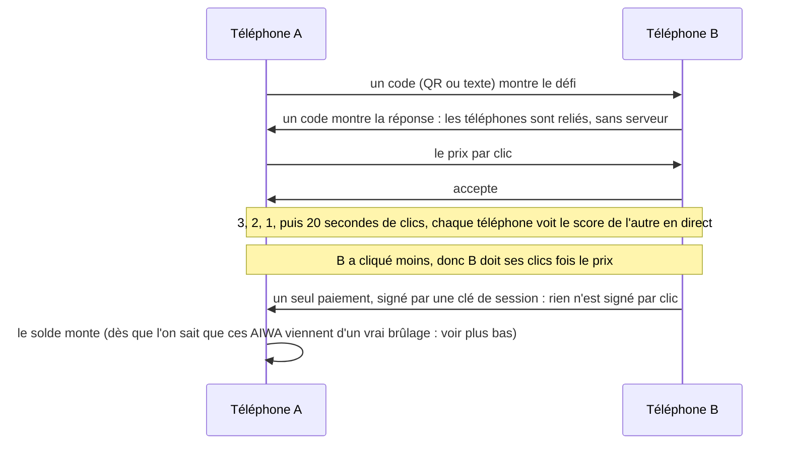

Ce que ça montre : rien n'est signé par clic. Le premier paiement à quelqu'un signe une délégation (section 2.2), et le paiement lui-même est
signé par une clé de session. Le jeu ne touche jamais Solana. Le portefeuille, lui, y va une fois pour tout AIWA qu'il reçoit : il vérifie que le
brûlage d'où il vient est réel (section 3.7), sinon n'importe qui pourrait inventer des AIWA et te payer avec. Sans internet à ce moment-là, le
paiement est reçu et compte dès que le téléphone a été en ligne. Ce que ça ne fait pas, exprès pour l'instant : chaque téléphone compte ses propres clics, donc une app modifiée
peut mentir ; l'argent n'est pas mis de côté avant la course, donc le perdant pourrait le dépenser ailleurs avant ; il n'y a pas de recherche de
joueurs à proximité. Essayé entre deux pages du navigateur d'un ordinateur, pas entre deux vrais téléphones.

## 7. Ce qui est nouveau, et ce qui ne l'est pas

Les briques sont connues : un journal signé et chaîné par hash (comme git ou Secure Scuttlebutt), une preuve de travail séquentiel
(Wesolowski), le brûlage comme coût, les bons verrouillés par hash, les clés de session. Aucune recherche d'antériorité n'a été faite. Ce
qui est inhabituel, c'est la combinaison :

- **Créer de la valeur sans consensus.** Chaque identité crée ses AIWA toute seule, à partir d'un travail vérifiable, avec une seule porte
  extérieure (le brûlage). La plupart des systèmes lient l'émission au consensus ; ici non, ce qui convient aux partitions et au hors ligne.
- **Le travail comme horloge propre à chaque identité.** Cacher ou réordonner une action coûte du calcul.
- **Une preuve que n'importe qui vérifie en millisecondes.** Un registre peut lire le minage de quelqu'un sans lui faire confiance.

## 8. Ce qui n'est pas résolu

- Rien ne prouve que deux identités sont deux personnes.
- Personne n'est payé pour garder les données des autres ; un carnet perdu sans copie est perdu.
- Une double dépense entre des gens qui n'échangent jamais d'événements ne peut pas être empêchée, seulement détectée et résolue de la même
  façon pour tout le monde.
- Il n'y a pas de moyen automatique pour que des inconnus se trouvent.
- Les apps ne sont pas relues, et peuvent utiliser le réseau. Une app qui dit utiliser ton portefeuille peut le dépenser : le Store affiche seulement une bannière.
- Une machine plus rapide gagne des époques plus vite.
- Solana est la seule dépendance extérieure du protocole (GitHub héberge le registre et le site de ce déploiement).

## 9. Ce qui a été vérifié, et ce qui ne l'a pas été

**Vérifié par des tests** (tous exécutés en CI) : le protocole (421 tests, dont un recoupement avec une implémentation Rust indépendante de
ses calculs de base), la couche de distribution (85), l'API du portefeuille (100), le registre (17), l'application web (46, dont 21 dans un
vrai Chromium : classement, bac à sable, falsification, hors ligne, restauration du portefeuille, brûlage avec sa part, publication des deux
types, une app qui utilise le portefeuille, un duel de clics entre deux pages, un QR code lu par une fausse caméra), le backend de dictée (73), les vérifications d'une page signée par l'appli Android (15, sur une JVM ordinaire), et une répétition complète contre un Solana de substitution (`node scripts/devnet-check.mjs --fake`).

**Non vérifié :** un vrai brûlage sur Solana (il faut un portefeuille devnet alimenté) ; l'application Android sur un vrai téléphone (elle
n'est compilée qu'en CI), la connexion d'appareil de GitHub contre le vrai GitHub, la sauvegarde d'Android qui porte le journal ; une vraie
pull request à travers tout le workflow du registre ; le statut juridique de la part du créateur ; les paramètres économiques sur le terrain.

## Pour aller plus loin

[Yellow paper](YELLOWPAPER.md) (le protocole formel, dans le même ordre) · [README](../README.md) · [plan](PLAN.md) · [modèle
économique](BUSINESS.md) · [Android](ANDROID.md).
