# AIWA Yellow Paper

**Causal coordination and local value accrual for partition-tolerant networks**
Version 1.0 · formal specification, with its reference implementation

*Not a specialist? [EXPLAINED.md](EXPLAINED.md) says the same things in plain words, with pictures ([EXPLICATION.md](EXPLICATION.md) en français).*

---

## Contents

| | |
|---|---|
| **Front** | [Abstract](#abstract) · [How to read this document](#how-to-read-this-document) |
| **1** | [Goals and non-goals](#1-goals-and-non-goals) |
| **2** | [The protocol at a glance](#2-the-protocol-at-a-glance) — system model, one picture, the life of a value |
| **I. Foundations** | [3 Identity](#3-identity) · [4 Events and the log](#4-events-and-the-log) · [5 Signed actions](#5-signed-actions) |
| **II. The three pillars** | [6 Progression](#6-progression) · [7 Conservation](#7-conservation) · [8 Mirror](#8-mirror) |
| **III. Creating value** | [9 The genesis commitment](#9-the-genesis-commitment) · [10 Accrual](#10-accrual) · [11 The creator fee](#11-the-creator-fee) · [12 What a third party can read of a domain](#12-what-a-third-party-can-read-of-a-domain) |
| **IV. Agreement without a clock** | [13 Partition, branches and conflicts](#13-partition-branches-and-conflicts) · [14 Bounded storage](#14-bounded-storage) · [15 History recovery](#15-history-recovery) |
| **V. Programs and applications** | [16 Contracts](#16-contracts) · [17 Bundles and sandboxed execution](#17-bundles-and-sandboxed-execution) · [18 The store](#18-the-store) |
| **VI. Informational mechanisms** | [19 Observation: Causal Tick, hardware roots, relative rate](#19-observation-causal-tick-hardware-roots-relative-rate) |
| **VII. Assessment** | [20 Threats and what answers them](#20-threats-and-what-answers-them) · [21 Limits and open problems](#21-limits-and-open-problems) |
| **Appendices** | [A Wire formats](#appendix-a-wire-formats) · [B Parameters](#appendix-b-parameters) · [C Reference implementation](#appendix-c-reference-implementation) · [D Verification status](#appendix-d-verification-status) |

---

## Abstract

AIWA is a primitive for creating and moving value, and for coordinating, in networks with arbitrary delay, intermittent
connectivity and unbounded partition. It separates two things that distributed ledgers conventionally couple:

- **Coordination.** Every participant keeps its own log of signed events; events name their causal parents; nobody needs
  everybody else's log. Participants operate while disconnected, and reconciliation is deferred, not required.
- **Accrual.** Value is created locally and unconditionally by a domain, gated once by an external commitment (an
  irreversible burn on Solana, §9) and thereafter driven by real sequential computation (§6), never by a shared clock.

Three mechanisms, each answering one question, carry the whole design:

| Pillar | Question it answers | Section |
|---|---|---|
| **Progression** | How does a domain show that time (work) has passed, without a clock? | §6 |
| **Conservation** | Who owns what, and how is it moved without being spent twice? | §7 |
| **Mirror** | What has a domain seen of the others, verifiably? | §8 |

No component requires a globally synchronized state, a consensus quorum or a trusted server. The one external dependency is
the burn that opens accrual (§9); once it is made, a domain works offline.

## How to read this document

Each mechanism is specified in the same order: **what it is**, **the rules**, **what it guarantees**, **what it does not
guarantee**. The last two are never omitted. Claims are checked against the reference implementation (`packages/`); where
something is only designed or only experimental, the text says so, and the legend below marks it.

| Mark | Meaning |
|---|---|
| *(none)* | specified, implemented and tested |
| **[experimental]** | implemented and tested, but not part of what a deployment relies on |
| **[not built]** | designed or discussed only |

**Notation.** $D$ is a domain; $e$ an event; $\mathrm{id}(\cdot)$ a content hash; $b$ committed capital; $q$ the epochs since a
domain's last action; $q_{\text{tot}}$ its total epochs; $T$ the patience rate; $E$ the work of one epoch; $\mathrm{prev}$ the
mining event another follows. $\mathrm{SHA}$ is SHA-256 throughout; hex strings are lowercase. Amounts of AIWA are integers of
$10^{-18}$ AIWA; amounts of SOL are lamports ($10^{-9}$ SOL).

---

## 1. Goals and non-goals

**Goals.**

1. *Local issuance.* A domain creates value on its own, offline, from verifiable work, with one external gate.
2. *Verifiable by anyone, cheaply.* A third party that holds a domain's events can derive its state, and check the work it
   claims, in milliseconds per event, without trusting the domain.
3. *No double spending that survives reconciliation.* Value is never duplicated in any reader's view, and all readers that
   hold the same events agree on the outcome of a conflict.
4. *Partition tolerance.* Nothing waits for a quorum, a clock or a server.
5. *Applications on top, with no new protocol.* Contracts, published applications and a store are compositions of the above.

**Non-goals** (stated early because they are the usual objections; §21 returns to them).

- *Real-time prevention of a double spend between parties who never exchange events.* The protocol detects and resolves it
  once histories meet (§13); it cannot prevent it while they stay apart.
- *Proof that two identities are two people.* Identity is a key.
- *Durability of data nobody chooses to keep.* Nothing pays anyone to store (§21).
- *A market price for AIWA.* The protocol creates and moves AIWA; what it is worth is not specified, and nothing here
  implies it is worth anything.

---

## 2. The protocol at a glance

### 2.1 System model

A **domain** is an operational environment holding one identity (a keypair) and local state. Domains exchange information
over links that may be continuous, intermittent, delayed, asymmetric or absent, for any duration.

| | |
|---|---|
| **Assumed** | collision-resistant hashing; EUF-CMA-secure signatures (Ed25519); deterministic serialization; the sequential nature of repeated squaring in a group of unknown order (§6.3) |
| **Not assumed** | a synchronized wall clock; continuous access to any external chain; a global consensus quorum; a globally replicated state; honest majorities |

### 2.2 The whole protocol on one page

<!-- diagram: yellowpaper-01-6e5a5044.png -->
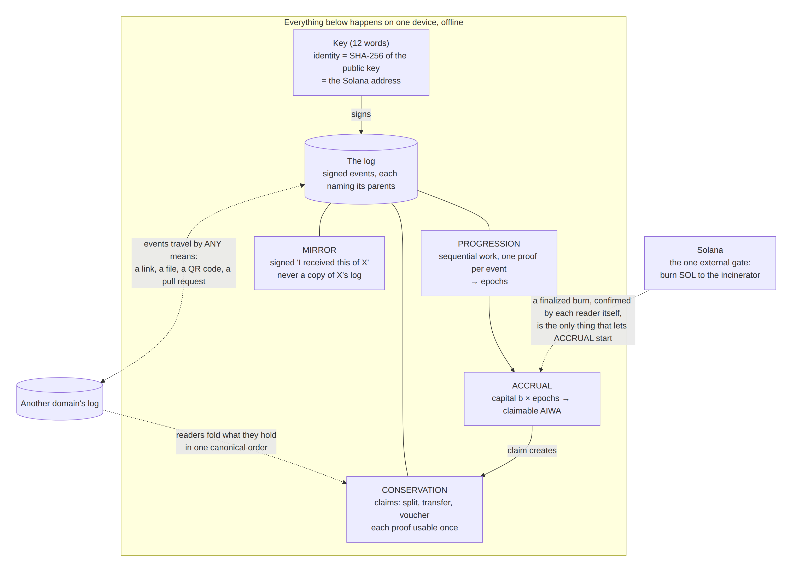

<details>
<summary>The source of this diagram (Mermaid)</summary>

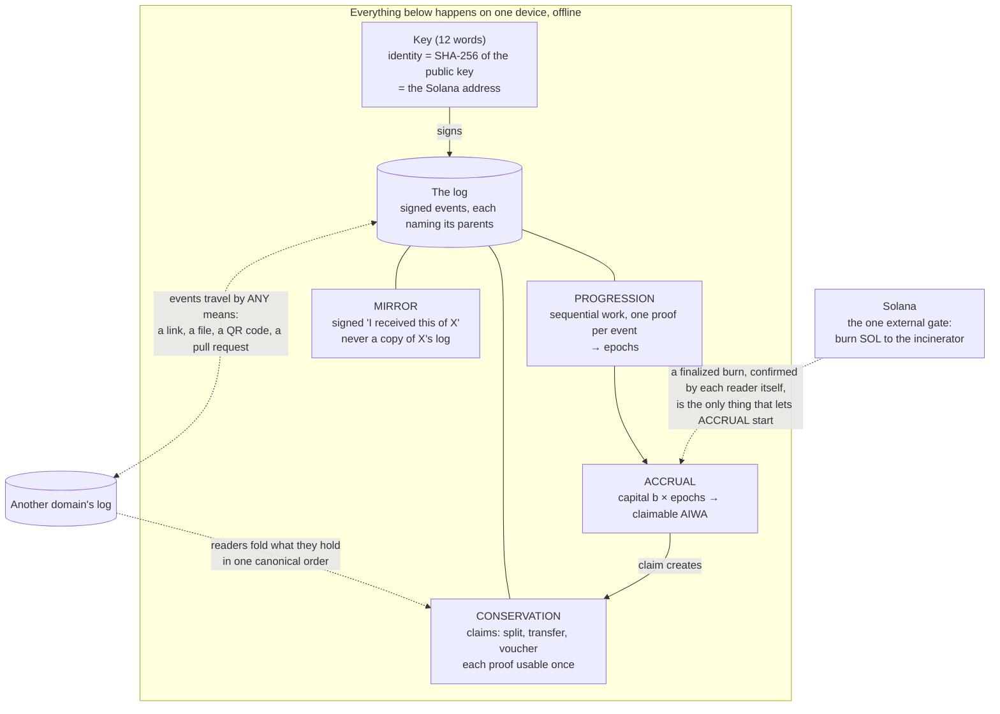
```mermaid
flowchart TB
  subgraph local["Everything below happens on one device, offline"]
    KEY["Key (12 words)<br/>identity = SHA-256 of the public key<br/>= the Solana address"]
    LOG[("The log<br/>signed events, each naming its parents")]
    KEY -- "signs" --> LOG
    PROG["PROGRESSION<br/>sequential work, one proof per event<br/>→ epochs"]
    CONS["CONSERVATION<br/>claims: split, transfer, voucher<br/>each proof usable once"]
    MIR["MIRROR<br/>signed 'I received this of X'<br/>never a copy of X's log"]
    ACC["ACCRUAL<br/>capital b × epochs → claimable AIWA"]
    LOG --- PROG
    LOG --- CONS
    LOG --- MIR
    PROG --> ACC
    ACC -- "claim creates" --> CONS
  end

  SOL["Solana<br/>the one external gate:<br/>burn SOL to the incinerator"]
  SOL -. "a finalized burn, confirmed by each reader itself,<br/>is the only thing that lets ACCRUAL start" .-> ACC

  OTHER[("Another domain's log")]
  LOG <-. "events travel by ANY means:<br/>a link, a file, a QR code, a pull request" .-> OTHER
  OTHER -. "readers fold what they hold<br/>in one canonical order" .-> CONS
```

</details>
<!-- /diagram -->

Reading the picture: a domain's key signs events; the events are one log. Three mechanisms read that log. *Progression*
turns work into epochs; *accrual* turns capital (a burn) and epochs into claimable AIWA; *conservation* says who owns each
claim; *mirror* records what a domain has received from others. Events reach other domains by any transport, and each
reader folds what it holds in one canonical order (§13.4) so that readers with the same events agree.

### 2.3 The life of a value

<!-- diagram: yellowpaper-02-8ab20ea2.png -->
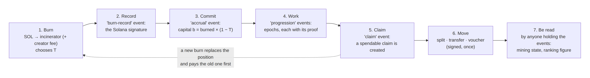

<details>
<summary>The source of this diagram (Mermaid)</summary>

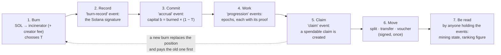
```mermaid
flowchart LR
  A["1. Burn<br/>SOL → incinerator (+ creator fee)<br/>chooses T"] --> B["2. Record<br/>'burn-record' event:<br/>the Solana signature"]
  B --> C["3. Commit<br/>'accrual' event:<br/>capital b = burned × (1 − T)"]
  C --> D["4. Work<br/>'progression' events:<br/>epochs, each with its proof"]
  D --> E["5. Claim<br/>'claim' event:<br/>a spendable claim is created"]
  E --> F["6. Move<br/>split · transfer · voucher<br/>(signed, once)"]
  F --> G["7. Be read<br/>by anyone holding the events:<br/>mining state, ranking figure"]
  E -. "a new burn replaces the position<br/>and pays the old one first" .-> A
```

</details>
<!-- /diagram -->

Steps 1–3 need the network once (to burn and to confirm the burn). Steps 4–6 are local. Step 7 is what applications such
as the store build on (§12, §18).

---

# Part I — Foundations

## 3. Identity

$$\mathrm{domain}(D) = \mathrm{SHA}(\mathrm{pk}_D)$$

The full 256-bit digest, hex-encoded. The private key authorizes every state transition; nothing else (device, address,
location) is part of identity. In the reference implementation the same Ed25519 key is also the domain's **Solana address**
(base58 of the public key), so the wallet that burns and the identity that mines are one credential, derived from one BIP39
recovery phrase (§15).

*Guarantees.* Only the holder of the key can sign for the domain. *Does not guarantee.* That a key is one person, or that two
keys are two (§21).

## 4. Events and the log

### 4.1 The event

A state transition is a signed event that names the events it depends on.

$$e = \big(\mathrm{domain},\ \mathrm{author},\ \mathrm{authorPublicKey},\ \mathrm{parents},\ \mathrm{type},\ \mathrm{payload},\ \mathrm{createdAt},\ \mathrm{signature}\big)$$

$$\mathrm{id}(e) = \mathrm{SHA}\Big(\mathrm{JSON}\big(\{\mathrm{domain}, \mathrm{author}, \mathrm{authorPublicKey}, \mathrm{sort}(\mathrm{parents}), \mathrm{type}, \mathrm{canon}(\mathrm{payload}), \mathrm{createdAt}\}\big)\Big)$$

$\mathrm{canon}(v)$ is defined recursively: an array is mapped element-wise, order preserved; an object has its keys sorted
lexicographically and $\mathrm{canon}$ applied to each value; anything else is unchanged. The **signature covers the same
bytes as the id**: the event is signed by the key whose hash is `author`.

`domain` here is the *log domain* (the namespace of a log); `author` is the signer's identity (§3).

### 4.2 Verification

A verifier accepts an event only if all three hold:

1. $\mathrm{SHA}(\mathrm{authorPublicKey}) = \mathrm{author}$ (the embedded key really is the claimed author's);
2. the recomputed id equals the event's id (the content is unchanged);
3. the signature verifies against `authorPublicKey`.

The type is inside the hashed and signed bytes: an envelope that covered only parents and payload would leave `type`
outside content-addressing, which is a forgery class (a payload signed for one type, replayed as another).

### 4.3 Parents, and what a log is

`parents` encode **causal dependency**, never time: $B$ lists $A$ among its parents because $B$ depends on $A$. A timestamp
would only encode arrival order. The events of a log therefore form a directed acyclic graph, and changing any past event
changes its id and breaks every event that cites it.

<!-- diagram: yellowpaper-03-d0dcb563.png -->
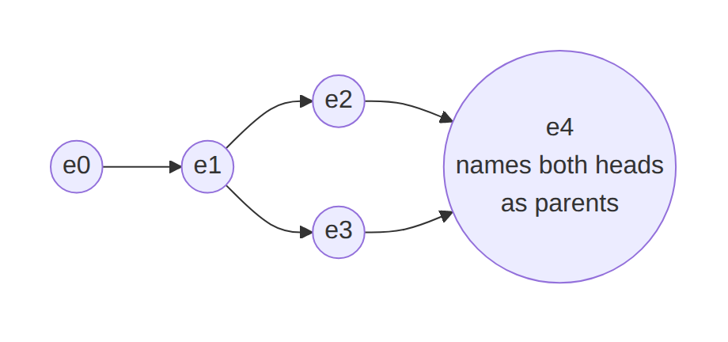

<details>
<summary>The source of this diagram (Mermaid)</summary>

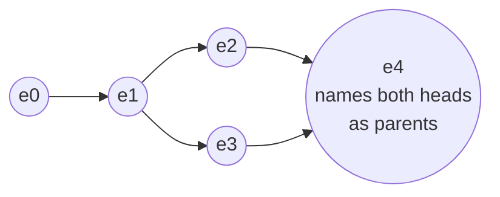
```mermaid
flowchart LR
  e0(("e0")) --> e1(("e1")) --> e2(("e2"))
  e1 --> e3(("e3"))
  e2 --> m(("e4<br/>names both heads<br/>as parents"))
  e3 --> m
```

</details>
<!-- /diagram -->

$e_2$ and $e_3$ do not know of each other: two **branches**, which is ordinary (two things happening on two devices). They
meet again when a later event cites both. A log's **heads** are its events no other event cites.

A participant need not hold every event: only what concerns its own state and its observed relationships. A log can also
be pruned against a checkpoint (§14).

### 4.4 The envelope's author is not what reducers see

A *reducer* (the function that folds events into state) never receives `author`: it is handed only `{id, parents,
payload}` with the payload's `type`. So anything a reducer must attribute to a real signer has to be a **separate signature
inside the payload**, checked by the reducer itself, never inferred from the envelope. That is the reason for §5.

## 5. Signed actions

Every action that changes a domain's economic state carries its own signature in its payload:

$$\mathrm{payload} = \big(\text{fields},\ \mathrm{nonce},\ \mathrm{timestamp},\ \mathrm{signerPubkey},\ \mathrm{signature}\big)$$

where $\mathrm{signature} = \mathrm{Sign}\big(\mathrm{JSON}(\text{an ordered, fixed list of the action's fields})\big)$ and the field list is fixed per
action type (Appendix A.2 gives every list; a field that is undefined is left out of the JSON). A reducer accepts an action only if

1. $\mathrm{SHA}(\mathrm{signerPubkey}) = $ the identity named as the action's **owner** (the `from` of a transfer, the
   `owner` of a split, the `domain` of an accrual, claim or progression, the `to` of a voucher redemption), and
2. the signature verifies, and
3. the `nonce` has not been used (every action except a progression, which is single-use by construction: its epochs must
   go past the ones already accepted, §6.1).

<!-- diagram: yellowpaper-04-d05eceb8.png -->
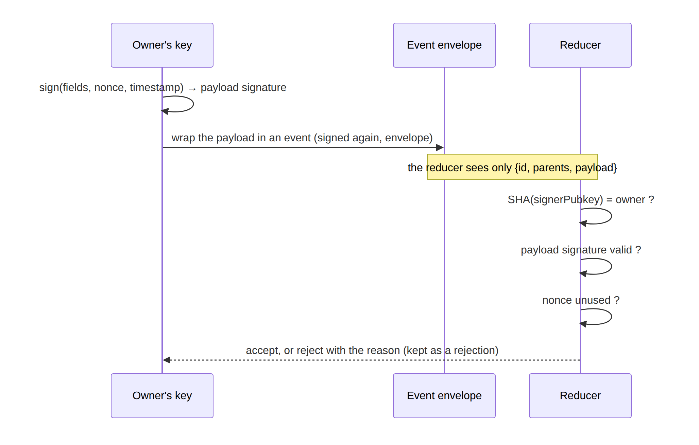

<details>
<summary>The source of this diagram (Mermaid)</summary>

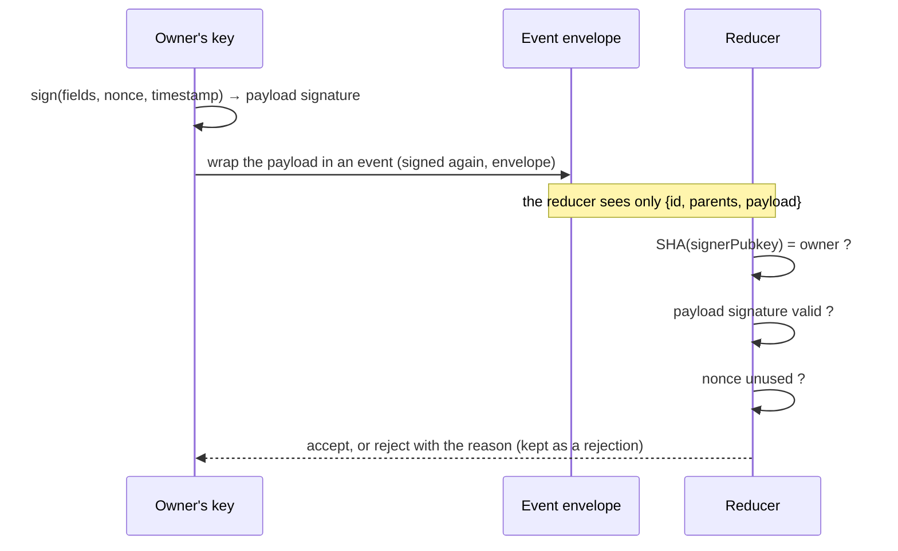
```mermaid
sequenceDiagram
  participant K as Owner's key
  participant E as Event envelope
  participant R as Reducer
  K->>K: sign(fields, nonce, timestamp) → payload signature
  K->>E: wrap the payload in an event (signed again, envelope)
  Note over E,R: the reducer sees only {id, parents, payload}
  R->>R: SHA(signerPubkey) = owner ?
  R->>R: payload signature valid ?
  R->>R: nonce unused ?
  R-->>K: accept, or reject with the reason (kept as a rejection)
```

</details>
<!-- /diagram -->

**Delegation.** The owner may sign **once** a statement authorising another key, $\mathrm{Sign}_{\text{owner}}(\{\mathrm{delegate},
\mathrm{from}\})$ (no amount, no expiry, by design: §7.5). An action signed by the delegate then carries that statement and a
`delegate` field in its own signed list; a reducer checks **two** signatures, the owner's over the delegation and the
delegate's over this very action, plus that the owner's key derives the owner identity and that the signer is exactly the
delegated key.

*Guarantees.* A real signature by the owner is required for each action (or for one delegation); an action cannot be
replayed (nonce) or redirected (every destination is in the signed list). *Does not guarantee.* Anything about who held the
key (a stolen key signs validly).

The same scheme, for the actions of a contract defined by an application, is `signedAction` (§16.2).


---

# Part II — The three pillars

## 6. Progression

**What it is.** The mechanism by which a domain shows, without a clock, that time has passed: it performs a sequential
computation that cannot be sped up by adding machines, and each unit of work (an **epoch**) comes with a proof anyone can
check cheaply. Progression is **local**: $\mathrm{epoch}_A$ and $\mathrm{epoch}_B$ are never directly comparable, and a faster
machine simply makes more epochs per second.

### 6.1 The rule

$$\mathrm{epoch}_D \leftarrow \mathrm{epoch}_D + k,\qquad k \ge 1$$

A `progression` event is accepted only if all of these hold:

- it is **signed by the key of $D$** (§5): a progression event is a signed action like any other;
- it is **chained** to $D$'s last accepted mining event (§6.5);
- it carries a **valid proof of sequential work** for exactly $k$ epochs (§6.2–6.4).

A deployment that sets `rewardParams.epochIterations` $= E$ fixes the work of one epoch; an event may carry $k$ epochs at
once, with exactly $kE$ iterations and one proof. A deployment that does not set $E$ accepts the iteration count the signer
wrote ($\ge 1$): an epoch could then cost one hash, and $D$'s age could be inflated for nothing, which is why a real
deployment sets it. The reference deployment sets $E = 10^5$ squarings.

**Why the signature is required.** The proof is a public, deterministic function of $(\mathrm{domain}, \mathrm{output}_{n-1})$,
both visible to anyone who watches the log. Without a signature, anyone could compute $D$'s next epoch and publish it for
$D$. That is not a theft, but it is a free griefing attack: $D$'s total age $q_{\text{tot}}$ sits in the denominator of the
accrual formula (§10) and never resets, so a third party can lower every future reward of $D$ at no cost to itself (for
$b{=}100$, $q{=}1$, $T{=}0$ the reward falls from about $0.087$ at $q_{\text{tot}}{=}1$ to about $0.0097$ at
$q_{\text{tot}}{=}20000$).

**Automatic in the reference wallet.** The wallet advances progression on a timer for as long as it is open (default: one
epoch every 30 s). A domain that never advances stays at epoch 0 and accrues nothing, however much wall-clock time passes.

### 6.2 The sequential proof (symmetric form)

$$h_0 = \mathrm{SHA}(\mathrm{seed}),\qquad h_i = \mathrm{SHA}(h_{i-1}),\qquad \mathrm{seed} = (\mathrm{domain}, \mathrm{output}_{n-1})$$

A hash chain of $\mathrm{iterations}$ genuinely dependent steps: no hardware lets a later step be computed before an earlier
one. It is **symmetric**: verifying costs what producing cost (5.6 s to verify one $10^5$-step epoch, measured). It is kept for
deployments that do not set $E$. How much *real time* the steps take is not unconditional: SHA-256 benchmarks differ by about
2–4× between hardware with and without SHA acceleration.

**Locality.** The computation of $h_i$ happens on one device at a time, never distributed, never assisted by another domain.
Identity is the keypair; the computing device may change without a discontinuity in $\mathrm{epoch}_D$.

### 6.3 Asymmetric verification (Wesolowski)

Over $\mathbb{Z}_N^*$, with $N$ the published 2048-bit RSA challenge modulus (factorization unknown):

$$y = x^{2^{T}} \bmod N,\qquad \ell = \mathrm{HashToPrime}(x, T, y),\qquad \pi = x^{\lfloor 2^{T}/\ell \rfloor} \bmod N$$

$$r = 2^{T} \bmod \ell,\qquad \text{verify: } \pi^{\ell}\cdot x^{r} \overset{?}{=} y \pmod N$$

($T$ here is the squaring count, not the patience rate.) Producing costs about $2T$ modular multiplications; verifying
costs $O(\log T)$. $\ell$ is derived from $(x, T, y)$, never accepted from the prover; $y$, $\pi$ and $\ell$ are canonical
(one representation per value: $y$ and $y+N$ would otherwise both verify).

### 6.4 Succinct progression

With $E$ set, a progression event carries $(\mathrm{epoch},\ \texttt{vdfIterations} = kE,\ \texttt{vdfOutput} = y,\ \texttt{vdfProof} = (\pi, \ell))$ and the reducer
checks the Wesolowski proof instead of recomputing a chain. The work starts from

$$x = H(\mathrm{domain}\ \|\ \mathrm{output}_{n-1}\ \|\ \mathrm{prev}) \bmod N$$

so it cannot be done ahead of time, borrowed from another domain, or reused. Measured: verifying takes about 3.6 ms whether
the event holds $10^5$ or $4\cdot10^5$ squarings, against 0.5 s and 2.8 s to produce. A third party (a validator, a
registry) can therefore check a domain's age and its time since its last action at a cost of milliseconds per event, not
the work the domain did. The cost it does pay is storage: about 1.7 KB per proof, so the history that proves an age grows
with the number of **events**, not of epochs ($k$ epochs fit in one event).

### 6.5 The mining events are one signed chain

In a deployment that sets $E$, every `progression`, `accrual` and `claim` of $D$ (the *mining events*) names in its signed
payload the mining event it follows, $\mathrm{prev}$ (an id, or none before the first), and a progression's work starts from
a seed that includes $\mathrm{prev}$ (§6.4).

<!-- diagram: yellowpaper-05-a71bb528.png -->
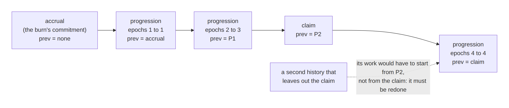

<details>
<summary>The source of this diagram (Mermaid)</summary>

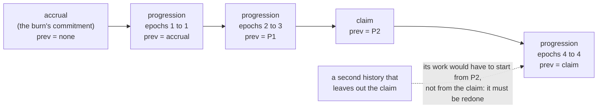
```mermaid
flowchart LR
  A["accrual<br/>(the burn's commitment)<br/>prev = none"] --> P1["progression<br/>epochs 1 to 1<br/>prev = accrual"]
  P1 --> P2["progression<br/>epochs 2 to 3<br/>prev = P1"]
  P2 --> C["claim<br/>prev = P2"]
  C --> P3["progression<br/>epochs 4 to 4<br/>prev = claim"]
  X["a second history that<br/>leaves out the claim"] -. "its work would have to start from P2,<br/>not from the claim: it must be redone" .-> P3
```

</details>
<!-- /diagram -->

Consequences:

- **An action cannot be left out.** The epochs worked after an action are bound to it and are refused without it.
- **Proven work cannot be re-signed over another history.** Showing a history that lacks an action means redoing, from that
  action on, all the work the other history holds.
- **An action cannot be placed earlier than it was made.** (Previously, which of two concurrent events a reader folded first
  decided its epoch.)

The link is a **signed field**, not the event's `parents` (those are the log's heads at the time: a checkpoint, a reception
commitment, which pruning later removes).

*Does not guarantee.* That no other history exists. A domain can keep two, redoing the work, and show one. That is what
**witnesses** answer (§12.4): anyone who holds an event $D$ signed can show it, and a reader that keeps it can require $D$'s
next history to contain it. Without any witness the chain alone is the protection, and its price is the work. A snapshot is
also not "the current state": an action made after the last epoch shown, and followed by none, can be left out; closing that
needs a clock (for example the head of the log anchored on Solana **[not built]**).

---

## 7. Conservation

**What it is.** The mechanism by which value has one owner at a time and cannot be spent twice. A **claim** is a unit of AIWA
owned by one key.

### 7.1 Claims

$$\mathrm{claim} = (\mathrm{id},\ \mathrm{kind},\ \mathrm{amount},\ \mathrm{owner},\ \mathrm{status}),\qquad \mathrm{status} \in \{\texttt{active}, \texttt{deactivated}, \texttt{consumed}\}$$

Amounts are integers of $10^{-18}$ AIWA. A claim is created by an accrual (the automatic payment of the previous position,
§10.1) or by a `claim` event (§10.3); it is never created from nothing elsewhere. `owner`, `from` and `to` are **opaque
strings**: nothing in the ledger requires them to be identities. Ownership is proven entirely by the signature check of the
action that moves a claim, never by a property of the string. §7.4 uses exactly this.

### 7.2 Split

$C \to (C_1, C_2)$ with $\mathrm{amount}(C_1) + \mathrm{amount}(C_2) = \mathrm{amount}(C)$ by construction, both parts owned
by the owner of $C$, $C$ deactivated. Signed by the owner (or a delegate, §7.5). The new ids must be fresh and distinct.

### 7.3 Transfer

A transfer is five steps, each a precondition of the next:

<!-- diagram: yellowpaper-06-bc60e86c.png -->
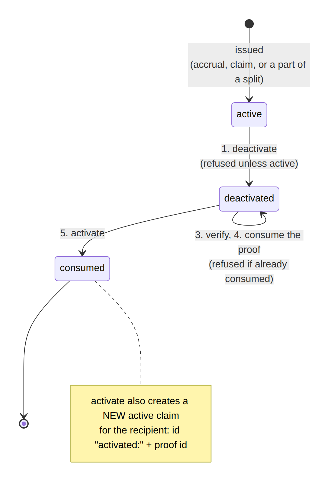

<details>
<summary>The source of this diagram (Mermaid)</summary>

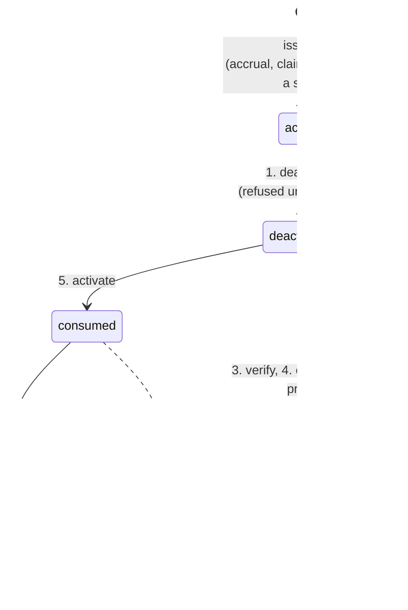
```mermaid
stateDiagram-v2
  [*] --> active: issued<br/>(accrual, claim, or a part of a split)
  active --> deactivated: 1. deactivate<br/>(refused unless active)
  deactivated --> deactivated: 2. prove: the owner's signature<br/>over (claim, from, to, nonce)
  deactivated --> deactivated: 3. verify, 4. consume the proof<br/>(refused if already consumed)
  deactivated --> consumed: 5. activate
  consumed --> [*]
  note right of consumed
    activate also creates a NEW active claim
    for the recipient: id "activated:" + proof id
  end note
```

</details>
<!-- /diagram -->

The proof id is deterministic, $\mathrm{claimId}{:}\mathrm{from}{:}\mathrm{to}{:}n{:}\mathrm{derivation}$, and the set of consumed
proofs is idempotent: a second attempt at the same proof is rejected, and `deactivate` refuses a claim that is not `active`.
The value is moved, never copied; the new claim keeps the amount.

*Guarantees.* In any reader's view a claim has at most one owner at a time, and each proof is consumed at most once.
*Does not guarantee.* That two readers who hold different events agree; §13 handles reconciliation.

### 7.4 Bearer vouchers — a withdrawal QR

For the case neither a transfer nor a delegation covers: **the recipient is not known until redemption.** A classic
hash-lock (the idea of a Lightning HTLC).

$$\mathrm{voucherAddress} = \texttt{voucher:}\,\mathrm{SHA}(\mathrm{secret})$$

<!-- diagram: yellowpaper-07-c9bf21a1.png -->
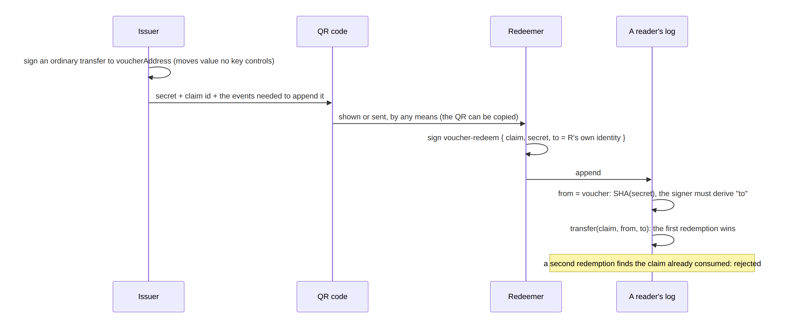

<details>
<summary>The source of this diagram (Mermaid)</summary>

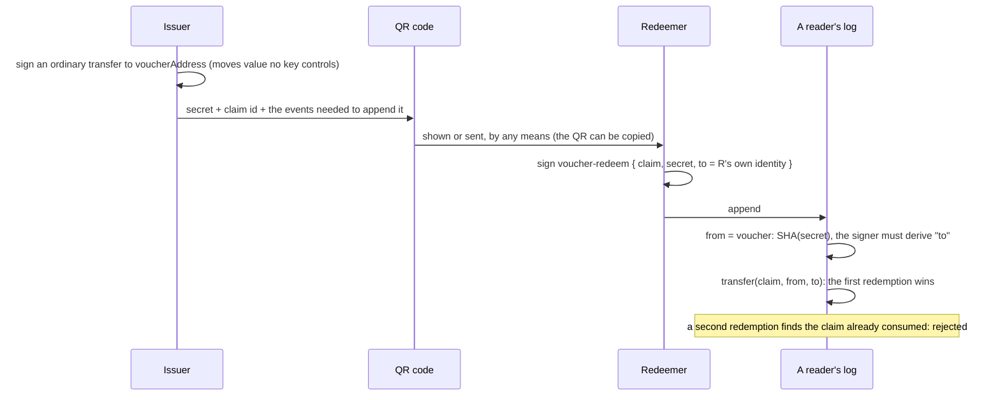
```mermaid
sequenceDiagram
  participant I as Issuer
  participant Q as QR code
  participant R as Redeemer
  participant L as A reader's log
  I->>I: sign an ordinary transfer to voucherAddress (moves value no key controls)
  I->>Q: secret + claim id + the events needed to append it
  Q->>R: shown or sent, by any means (the QR can be copied)
  R->>R: sign voucher-redeem { claim, secret, to = R's own identity }
  R->>L: append
  L->>L: from = voucher: SHA(secret), the signer must derive "to"
  L->>L: transfer(claim, from, to): the first redemption wins
  Note over L: a second redemption finds the claim already consumed: rejected
```

</details>
<!-- /diagram -->

Redemption is signed by the identity the value is to land in, and a reader checks (a) the redeemer's key derives `to` (a
secret revealed by someone who does not control the claimed destination must not move value there) and (b) the transfer
itself, with $\mathrm{from}$ recomputed from the secret. A wrong secret fails because the claim is not owned by that address.
"The QR can be copied but only the first redemption succeeds" needs **no new double-spend rule**: it is the conservation
invariant, unchanged.

*Does not guarantee.* Real-time prevention. Two people offline can each redeem the same voucher and each believe they
succeeded until their logs meet; then every reader agrees on one winner (§13.4: the smaller event id, arbitrary).

### 7.5 Delegation — "sign once, click many times"

The owner signs one delegation (§5) authorising a session key; the delegate then signs each transfer, split, voucher
redemption or claim for the owner, with no further use of the owner's root key.

<!-- diagram: yellowpaper-08-1132d3e0.png -->
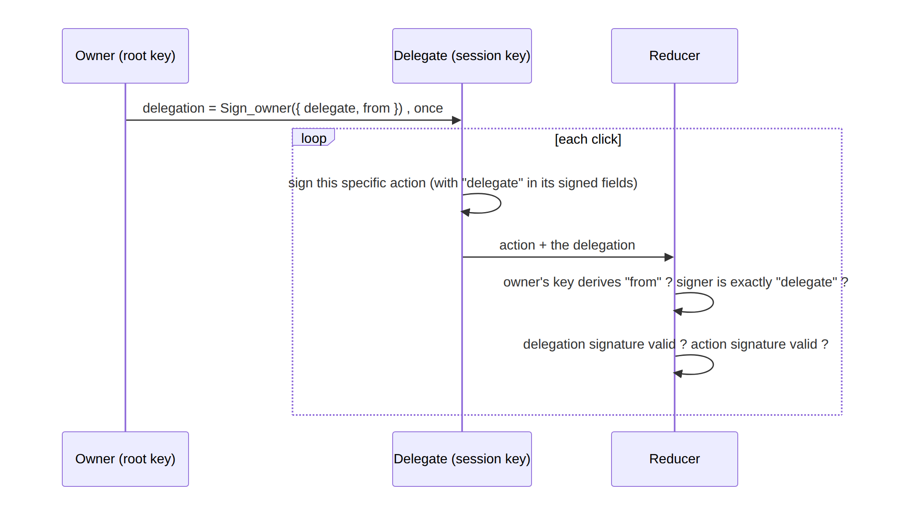

<details>
<summary>The source of this diagram (Mermaid)</summary>

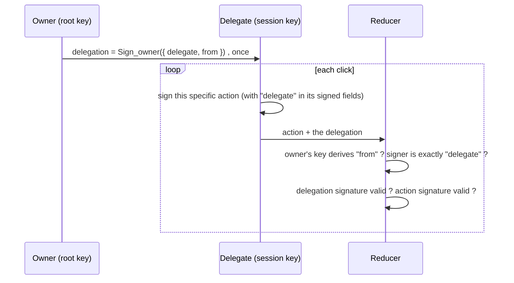
```mermaid
sequenceDiagram
  participant O as Owner (root key)
  participant D as Delegate (session key)
  participant R as Reducer
  O->>D: delegation = Sign_owner({ delegate, from }) , once
  loop each click
    D->>D: sign this specific action (with "delegate" in its signed fields)
    D->>R: action + the delegation
    R->>R: owner's key derives "from" ?  signer is exactly "delegate" ?
    R->>R: delegation signature valid ?  action signature valid ?
  end
```

</details>
<!-- /diagram -->

- **No pre-funding, no escrow.** Issuing a delegation moves nothing. The delegate only authorises moving what the owner
  already owns at click time; a compromised session key threatens only what the owner holds, for that counterparty, as the
  root key already could.
- **A channel is self-sufficient once open, for any amount, including splitting** (the same delegation authorises transfers
  and splits). The reference wallet derives the session key deterministically, $\mathrm{HMAC\text{-}SHA256}(\mathrm{rootSecret},
  \text{"aiwa-lib-channel-session-v1:"}\,\|\,\mathrm{peerId})$, so it is recoverable after a crash and unique per peer.
  Verified: clearing the root key from memory does not stop an open channel from sending, splitting or reporting a balance.
- **Consent of the peer.** A unilateral channel (`openChannel`) needs no one's agreement. A *requested* channel
  (`requestChannel` → `acceptChannelRequest` → `confirm`) travels as blobs over any medium, the peer answers with a signed
  acceptance bound to that request and to its own identity, and the requester's channel refuses every action until the
  acceptance verifies.
- **Limit, by design.** No amount cap, no expiry, no revocation. A deployment that wants any of them layers it into a
  contract verifier (§16.1) instead of imposing it on every caller.

---

## 8. Mirror

**What it is.** A domain's own **signed, per-epoch commitment to what it has received of other domains**: never a copy of their
state, only a statement, by the observer, that it received specific events.

$$\mathrm{reception} = \big(\mathrm{domain}=D,\ \mathrm{epoch}=n,\ \mathrm{kind}\in\{\texttt{empty},\texttt{full}\},\ \mathrm{receivedFrom}=[(X, \mathrm{eventId}),\dots],\ \mathrm{signature}\big)$$

`epoch` is $D$'s own commitment sequence number (never the observed domain's epoch); `kind = empty` requires an empty list,
`full` a non-empty one.

<!-- diagram: yellowpaper-09-eaa034ac.png -->
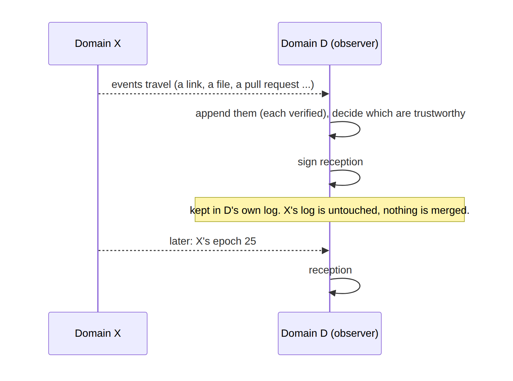

<details>
<summary>The source of this diagram (Mermaid)</summary>

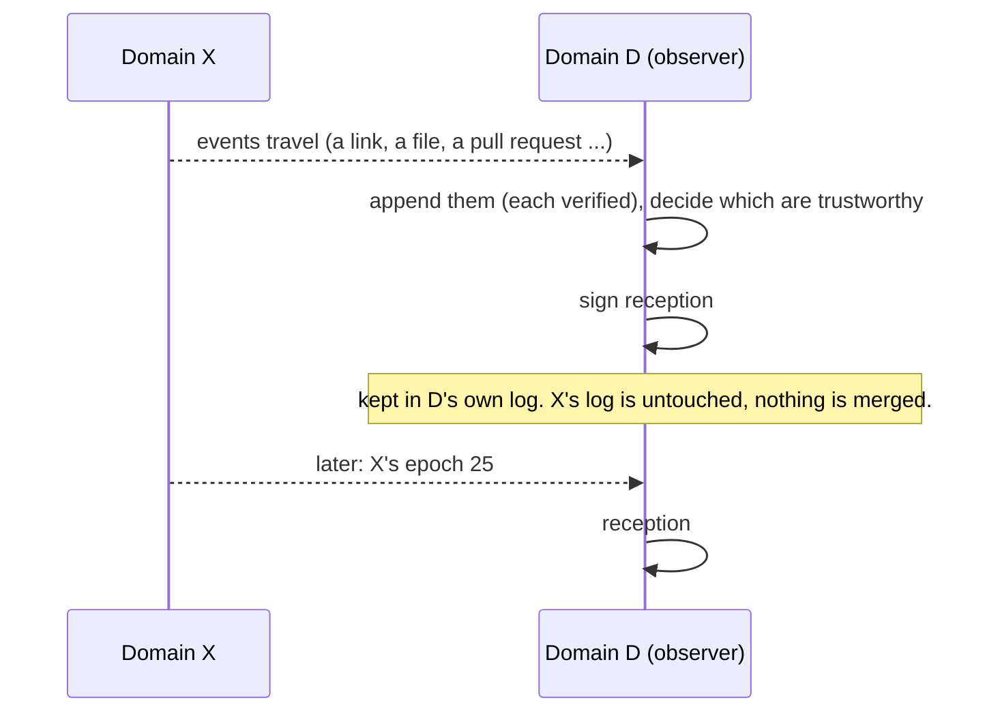
```mermaid
sequenceDiagram
  participant X as Domain X
  participant D as Domain D (observer)
  X-->>D: events travel (a link, a file, a pull request ...)
  D->>D: append them (each verified), decide which are trustworthy
  D->>D: sign reception #n: "I received X's event e, epoch 20"
  Note over D: kept in D's own log. X's log is untouched, nothing is merged.
  X-->>D: later: X's epoch 25
  D->>D: reception #n+1: must name an epoch ≥ 20 for X (monotonicity)
```

</details>
<!-- /diagram -->

**Rules.** A reception is rejected unless its signature derives $D$, every cited event really exists (and is attributed to the
source domain it names: `does not correspond to a real event there`), and **reception monotonicity** holds: for successive
commitments, $\mathrm{seen}_D(X, e_{i+1}) \ge \mathrm{seen}_D(X, e_i)$. A claim of having seen less than before is refused.
The epoch of a cited event is recomputed from the event graph, never self-declared.

**What it is for.** (1) A mandatory recurring cost: a signed commitment at each epoch, even an empty one, makes keeping an
identity an ongoing act rather than a one-time registration. (2) Evidence about structure: witnesses to a domain's
progress (§12.4, §19). The reference wallet signs receptions **automatically** when events of other domains arrive (a sync, an
offline bundle) and it trusts only events it can check: a foreign progression is cited at the highest epoch the domain's own
chain accepts, or, if the log lacks that domain's history from epoch 1, the highest whose signature is genuine.

**What it does not do.** It does not establish that two domains are distinct actors, and does not rule out a coalition
fabricating a consistent history together at real cost. It is evidence about the *structure of observed history*, not an
identity oracle. A helper computes the entropy of a domain's reappearances across the domains it observes
(`computeResidualDiversity`): a signal, never a verdict (a small honest group scores low too).


---

# Part III — Creating value

Part II gave a domain a clock (progression), ownership (conservation) and a memory of others (mirror). None of the three
creates value. This part does: a **burn** (§9) lets a domain commit capital; **accrual** (§10) turns that capital and the
epochs worked into claimable AIWA; a small **creator fee** (§11) rides on the burn; and any third party can **read** what a
domain has earned without trusting it (§12).

<!-- diagram: yellowpaper-10-9bbb8c17.png -->
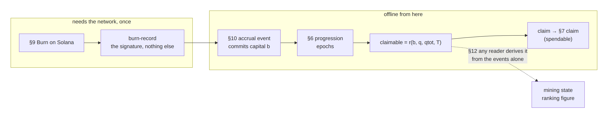

<details>
<summary>The source of this diagram (Mermaid)</summary>

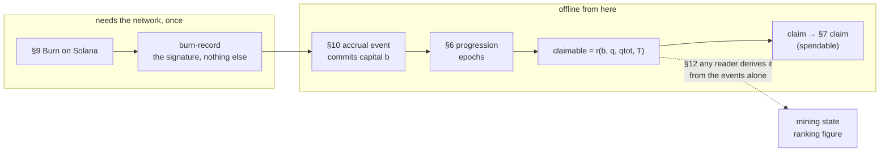
```mermaid
flowchart LR
  subgraph net["needs the network, once"]
    B["§9 Burn on Solana"] --> R["burn-record<br/>the signature, nothing else"]
  end
  subgraph off["offline from here"]
    R --> A["§10 accrual event<br/>commits capital b"]
    A --> W["§6 progression<br/>epochs"]
    W --> Q["claimable = r(b, q, qtot, T)"]
    Q --> C["claim → §7 claim<br/>(spendable)"]
  end
  Q -. "§12 any reader derives it<br/>from the events alone" .-> X["mining state<br/>ranking figure"]
```

</details>
<!-- /diagram -->

---

## 9. The genesis commitment

**What it is.** The one external gate of the protocol: an irreversible burn of SOL on Solana. It is the entry price of
**accrual** and of nothing else. An identity, its log, progression, mirror, receiving and moving claims, contracts and
applications need no burn; the reducers check none there. A domain that never burned simply has nothing to claim (`no committed
capital for this domain`).

**Why a cost at all.** $r$ is linear in capital $b$ (§10). Without a price per identity, splitting capital over a thousand
identities would earn the same as one, and making identities would be free. A burn is a price that is irreversible,
verifiable by anyone, and set by something the protocol does not control.

### 9.1 The path of a burn

<!-- diagram: yellowpaper-11-4927da26.png -->
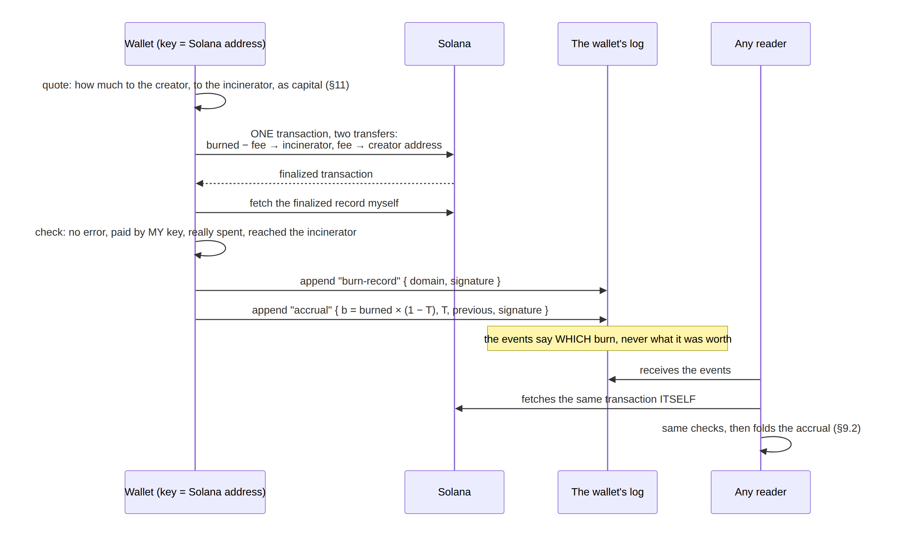

<details>
<summary>The source of this diagram (Mermaid)</summary>

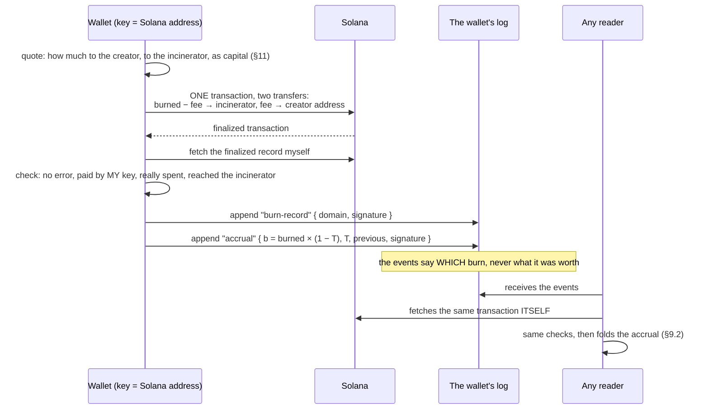
```mermaid
sequenceDiagram
  participant W as Wallet (key = Solana address)
  participant S as Solana
  participant L as The wallet's log
  participant R as Any reader
  W->>W: quote: how much to the creator, to the incinerator, as capital (§11)
  W->>S: ONE transaction, two transfers:<br/>burned − fee → incinerator,  fee → creator address
  S-->>W: finalized transaction
  W->>S: fetch the finalized record myself
  W->>W: check: no error, paid by MY key, really spent, reached the incinerator
  W->>L: append "burn-record" { domain, signature }
  W->>L: append "accrual" { b = burned × (1 − T), T, previous, signature }
  Note over L: the events say WHICH burn, never what it was worth
  R->>L: receives the events
  R->>S: fetches the same transaction ITSELF
  R->>R: same checks, then folds the accrual (§9.2)
```

</details>
<!-- /diagram -->

The reference wallet does the first steps in one call (`burn`): broadcast, record, commit, one button. If the transaction is
broadcast but not yet finalized, `record(signature)` finishes the job later; the commitment stays uncredited until then.

### 9.2 The commitment is backed in the reducer

Without a rule here the burn would be a convention of the application: an `accrual` event carrying any $b$, signed by its
domain, would be accepted, and since $r$ is linear in $b$ a domain could commit $b = 10^9$ with no burn anywhere.

The reducer therefore rejects an `accrual` unless the burns **the reader itself confirmed** cover it:

$$\mathrm{consumed}(D) + \Big\lceil \frac{b\cdot 10^{9}}{1 - T} \Big\rceil \ \le\ \mathrm{covered}(D)\qquad(\text{lamports})$$

and, in a deployment with a creator fee, unless the fee is covered too (§11.3).

| Term | Meaning |
|---|---|
| $\mathrm{covered}(D)$ | lamports of burn the reader confirmed for $D$ (incinerated + paid to the creator) |
| $\mathrm{consumed}(D)$ | what $D$'s earlier commitments already used of it. **A burn backs a commitment once**, even though the next commitment replaces the position |
| $\lceil b\cdot 10^9/(1-T)\rceil$ | the price of capital $b$ at patience rate $T$: the $T$ share is part of the burn |

Rules:

- **What counts as a burn for $D$.** A `burn-record` event is only `{ domain, signature }`. The reducer never reads what the burn
  was worth from an event and never reaches Solana. It reads the record **the reader fetched itself** (the FINALIZED
  transaction), and counts it for $D$ only if that record is error-free, positive, sent to the incinerator, **paid by $D$'s own
  key** (a domain id is the hash of the key that is also its Solana address) and really spent by that payer. One signature counts
  once. Quoting someone else's signature earns nothing.
- **Per reader.** Validity depends on what a reader has confirmed: the same log folded with different confirmed records gives
  different, each correct, results. A reader that cannot reach Solana confirms nothing and credits no one's commitment until it
  can; folding again after confirming turns a rejected `accrual` into an accepted one.
- **Minting, not moving.** A claim exists in a reader's view only if the domain that minted it has a position there, hence a burn
  that reader confirmed. Moving a claim from hand to hand looks at nothing but the claim: a relay, a winner paid by a contract
  or a plain recipient passes value on freely. What a receiver needs is the burn of the coin's *origin*, which travels with the
  coin's ancestors and is confirmed once.
- **Opt-out.** `commitmentBacking: 'none'` in the deployment's parameters, for tests, demos and private economies. Omitting it
  means mandatory.
- **Not covered.** A dishonest Solana endpoint is the reader's problem. A log whose commitments have no burns behind them is
  rejected by every reader that enforces the rule.

### 9.3 Whether churn pays

A real cost is not the same claim as a sufficient one. `churn-analysis.js` compares one domain that commits once and matures for
the whole span $N$ against one that restarts every $k$ epochs, repeatedly re-entering at low $q_{\text{tot}}$ where $r$'s
denominator is smallest:

$$\text{stay} = r(S, N, N, 0) - \mathrm{cost}(0)\qquad \text{churn}(k) = \Big\lfloor \tfrac{N}{k} \Big\rfloor\cdot\big[r(S, k, k, 0) - \mathrm{cost}(\text{slot at cycle start})\big]$$

With zero real cost, churn wins outright; with a deliberately chosen cost curve it nets negative while staying nets positive.
`findMostProfitableChurnInterval` sweeps $k$ over a candidate range to find the attacker's own best case instead of checking one
interval and declaring victory. **[experimental]** It is a calculator for a deployment's chosen $(\alpha,\beta,\gamma,C)$ and cost
curve, never a general proof that a tuple is safe; and it models the commitment cost, not the rest of §10 (a patience rate,
"last action" mining), so a result must be re-checked against those rules before it is relied on.

### 9.4 The dependency, stated plainly

Broadcasting a burn needs a reachable Solana RPC endpoint: the one exception to the protocol's no-shared-infrastructure
principle. Once a domain's commitment is accepted, $\mathrm{epoch}_D$ needs no further contact with Solana. Readers need Solana
too, but only to confirm a burn they have not confirmed before.

---

## 10. Accrual

**What it is.** The creation of claimable AIWA from three things: the capital $b$ a domain committed, the epochs $q$ it has
worked since its last action, and its age $q_{\text{tot}}$.

$$r(b, q, q_{\text{tot}}, T) = \frac{b\cdot q^{\alpha}}{\Big[\ln\!\big(q_{\text{tot}}^{\,\beta(1-T)} + C\big)\Big]^{\gamma}}$$

| Symbol | Meaning |
|---|---|
| $b$ | the capital that mines: what the **last burn** committed, $b = \mathrm{burned}\cdot(1-T)$ |
| $q$ | epochs since the domain's own last economic action (burn or claim); resets on each; floored at `minQ` |
| $q_{\text{tot}}$ | the domain's own total progression epochs; never resets |
| $T$ | a patience rate, clamped to $[0, 0.4]$, chosen **at the burn** for what follows |
| $\alpha,\beta,\gamma,C,\mathrm{minQ}$ | deployment parameters (reference: $1.1,\ 2.2,\ 3,\ 35937,\ 1$) |

At $T=0$ the denominator is $\ln(q_{\text{tot}}^{\beta}+C) = \beta\ln q_{\text{tot}} + \ln(1 + C/q_{\text{tot}}^{\beta})$; the sum
form is the numerically safe way to evaluate it.

**Reproducibility.** The formula funds a real claim, so it is computed in Q128 fixed-point BigInt arithmetic
(`fixed-point-math.js`), never with `Math.log`/`Math.pow`: IEEE 754 does not guarantee those agree bit for bit across runtimes
the way $+,-,\times,\div$ do. `rewardFixed()` is the reproducible core; `reward()` is a plain-number convenience over it. An
independent Rust implementation checks it byte for byte (Appendix C).

**Invariant.** $q$ and $q_{\text{tot}}$ are derived only from the domain's own verified progression state at the time of the
query, never accepted from an event payload. A caller-supplied reference epoch would let anyone claim "$t$ = now" forever.

### 10.1 "Last action" mining

A domain's position is what its **last action** left it.

<!-- diagram: yellowpaper-12-b8ef89da.png -->
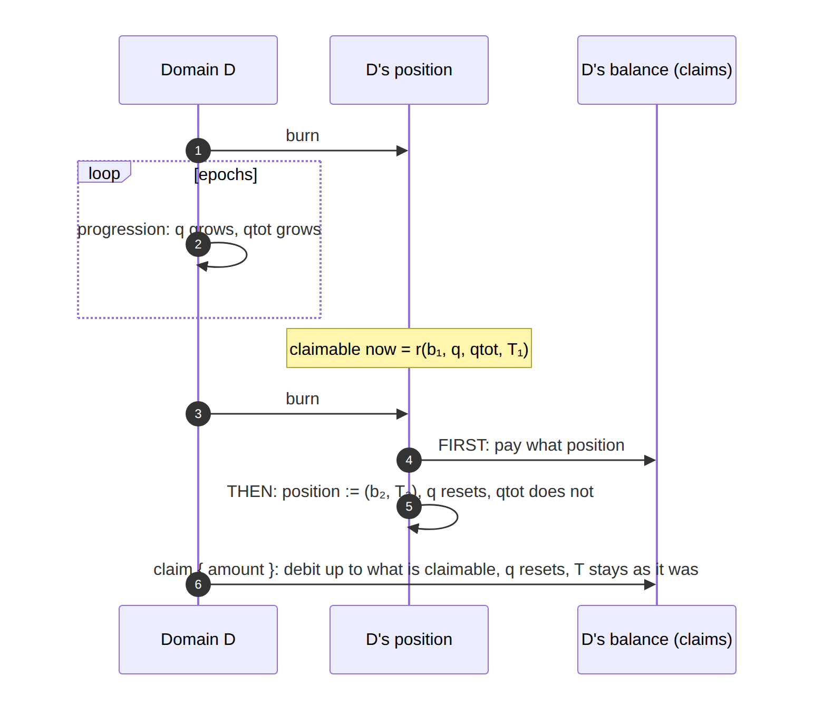

<details>
<summary>The source of this diagram (Mermaid)</summary>

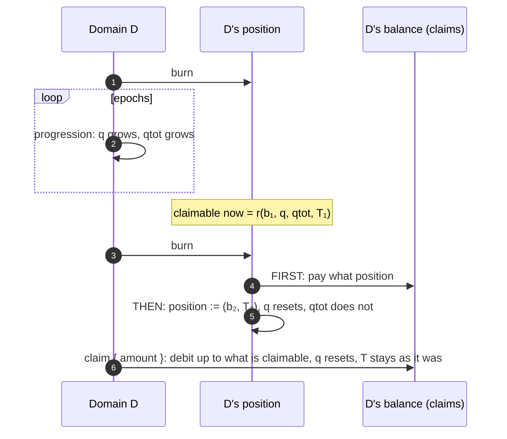
```mermaid
sequenceDiagram
  autonumber
  participant D as Domain D
  participant P as D's position
  participant B as D's balance (claims)
  D->>P: burn #1: accrual { b₁, T₁ }  (position = b₁, T₁, q = 0)
  loop epochs
    D->>D: progression: q grows, qtot grows
  end
  Note over P: claimable now = r(b₁, q, qtot, T₁)
  D->>P: burn #2: accrual { b₂, T₂ }
  P->>B: FIRST: pay what position #1 accrued, as claim "auto:‹nonce›" owned by D
  P->>P: THEN: position := (b₂, T₂), q resets, qtot does not
  D->>B: claim { amount }: debit up to what is claimable, q resets, T stays as it was
```

</details>
<!-- /diagram -->

- **A burn's commitment replaces the position.** $b$ is the capital that now mines; a small burn after a big one lowers $b$.
  That is the rule, not a bug.
- **The previous position is paid first.** What it had accrued is credited as a real claim (`auto:<nonce>`, owned by $D$, its id
  derived from the event's own signed nonce) before it is replaced: a new burn never forfeits.
- **$T$ is chosen at the burn, not inherited.** A burn without a $T$ is $T = 0$. A claim leaves $T$ as it was: it costs nothing,
  so it cannot buy a better one.
- **$T$ has a price, and it stays part of the burn.** $b = \mathrm{burned}\cdot(1-T)$, so a commitment costs
  $\lceil b/(1-T)\rceil$ lamports of confirmed burn. A larger $T$ makes the curve more generous ($q_{\text{tot}}^{\beta(1-T)}$)
  and costs that share of the burn, so it is a choice, not "always $0.4$". The $T$ share is destroyed, except for the creator fee
  (§11). There is no other recipient and none chosen by the user or by the app that distributes the burn: a recipient the payer or
  the app could name would let anyone self-host a page and pay themselves, which would make $T$ free again.
- **Epochs before the first burn earn nothing, and slow you down.** They raise $q_{\text{tot}}$, which sits in the denominator and
  never resets. A domain should burn first, then mine.

### 10.2 What the numbers look like

One real burn, computed with the reference `reward()` and the deployment's parameters: **1 SOL at $T = 0.2$**. The creator gets
$0.0002$ SOL (§11), $0.2$ SOL is destroyed without counting, and the capital is $b = 0.8$. The wallet works one epoch every 30 s
while it is open; for the figures below it is assumed to stay open, and nothing was claimed in between ($q = q_{\text{tot}}$).

| Time open | Epochs | Claimable (AIWA) | Same SOL at $T=0$ ($b=1$) | At $T=0.4$ ($b=0.6$) |
|---|---|---|---|---|
| 1 hour | 120 | 0.130 | 0.138 | 0.100 |
| 1 day | 2 880 | 1.84 | 1.19 | 2.73 |
| 7 days | 20 160 | 8.19 | 5.24 | 14.3 |
| 30 days | 86 400 | 26.9 | 17.2 | 47.7 |
| 1 year | 1 051 200 | 231 | 148 | 412 |

How to read it.

- Early, the curve is flat and a smaller $T$ wins (more capital counts). Later the more generous exponent wins: at $T=0.4$, a day
  already pays more than at $T=0$ though only 60 % of the burn counts. That is the trade $T$ offers: pay a share up front for a
  better curve later. It is a choice because it pays only for someone who stays.
- Claiming does not restart the age. After 30 days, claiming and mining 30 more days gives $22.5$; not claiming for the
  whole 60 days gives $48.3$ in one go. The two paths are within a few percent of each other (claiming in between gives
  $26.9 + 22.5 = 49.4$), so there is nothing clever to do: leave the app open.
- Nothing here says AIWA is worth anything. These are quantities of AIWA, not prices.

### 10.3 Claim

A `claim { amount }` debits up to what is claimable into the domain's balance as a spendable claim (§7.1), resets $q$ and leaves
$T$ unchanged. Both `accrual` and `claim` are signed actions (§5), also usable through a delegate (§7.5); both are links of
the mining chain (§6.5).

---

## 11. The creator fee

A deployment may set `rewardParams.creatorFee = { address, rateOfT }`: one fixed protocol address, and the fraction of the $T$
share that goes to it instead of being destroyed. The reference value is $\mathrm{rateOfT} = 0.001$ (0.1 % of the $T$ share),
paid to the address in `deployment.json`. The fraction and the address are protocol parameters: changing either is a change of
the versioned rule set, not a setting of the wallet, the store or the user.

$$\mathrm{fee}(\mathrm{burned}, T) = \Big\lfloor \frac{\mathrm{burned}\cdot \hat T\cdot \hat\rho}{10^{12}} \Big\rfloor\ \text{lamports},\qquad \hat T = \mathrm{round}(10^{6}T),\ \hat\rho = \mathrm{round}(10^{6}\,\mathrm{rateOfT})$$

in integer (BigInt) arithmetic, so every reader computes the same number. At $T=0$, or in a deployment without `creatorFee`, the
fee is $0$ and nothing below applies.

### 11.1 Where one SOL goes

<!-- diagram: yellowpaper-13-d7265ba0.png -->
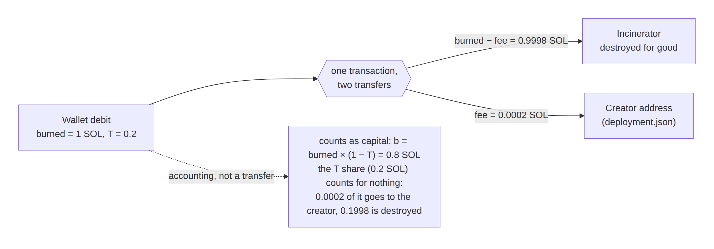

<details>
<summary>The source of this diagram (Mermaid)</summary>

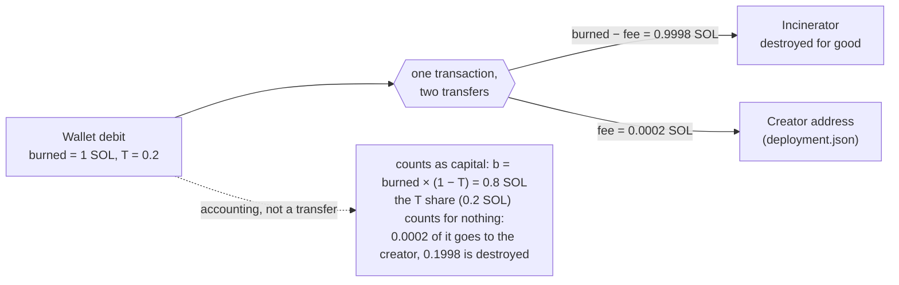
```mermaid
flowchart LR
  U["Wallet debit<br/>burned = 1 SOL, T = 0.2"] --> TX{{"one transaction,<br/>two transfers"}}
  TX -- "burned − fee = 0.9998 SOL" --> I["Incinerator<br/>destroyed for good"]
  TX -- "fee = 0.0002 SOL" --> CR["Creator address<br/>(deployment.json)"]
  U -. "accounting, not a transfer" .-> CAP["counts as capital: b = burned × (1 − T) = 0.8 SOL<br/>the T share (0.2 SOL) counts for nothing:<br/>0.0002 of it goes to the creator, 0.1998 is destroyed"]
```

</details>
<!-- /diagram -->

(Example: $T = 0.2$.) The fee is part of the $T$ share, which is part of the burn: capital is still $b = \mathrm{burned}\cdot(1-T)$,
and the user's debit is still $\mathrm{burned}$, network fee aside. `burnQuote` returns the split before anything is signed.

| Burned | $T$ | Fee to the creator | Counted as capital |
|---|---|---|---|
| 1 SOL | 0 | 0 | 1 |
| 1 SOL | 0.2 | 0.0002 SOL | 0.8 |
| 1 SOL | 0.4 | 0.0004 SOL | 0.6 |

### 11.2 What the reader checks

The reader that fetches the finalized transaction (§9.1) also records what the creator address received in it
(`creatorBalanceDeltaLamports`), but only if it asks for that address. A reader that does not know the creator address cannot
confirm the fee and **fails closed**: it counts no position at $T>0$. A burn counts as incinerated + creator lamports for the
payer, who must really have spent at least that much. Each lamport paid to the creator backs the fee of commitments once
(`feeCovered` against `feeConsumed`).

### 11.3 The rule

A commitment at $T>0$ is rejected unless its fee $\mathrm{fee}(\lceil b/(1-T)\rceil, T)$ is covered by the creator payments the
reader confirmed for that domain and no earlier commitment used. A burn that sent the whole $T$ share to the incinerator, to dodge
the fee, simply does not back a commitment at $T>0$ in any reader that enforces the rule.

### 11.4 What it does not do

The user does not choose who is paid: one address per rule set. A fork of the software that changes the address (the licence
allows it) is a different deployment with its own readers and its own economy; it takes nothing from this one. The amounts are
small by design (above). The fee and the store have not had a legal review (Appendix D).

---

## 12. What a third party can read of a domain

Any holder of a domain's events (an app, a validator, a registry) can derive two things from them, trusting nobody: the **mining
state** and the **ranking figure**. This is what the store ranks by (§18.4).

<!-- diagram: yellowpaper-14-5b077892.png -->
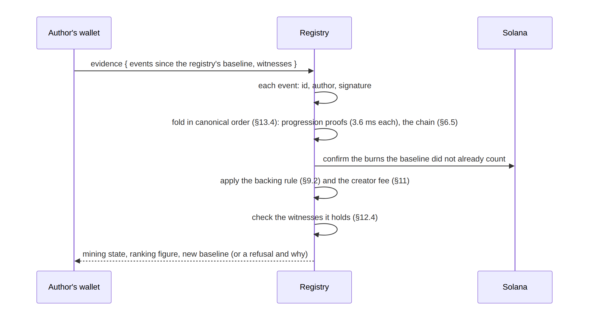

<details>
<summary>The source of this diagram (Mermaid)</summary>

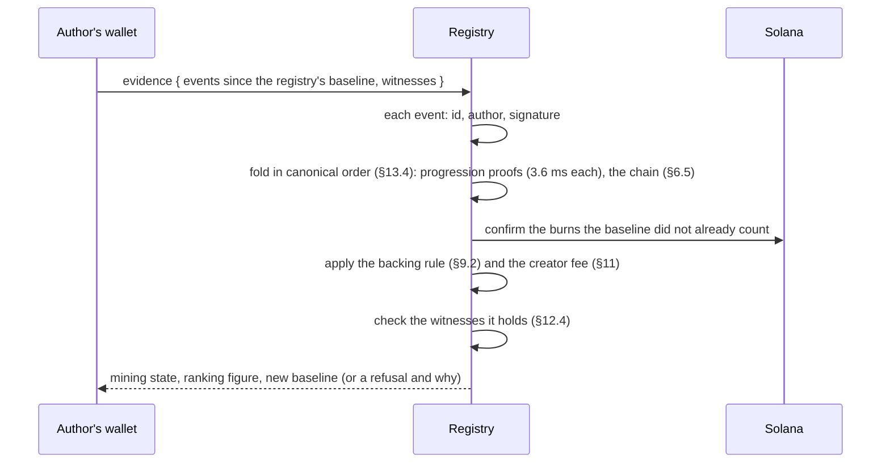
```mermaid
sequenceDiagram
  participant A as Author's wallet
  participant G as Registry
  participant S as Solana
  A->>G: evidence { events since the registry's baseline, witnesses }
  G->>G: each event: id, author, signature
  G->>G: fold in canonical order (§13.4): progression proofs (3.6 ms each), the chain (§6.5)
  G->>S: confirm the burns the baseline did not already count
  G->>G: apply the backing rule (§9.2) and the creator fee (§11)
  G->>G: check the witnesses it holds (§12.4)
  G-->>A: mining state, ranking figure, new baseline (or a refusal and why)
```

</details>
<!-- /diagram -->

### 12.1 The mining state

$$\mathrm{mining}(D) = \big(b,\ T,\ \mathrm{lastActionEpoch},\ \mathrm{epoch},\ q,\ \mathrm{chainHead},\ \mathrm{claimable}\big)$$

The capital that mines, $T$, the epoch of the last action, the age $q_{\text{tot}}$, $q$, the head of the mining chain, and what
is claimable now.

### 12.2 The ranking figure

$$\{\ \mathrm{score} = \mathrm{claimable},\quad \mathrm{laps} = \max(1, q)\ \}$$

Read at a moment and **frozen by whoever stores it**. The store ranks apps by $\mathrm{score}/\mathrm{laps}$, claimable value per epoch
since the last action, and adds no ranking rule of its own (§18.4).

### 12.3 Cost for the reader, and the baseline

One envelope check and one signature per event, plus a few milliseconds per progression event: not the work the domain did. A
validator that kept the state it derived earlier (the **baseline**: wallet state, epoch, head) folds only the new events, if the
evidence continues exactly from it (`afterEpoch`). Limits per submission: 200 000 events, 200 burns to confirm, 50 witnesses,
16 384 bytes per witness event; at most 32 witnesses are kept per domain (the furthest along).

### 12.4 Witnesses: closing the second history

The mining chain (§6.5) stops an action from being left out of one history. It does not stop a domain from keeping two histories
(redoing the work) and showing the favourable one. Someone else closes that: a wallet that received a domain's events can show the
highest progression event of that domain it holds. That event is **signed by the domain**, which is what makes it a proof with no
trust in whoever shows it. The registry keeps it, and when the domain next submits, the history shown must contain it. A fork, a
stretch of work cut short, or a hidden action followed by more work is then refused.

*Does not guarantee.* A witness exists only if someone received those events. A burn made after the last epoch shown and followed
by none can still be left out: a submission is a snapshot, not "the current state", and that needs a clock (for example the head
anchored on Solana, **[not built]**). A domain whose history was really forked (one key on two devices) is refused for good once
its other history is witnessed.

---

# Part IV — Agreement without a clock

Every domain acts alone, for as long as it likes. This part says what happens when histories meet again: how readers that hold
the same events reach the same state (§13), how a domain keeps its storage bounded (§14), and how a lost device gets its history
back (§15).

## 13. Partition, branches and conflicts

### 13.1 Independent histories

Each domain continues through a partition on its own: none decrements state for another's unreachability and none awaits
permission. Reconciliation is verification of signatures, ancestry and receptions over newly available evidence, never a question
of clock authority.

<!-- diagram: yellowpaper-15-51b0df8b.png -->
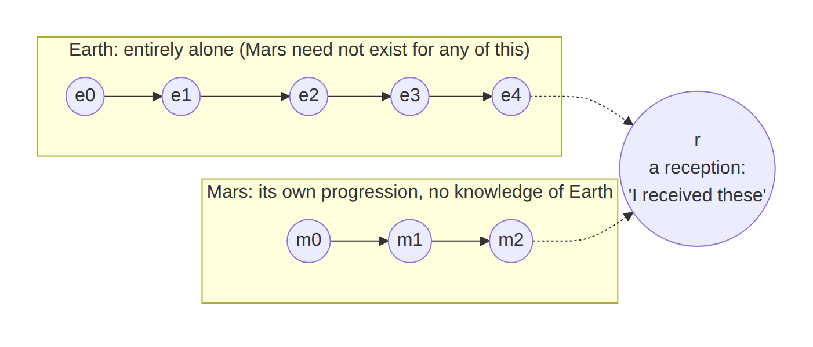

<details>
<summary>The source of this diagram (Mermaid)</summary>

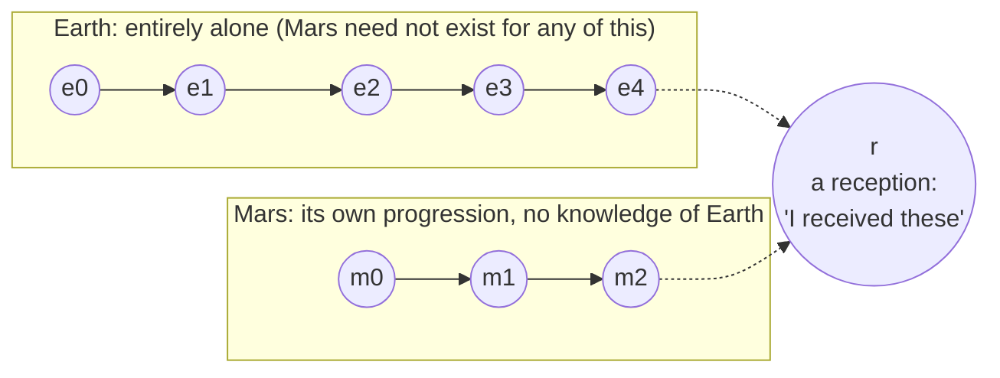
```mermaid
flowchart LR
  subgraph earth["Earth: entirely alone (Mars need not exist for any of this)"]
    e0((e0)) --> e1((e1)) --> e2((e2)) --> e3((e3)) --> e4((e4))
  end
  subgraph mars["Mars: its own progression, no knowledge of Earth"]
    m0((m0)) --> m1((m1)) --> m2((m2))
  end
  e4 -.-> r(("r<br/>a reception:<br/>'I received these'"))
  m2 -.-> r
```

</details>
<!-- /diagram -->

When a link finally opens (or a file, or a QR code), $r$ is **not a merge and not a correction** of either chain: $e_4$ and
$m_2$ stay exactly what they were. $r$ is a new event, a signed statement by whichever domain builds it of what it has now
observed of the other (§8). Nothing is renumbered, rewritten or invalidated. Independent histories stay independent and become
causally correlated the moment they interact; nothing forces a shared timeline, height or next event.

**Channel versus data.** A transport session is temporary. Once data has crossed it, each side verifies and stores it
durably and independently, so losing the session never loses what already crossed. Re-establishing a channel after a gap is an
ordinary event, not a failure.

### 13.2 A branch is not a conflict

Two events that do not know of each other are two branches (§4.3), which is ordinary: Alice and Bob each acting on their own. It
matters only when they **contradict**, that is, when a reader cannot keep both:

| Contradiction | Why both cannot stand |
|---|---|
| one claim spent twice | a claim has one owner at a time (§7.3) |
| one voucher redeemed twice | the first redemption consumes the claim (§7.4) |
| one claim id taken by two domains | an id names one claim |

A reader folds one and refuses the other. The refusal is recorded (`rejections`), never silent.

### 13.3 Why arrival order cannot decide

A reader that folded events in the order they **arrived** would pick whichever it met first. Two readers holding the very same
events, having received them in a different order, would pick different winners, and keep them. Convergence would fail even after
everything had been exchanged.

<!-- diagram: yellowpaper-16-84ba811c.png -->
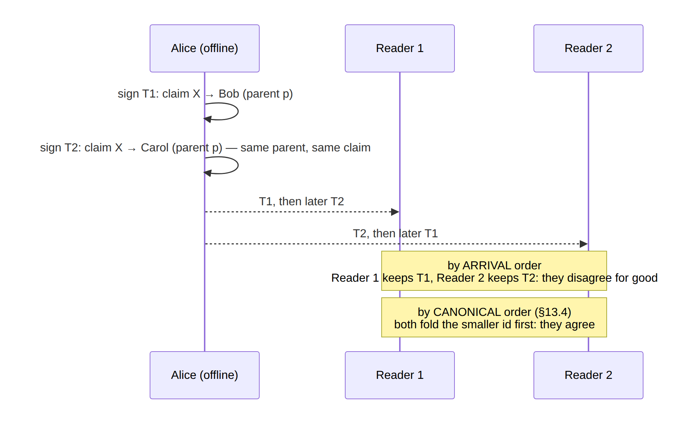

<details>
<summary>The source of this diagram (Mermaid)</summary>

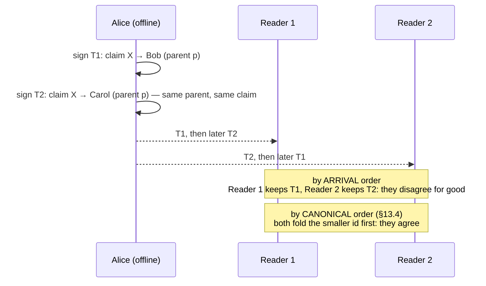
```mermaid
sequenceDiagram
  participant A as Alice (offline)
  participant B as Reader 1
  participant C as Reader 2
  A->>A: sign T1: claim X → Bob   (parent p)
  A->>A: sign T2: claim X → Carol (parent p) — same parent, same claim
  A-->>B: T1, then later T2
  A-->>C: T2, then later T1
  Note over B,C: by ARRIVAL order<br/>Reader 1 keeps T1, Reader 2 keeps T2: they disagree for good
  Note over B,C: by CANONICAL order (§13.4)<br/>both fold the smaller id first: they agree
```

</details>
<!-- /diagram -->

### 13.4 The canonical order

Readers therefore fold in one **canonical order**, `canonicalOrder` in `aiwa-core`: a topological order (a parent before its
children) in which, among the events that can come next, **the one with the smallest id goes first**.

$$\mathrm{next}(\text{placed}) = \min_{\mathrm{id}}\ \{\, e \ :\ \text{every parent of } e \in \text{placed} \,\}$$

A small case. Events: a root $p$; $T_1$ (id `9e…`) and $T_2$ (id `41…`) both citing $p$; $m$ citing both.

| Step | Can come next | Placed |
|---|---|---|
| 1 | $p$ | $p$ |
| 2 | $T_1$ `9e…`, $T_2$ `41…` | $p$, **$T_2$** (`41` < `9e`) |
| 3 | $T_1$ | $p, T_2, T_1$ |
| 4 | $m$ | all |

$T_2$ is folded first and wins; $T_1$ is then refused (`claim already consumed`). Every reader that holds these four events gets
this order, whatever order they arrived in, whether folded in one go or one arrival at a time (a wallet that already folded part of
its log folds again from its last checkpoint when a concurrent branch arrives). The order is not a signed format: it adds nothing to
an event. A parent that is in neither the batch nor the already-placed set (pruned history, an ancestor this reader never had)
counts as satisfied.

**Agreement, not fairness.** The winner is the smaller id: arbitrary, not the first in time (nothing here has a clock). A signer
who writes two contradicting events can try variants until the one wanted has the smaller id, so the rule does not protect whoever
accepted the other; it makes every reader agree on the outcome. What stays is a **proof**: two valid signatures by the same key on
contradicting events show, to anyone, that it wrote both. A conflict that a checkpoint (§14.1) already absorbed stays as the
checkpoint decided it, the same trade-off every checkpoint makes.

### 13.5 What offline can and cannot prevent

Nothing prevents a signer who holds their key from writing two contradicting events while disconnected. The protocol does not
claim to prevent it: it makes the double spend **visible once histories meet, and the same for everyone**, and it never lets value
be duplicated in any reader's view.

<!-- diagram: yellowpaper-17-7f92b9a1.png -->
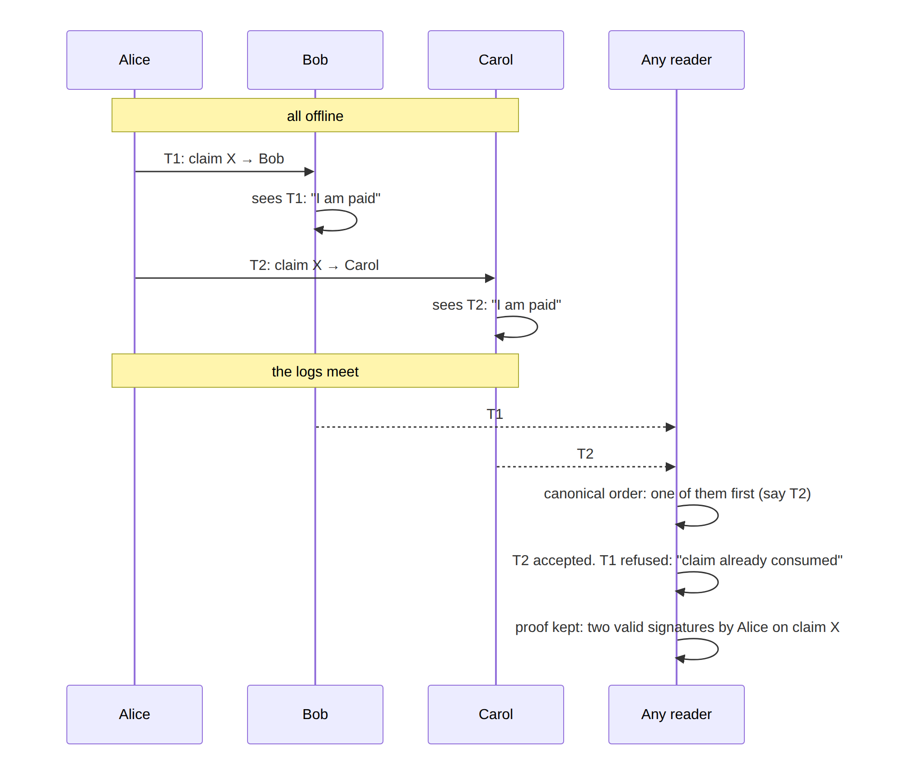

<details>
<summary>The source of this diagram (Mermaid)</summary>

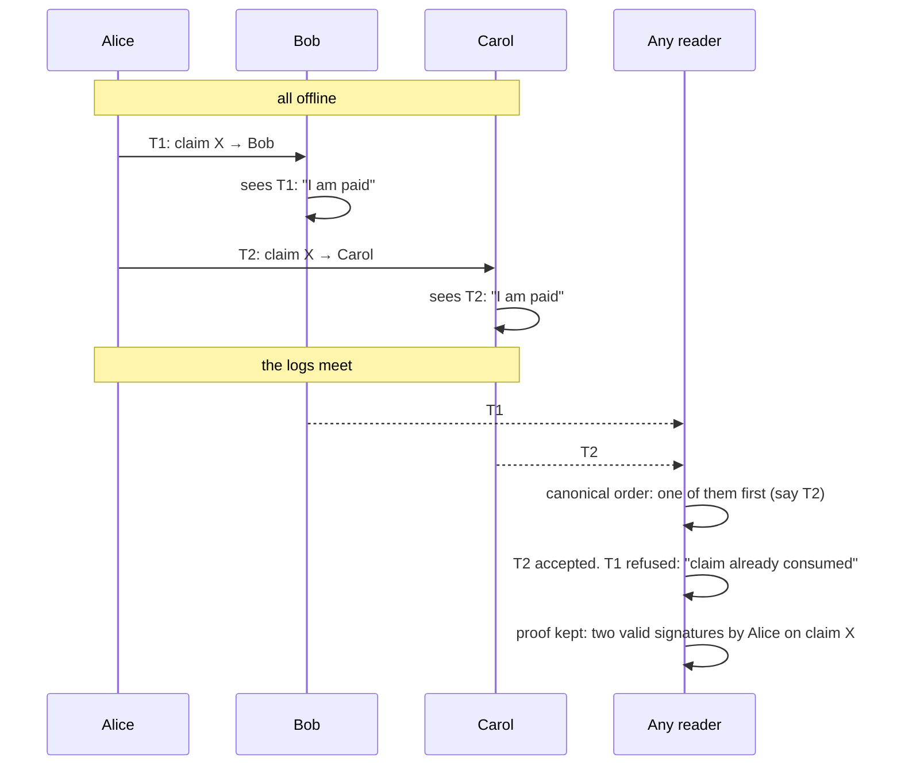
```mermaid
sequenceDiagram
  participant A as Alice
  participant Bo as Bob
  participant Ca as Carol
  participant R as Any reader
  Note over A,Ca: all offline
  A->>Bo: T1: claim X → Bob
  Bo->>Bo: sees T1: "I am paid"
  A->>Ca: T2: claim X → Carol
  Ca->>Ca: sees T2: "I am paid"
  Note over A,Ca: the logs meet
  Bo-->>R: T1
  Ca-->>R: T2
  R->>R: canonical order: one of them first (say T2)
  R->>R: T2 accepted. T1 refused: "claim already consumed"
  R->>R: proof kept: two valid signatures by Alice on claim X
```

</details>
<!-- /diagram -->

What stays possible: the person whose payment loses may have believed they were paid until they saw the other branch. Closing
that needs a common authority or a clock, which the protocol does not have. What remains:

- **limiting the amount** accepted from someone not trusted;
- **trust**, or letting the histories meet before relying on a payment;
- **the proof afterwards** (two valid signatures, checkable by anyone);
- **an anchor** (the head of the signer's log inscribed on Solana, an objective clock): **[not built]**. It would only help someone
  who can go online *before* handing over what they give. It does nothing for an exchange that stays entirely offline.

### 13.6 How events travel

The protocol asks for one thing: that the events of someone else reach you, **by any means**. All of these are the same thing to a
reader, because each event verifies on its own (§4.2):

| Means | In this repository |
|---|---|
| a file, pasted text, a QR code, NFC | `encodeOfflineBundle` / `decodeOfflineBundle` (`aiwa-lib`) |
| a GitHub pull request | the store's registry (§18) |
| an archive node | `aiwa-platform`, `archive-server.js` (§15) |
| a direct connection (WebRTC) | `aiwa-platform`'s replicator, which the wallet page starts with *Link with another phone*: two codes are swapped (shown and read, as in the click duel), then the phones exchange what each lacks |

The replicator is deliberately simple:

<!-- diagram: yellowpaper-18-d9c45fba.png -->
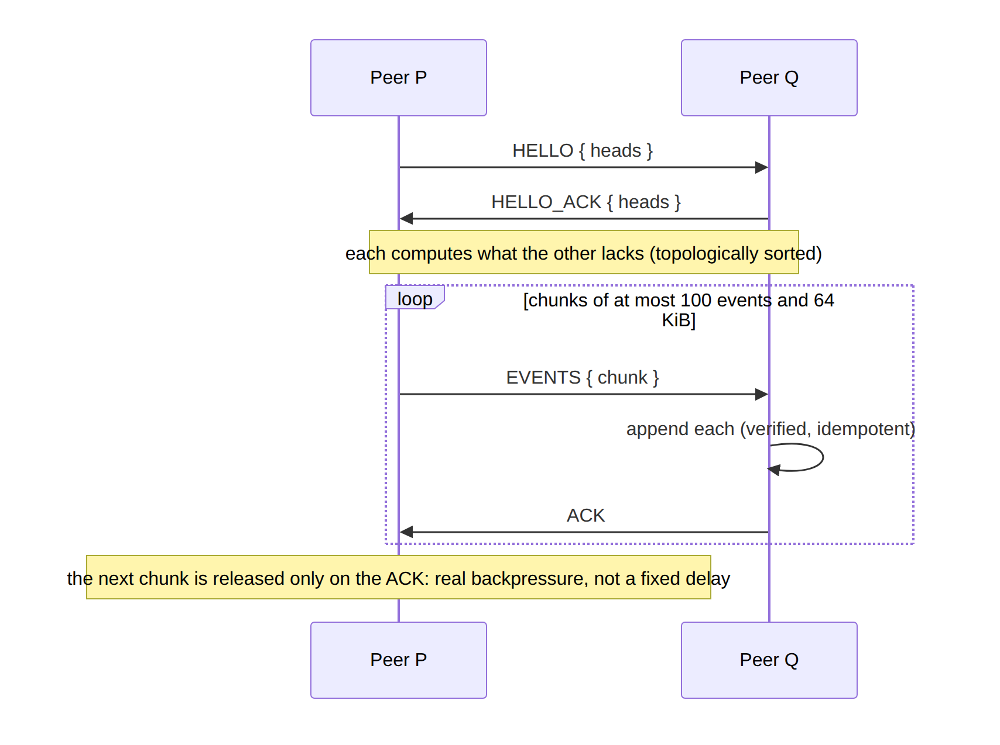

<details>
<summary>The source of this diagram (Mermaid)</summary>

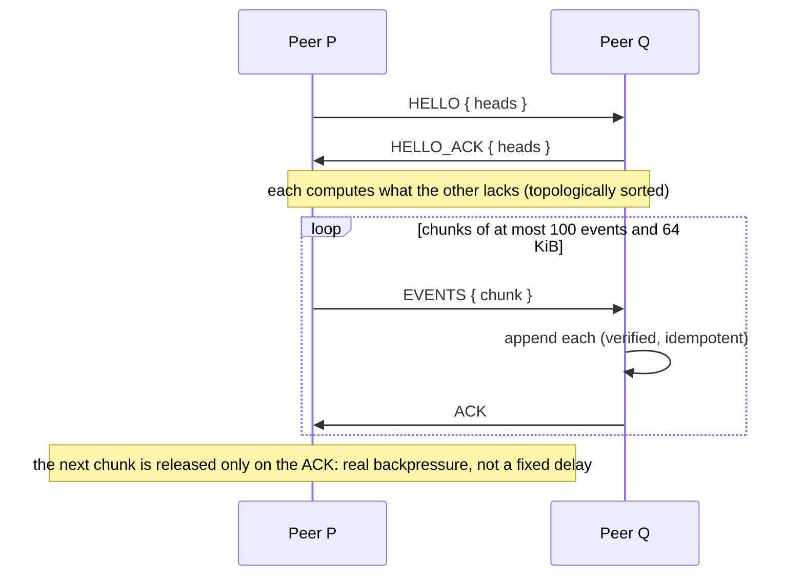
```mermaid
sequenceDiagram
  participant P as Peer P
  participant Q as Peer Q
  P->>Q: HELLO { heads }
  Q->>P: HELLO_ACK { heads }
  Note over P,Q: each computes what the other lacks (topologically sorted)
  loop chunks of at most 100 events and 64 KiB
    P->>Q: EVENTS { chunk }
    Q->>Q: append each (verified, idempotent)
    Q->>P: ACK
  end
  Note over P: the next chunk is released only on the ACK: real backpressure, not a fixed delay
```

</details>
<!-- /diagram -->

*Honest limit.* The `HELLO`/`HELLO_ACK` exchange computes "what is missing" twice per connection; in a narrow race this can send
one chunk twice. `append` is idempotent, so it is harmless; removing it would mean redesigning the handshake (future work).

**Where this sits among other proposals.** Published interplanetary-cryptocurrency proposals generally extend one Earth-anchored
consensus chain across the latency gap (delay-tolerant transport, timelocks widened to light-time, federated or merge-mined
settlement), leaving consensus and issuance untouched; creation stays dominated by whichever side has more compute. Here, value
creation is taken out of any consensus chain: $\mathrm{epoch}_D$ needs no awareness of one. That closes that asymmetry. It does
not address real byte transport under latency (pluggable by design) nor an exchange rate between economies that grew apart.

---

## 14. Bounded storage

Across domains this scales by construction: no consensus, no shared bottleneck. *Within* one domain, three costs would grow
without bound. Each is bounded, none is solved for free: each trades something explicit.

### 14.1 Local storage: checkpoints

A running domain accumulates one event per epoch and one per economic action, forever, unless pruned.

<!-- diagram: yellowpaper-19-fe6d1fb8.png -->
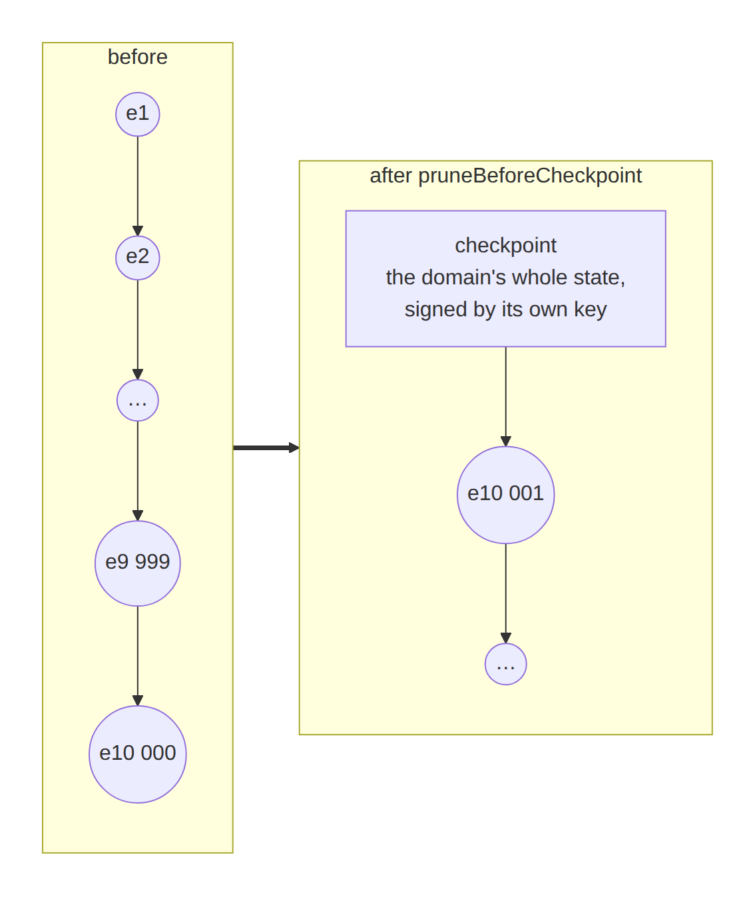

<details>
<summary>The source of this diagram (Mermaid)</summary>

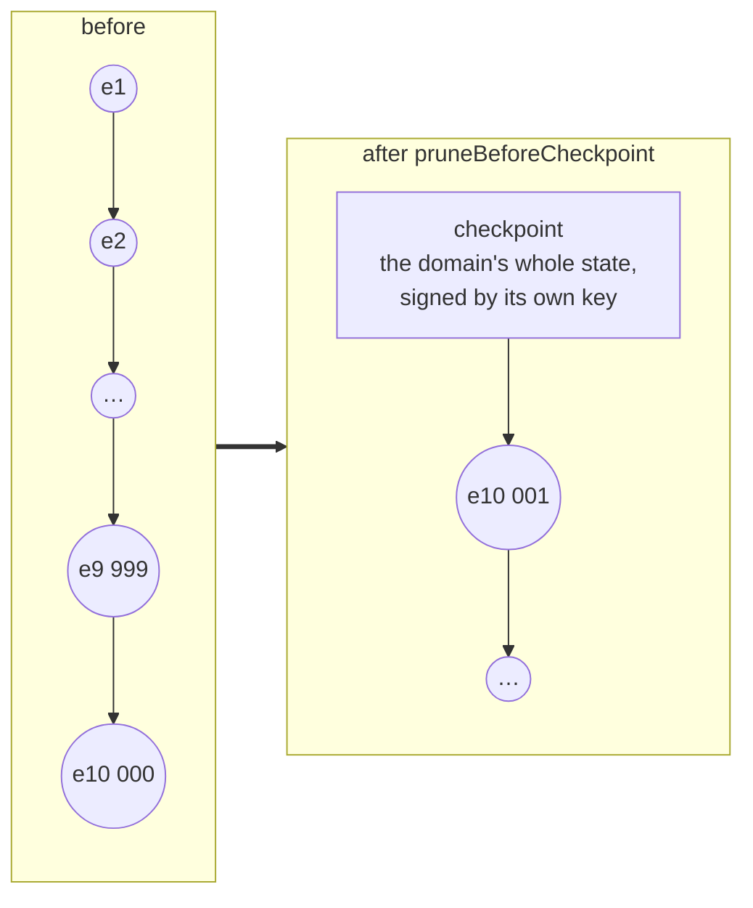
```mermaid
flowchart LR
  subgraph before["before"]
    a1((e1)) --> a2((e2)) --> a3((…)) --> a4((e9 999)) --> a5((e10 000))
  end
  subgraph after["after pruneBeforeCheckpoint"]
    ck["checkpoint<br/>the domain's whole state,<br/>signed by its own key"] --> a6((e10 001)) --> a7((…))
  end
  before ==> after
```

</details>
<!-- /diagram -->

A **checkpoint** is a self-signed event embedding the domain's own already-materialized state as of a set of log heads
(`verifyCheckpoint` requires `author === payload.domain`: the same signer-scoping discipline as §5).
`EventLog.pruneBeforeCheckpoint()` then deletes every event the checkpoint's state already accounts for. The reference wallet
checkpoints every five minutes by default; at the protocol level it is opt-in, and a domain that never does it grows unboundedly.

**The trade, plainly.** A peer that already verified everything up to a checkpoint loses nothing by trusting it afterward: it is its
own verified work, summarised. A brand-new peer that receives *only* a pruned log can no longer re-derive that state from
genesis: it trades independent verifiability for a signed assertion by the domain's key about its own past, the same trade
Ethereum's weak-subjectivity checkpoints make.

### 14.2 Wallet state: incremental folding

`materializeWallet` accepts an optional `baseState` to fold new events onto instead of replaying from genesis every time;
`aiwa-lib` caches the last materialized state and folds only what is new. Three details make that sound together with
checkpoints:

1. a checkpoint's embedded `progression.lastId` is repointed to the checkpoint's own id (pruning could delete the event it named);
2. the mining chain is the signed `previous` field, not `parents` (§6.5), so an ordinary event becoming the log's head in between
   cannot break the chain check (the older `progressionParents(heads, lastId)` routing exists for deployments that do not fix $E$);
3. the cache's exclusion boundary tracks the growing set of already-covered ids, not just the latest heads, since a helper's extra
   parent edge can reach past a heads-only boundary.

No trade beyond the cache being in memory per instance, not persisted across a reload by itself.

### 14.3 Synchronisation payload: chunks gated by acknowledgements

The replicator (§13.6) does not send every missing event in one message: it sorts them topologically and releases bounded chunks
(at most 100 events and 64 KiB, default), the next only when the previous one's ACK arrives. The byte bound is not a refinement: a data
channel closes the link on a message over 256 KiB, which two real browser pages did to each other with chunks of 100 events of 3 KB.

---

## 15. History recovery

A wallet is **a key plus a journal** of signed events (its burns, epochs, claims, transfers). The key is a BIP39 recovery phrase,
12 words (`m/44'/501'/0'/0'`: the same words give the same address in a Solana wallet). A wallet imported as a raw key has no
phrase; its private key is shown instead. **The journal is not in the phrase.** A blockchain recovers it for free because every
node keeps all of it; here nobody replicates everything, an event is kept by its owner and by whoever received it, so after a lost
device the journal has to come from somewhere.

<!-- diagram: yellowpaper-20-32c172a8.png -->
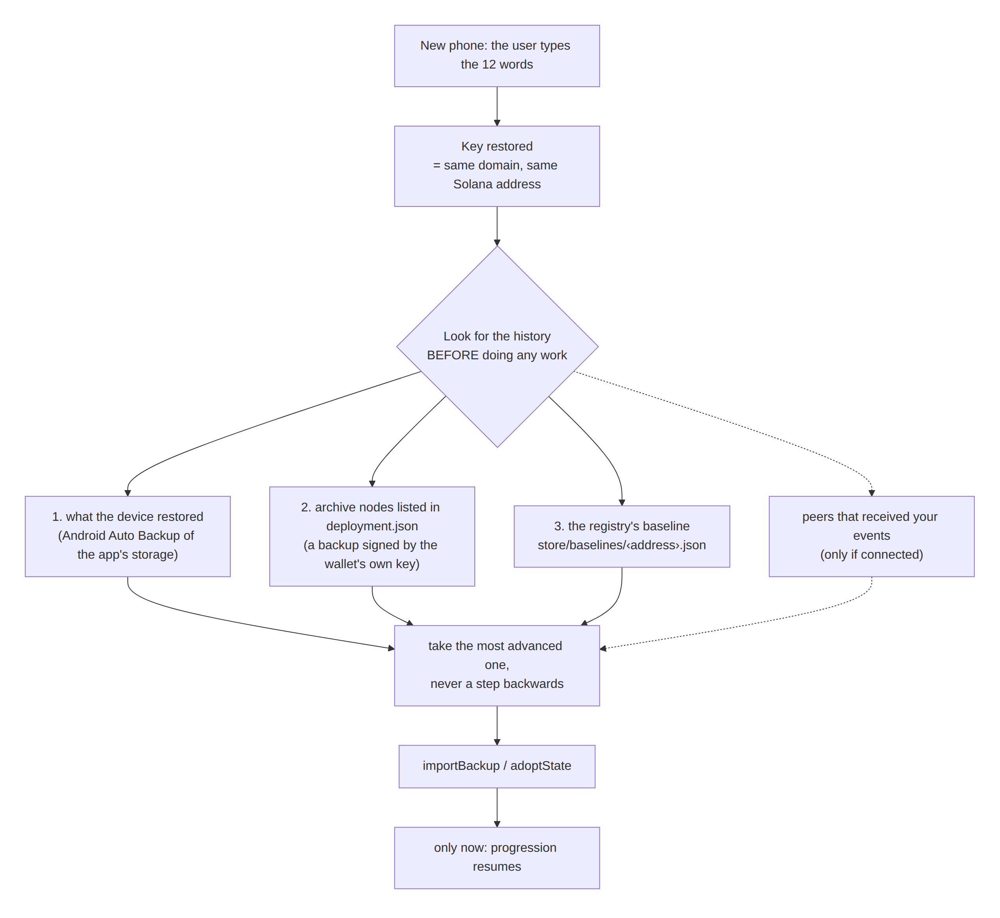

<details>
<summary>The source of this diagram (Mermaid)</summary>

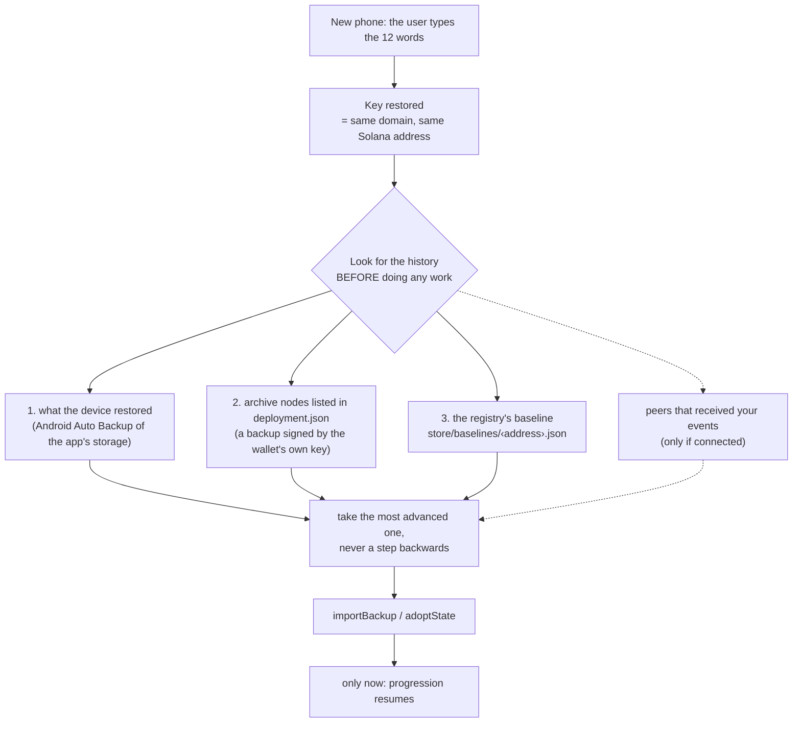
```mermaid
flowchart TB
  P["New phone: the user types the 12 words"] --> K["Key restored<br/>= same domain, same Solana address"]
  K --> L{"Look for the history<br/>BEFORE doing any work"}
  L --> S1["1. what the device restored<br/>(Android Auto Backup of the app's storage)"]
  L --> S2["2. archive nodes listed in deployment.json<br/>(a backup signed by the wallet's own key)"]
  L --> S3["3. the registry's baseline<br/>store/baselines/‹address›.json"]
  L -.-> S4["peers that received your events<br/>(only if connected)"]
  S1 --> M["take the most advanced one,<br/>never a step backwards"]
  S2 --> M
  S3 --> M
  S4 -.-> M
  M --> G["importBackup / adoptState"]
  G --> W["only now: progression resumes"]
```

</details>
<!-- /diagram -->

| Source | What it is | Trust it needs |
|---|---|---|
| **A backup** (`exportBackup` / `importBackup`) | a checkpoint (§14.1): the wallet's whole state signed by its own key; small however long the history. Refused if it is of another identity or no further along than the wallet is: it can never roll a wallet back | none beyond the signature |
| **The registry's baseline** (`adoptState`) | the state a registry derived from the wallet's submissions (§12.3); it holds what the registry saw, not value received from others | the registry (the wallet can check it only by re-deriving) |
| **An archive node** (`aiwa-platform`) | an always-on program anyone can run, keeping per wallet the latest backup. Only the owner of a key can write its backup (the checkpoint must verify and be authored by the domain), the most recent wins, reads are public (a backup holds no secret), sizes and rates limited | none: a node can only withhold or forget, hence several |
| **Peers** (`joinNetwork`) | what peers that received your events hold, as far as you have any connected | their signatures |
| **The platform's own backup** | where the OS backs up an app's storage (Android's Auto Backup of the store's WebView), the journal follows its owner to a new device with no server of ours | the OS |

A wallet application tries these in this order by itself, and the user is asked for nothing but the 12 words. **It never starts
working epochs before it has looked**: a log that began from nothing would fork the history about to come back. Same trade as
every checkpoint: whoever only sees a backup trusts its signature instead of re-deriving history from genesis.

**Not claimed.** A wallet with no backup, no node and no peer that lost its device loses its journal. The burns stay on Solana
and the key stays in the phrase; the epochs and their proofs are gone. In this repository's deployment `archiveNodes` is empty:
the first two sources in practice are the device backup and the registry's baseline.

---

# Part V — Programs and applications

Nothing in this part adds a rule to the protocol. A contract is a reducer a holder of events replays; an application is files
published as events; the store is a registry that applies the protocol's own checks and a ranking that reads the protocol's own
figure.

## 16. Contracts

### 16.1 What a contract is here

There is no machine that runs a contract for everyone. A contract is a set of rules, **state + event → new state**, that each
holder replays from the events they have. Two holders with the same events get the same state; two with different events may
not (§13), exactly as for the rest of the protocol.

<!-- diagram: yellowpaper-21-a58f47aa.png -->
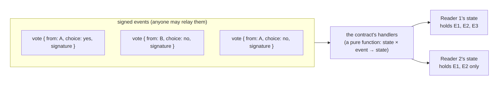

<details>
<summary>The source of this diagram (Mermaid)</summary>

```mermaid
flowchart LR
  subgraph signed["signed events (anyone may relay them)"]
    E1["vote { from: A, choice: yes, signature }"]
    E2["vote { from: B, choice: no, signature }"]
    E3["vote { from: A, choice: no, signature }"]
  end
  signed --> H["the contract's handlers<br/>(a pure function: state × event → state)"]
  H --> S1["Reader 1's state<br/>holds E1, E2, E3"]
  H --> S2["Reader 2's state<br/>holds E1, E2 only"]
```

</details>
<!-- /diagram -->

The SDK (`aiwa-lib`: `defineContract`, `Contract`, `signedAction`, `verifySignedAction`) is the pattern the protocol uses for itself,
opened to third parties: a handler gets the state and `{id, parents, payload}` and returns the new state; a contract dispatches
under whatever event types its own definition declares.

### 16.2 An action is proved by a signature inside the action

A reducer never sees who published an event (§4.4). A plain `payload.from` proves nothing: an event is validly self-signed by
*someone*, and nothing stops its payload from claiming to be someone else. `signedAction` is §5's scheme for a contract's own
actions: it signs the fields (which include the claimed `from`) plus a fresh nonce and timestamp, so the payload is independently
verifiable and safe to put on an event dispatched by anyone, including a relay with no reason to be trusted. A handler that skips
`verifySignedAction` for something that matters can be made to count an action "from" anyone: that is an impersonation hole,
not a style choice.

### 16.3 Moving AIWA from a contract: the one extension point

Conservation (§7) knows nothing about contracts. For a contract's own conditional outcome to move real spendable AIWA, some code
has to apply a state transition to the claim ledger, and it must not be a change to the core protocol. `applyWalletEvent` exposes
one generic hook: a map `contractVerifiers = { contractId → verifyPayout }`, supplied by the **application**, never by the
protocol's source.

<!-- diagram: yellowpaper-22-05bedfe0.png -->
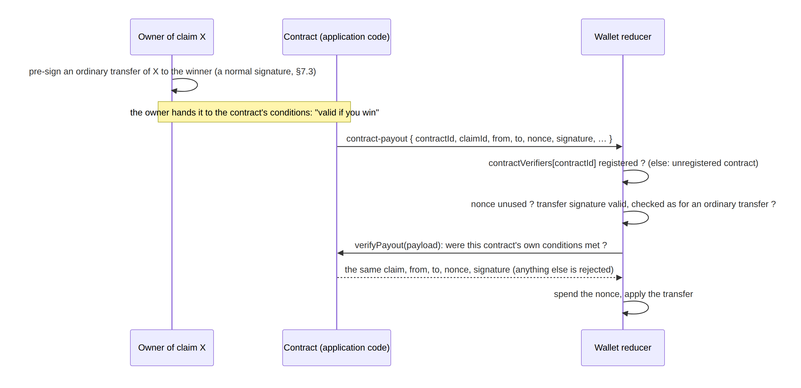

<details>
<summary>The source of this diagram (Mermaid)</summary>

```mermaid
sequenceDiagram
  participant O as Owner of claim X
  participant K as Contract (application code)
  participant W as Wallet reducer
  O->>O: pre-sign an ordinary transfer of X to the winner (a normal signature, §7.3)
  Note over O,K: the owner hands it to the contract's conditions: "valid if you win"
  K->>W: contract-payout { contractId, claimId, from, to, nonce, signature, … }
  W->>W: contractVerifiers[contractId] registered ? (else: unregistered contract)
  W->>W: nonce unused ?  transfer signature valid, checked as for an ordinary transfer ?
  W->>K: verifyPayout(payload): were this contract's own conditions met ?
  K-->>W: the same claim, from, to, nonce, signature (anything else is rejected)
  W->>W: spend the nonce, apply the transfer
```

</details>
<!-- /diagram -->

The wallet guarantees only what every contract shares (the pre-signed transfer is genuinely signed, once); the contract decides
whether its conditions were met. A new contract needs no change to the core, only an entry in the application's registry.

**Limit.** The extension point is real and tested. No concrete contract is registered into it by the reference applications: the
store ships none.

### 16.4 A contract's identity, and its source

A contract id is a plain string with no cryptographic anchor of its own: a signature proves only "signed by this key over this
content", never "this is really the trusted module it claims to be". The anchor is the source hash:

$$\mathrm{sourceHash} = \mathrm{SHA}(\mathrm{sourceCode})$$

`contract-registry.js` embeds a contract's complete source (never only its hash) in a `contract-spec` event, recoverable by anyone
who receives it; `registerVerifiedContract` re-hashes the currently deployed source against a pinned value before trusting its
`verifyPayout`. There is deliberately **no canonical registry**: competing contracts coexist under different ids, and wallets and
users choose which to trust. **Limit.** `publishContractSpec`, `scanContractSpecs` and `registerVerifiedContract` are real and
tested; the reference applications do not use them (they publish applications through §17).

---

## 17. Bundles and sandboxed execution

An application can be published as signed events, so that whoever holds the events can rebuild exactly what the author published.

### 17.1 The two event types

$$e_{\mathrm{file}} = \{\mathrm{type}: \texttt{bundle.file},\ \mathrm{payload}: \{\mathrm{path}, \mathrm{content}\},\ \mathrm{parents}: [\,],\ \mathrm{createdAt}: 0\}$$

$$e_{\mathrm{manifest}} = \{\mathrm{type}: \texttt{bundle.manifest},\ \mathrm{payload}: \{\mathrm{name}, \mathrm{version}, \mathrm{files}: \{\mathrm{path} \mapsto \mathrm{id}(e_{\mathrm{file}})\}\},\ \mathrm{parents}\}$$

<!-- diagram: yellowpaper-23-53582f90.png -->
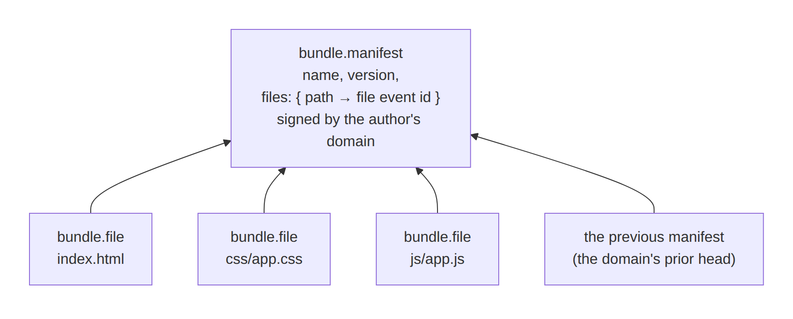

<details>
<summary>The source of this diagram (Mermaid)</summary>

```mermaid
flowchart BT
  F1["bundle.file<br/>index.html"] --> M
  F2["bundle.file<br/>css/app.css"] --> M
  F3["bundle.file<br/>js/app.js"] --> M
  M["bundle.manifest<br/>name, version,<br/>files: { path → file event id }<br/>signed by the author's domain"]
  PM["the previous manifest<br/>(the domain's prior head)"] --> M
```

</details>
<!-- /diagram -->

A file event is deliberately **parentless with `createdAt` fixed at 0**: its bytes do not causally depend on when or by whom they
were published, only their content does, and content addressing already captures that. Publishing the same content again (an
unchanged file across two versions) yields the same event id and is a no-op under `EventLog.append`'s deduplication. A one-byte
change is a wholly new event, like in any content-addressed store. A manifest's parents are every file event it references plus
the domain's own prior heads, so the log's head resolves to the latest manifest; a genuine fork (two competing manifest heads) is
surfaced to the caller, never silently resolved. Attribution needs nothing more: `listBundlesByAuthor` scans for manifests whose
verified `author` matches.

### 17.2 Execution: origin isolation, not a convention

A published application is arbitrary, untrusted code. A host that runs one loads its `index.html` into
`<iframe sandbox="allow-scripts">`, **never** `allow-same-origin`. This is a well-established browser mechanism, not custom
security code: the frame gets an opaque origin with no access to the parent page's storage, DOM or in-memory identity, enforced
by the browser. A malicious application's JavaScript can run; it cannot reach the wallet that opened it, and the isolation does not
depend on its author behaving.

**The one exception: the door.** An application that says it uses the wallet (`<meta name="aiwa-wallet" content="pay">`) is given a
narrow way out: it posts requests to the page, which answers them (§18.8). The frame is otherwise the same: no storage, no DOM
access, no secret. The Store signals the declaration with a banner and does nothing more. The door has no cap and no expiry, so a
hostile application that declares the wallet can spend it. That is a known gap, kept apart from the isolation, which is unchanged.

*Does not guarantee.* That the application cannot use the network (it can), or that it is not malicious towards its own user (it
is not reviewed). Storage inside a fully opaque origin is unreliable: an application cannot count on `IndexedDB` persisting
across sessions; an in-memory event log is the safe default for its internal state.

---

## 18. The store

The store is what an author, a registry and a reader do together. Four actors, and the protocol does the checking:

<!-- diagram: yellowpaper-24-242dbd36.png -->
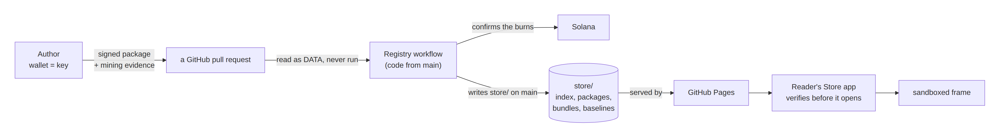

<details>
<summary>The source of this diagram (Mermaid)</summary>

```mermaid
flowchart LR
  AU["Author<br/>wallet = key"] -- "signed package<br/>+ mining evidence" --> PR["a GitHub pull request"]
  PR -- "read as DATA, never run" --> RG["Registry workflow<br/>(code from main)"]
  RG -- "confirms the burns" --> SO["Solana"]
  RG -- "writes store/ on main" --> ST[("store/<br/>index, packages,<br/>bundles, baselines")]
  ST -- "served by" --> PG["GitHub Pages"]
  PG --> RD["Reader's Store app<br/>verifies before it opens"]
  RD --> SB["sandboxed frame"]
```

</details>
<!-- /diagram -->

### 18.1 Two kinds of entry, both submitted on GitHub

| Kind | The package carries | What the author signs | Who verifies the code, and how |
|---|---|---|---|
| **`code`** | the app's one HTML file (≤ 512 KB; it loads what it needs from the network itself) | the hash of `[id, name, version, description, kind, html]` | anyone, by recomputing that hash |
| **`aiwa`** | no code: a **pointer**, the id of a signed `bundle.manifest` | the hash of `[id, name, version, description, kind, manifestId]` | the registry and the Store, each on its own: the bundle's events pass an event log (id, signature, parents), then are checked against the pin |

For an `aiwa` entry, the check against the pin is: the manifest is signed by the author's domain, names exactly this app and
version, lists files that are all signed by that domain, and nothing else is in the bundle (≤ 40 files, ≤ 1 MB). The code is then
immutable and is exactly what its author published, whoever served the events. A bundle lives in a log of its own, so a manifest
cites only its files and never the author's other history. What a bundle's code loads from the network (a CDN, the SDK
`lib/aiwa.js`) is **not** pinned by the manifest.

The package: `(id, name, version, description, kind, content or pointer, hash, authorization)`, where the authorization is a signed
action (§16.2) by the author's key over `(publish-app, id, version, hash)`. The author's identity is their Solana address (the same
key as their wallet). Anyone holding the package can verify offline that what will run is what the author published.

### 18.2 Publishing

<!-- diagram: yellowpaper-25-6db57375.png -->
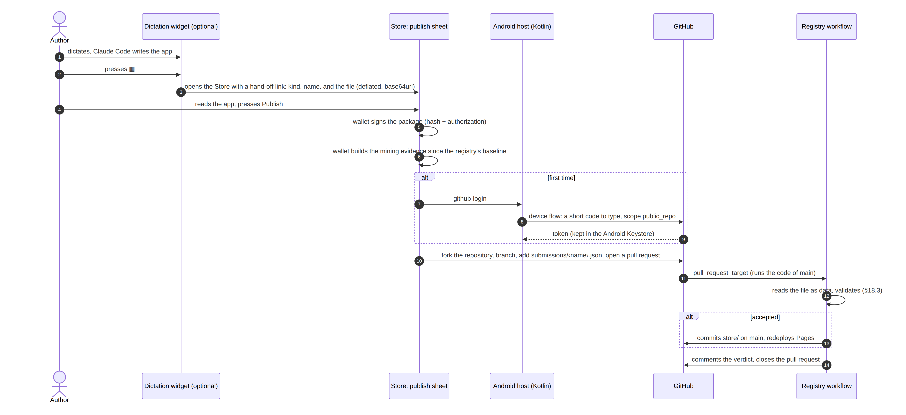

<details>
<summary>The source of this diagram (Mermaid)</summary>

```mermaid
sequenceDiagram
  autonumber
  actor U as Author
  participant WG as Dictation widget (optional)
  participant SS as Store: publish sheet
  participant AH as Android host (Kotlin)
  participant GH as GitHub
  participant RG as Registry workflow
  U->>WG: dictates, Claude Code writes the app
  U->>WG: presses ▦
  WG->>SS: opens the Store with a hand-off link: kind, name, and the file (deflated, base64url)
  U->>SS: reads the app, presses Publish
  SS->>SS: wallet signs the package (hash + authorization)
  SS->>SS: wallet builds the mining evidence since the registry's baseline
  alt first time
    SS->>AH: github-login
    AH->>GH: device flow: a short code to type, scope public_repo
    GH-->>AH: token (kept in the Android Keystore)
  end
  SS->>GH: fork the repository, branch, add submissions/‹name›.json, open a pull request
  GH->>RG: pull_request_target (runs the code of main)
  RG->>RG: reads the file as data, validates (§18.3)
  alt accepted
    RG->>GH: commits store/ on main, redeploys Pages
  end
  RG->>GH: comments the verdict, closes the pull request
```

</details>
<!-- /diagram -->

Nothing is signed or sent until the author presses **Publish**. In a plain browser, which cannot sign in to GitHub, the sheet hands
over the signed file to add to a pull request by hand. A **refresh** is a submission of another kind: a signed request, from fresh
evidence, to re-read the ranking figure of an app the author already owns.

The workflow reads the file as data and never runs anything from the pull request; it runs from `main`; one run writes `store/` at
a time (a concurrency group); the pull request is never merged, only closed with the verdict.

### 18.3 What the registry checks

<!-- diagram: yellowpaper-26-14b1e595.png -->
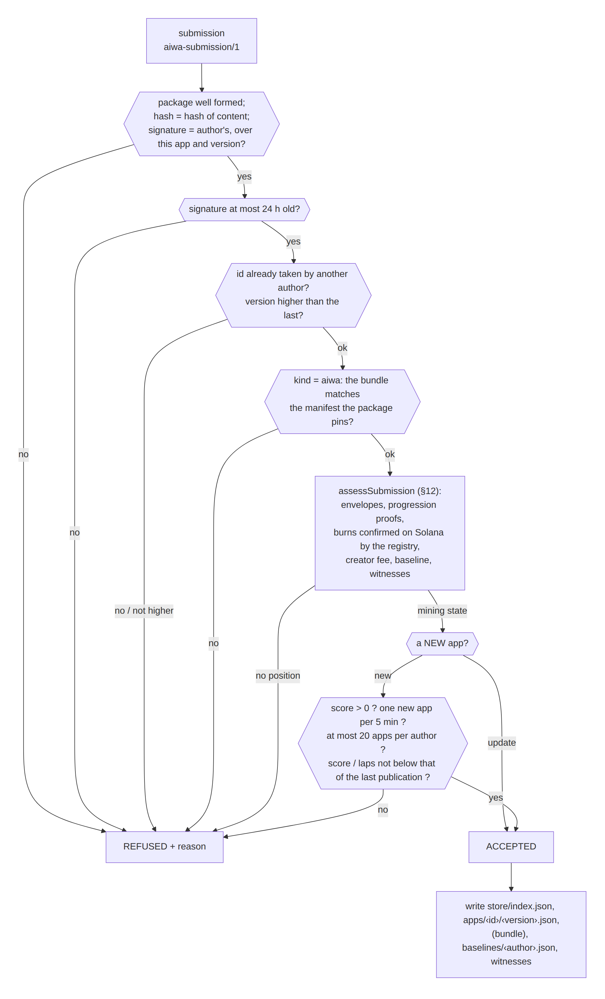

<details>
<summary>The source of this diagram (Mermaid)</summary>

```mermaid
flowchart TB
  S["submission<br/>aiwa-submission/1"] --> P1{{"package well formed;<br/>hash = hash of content;<br/>signature = author's, over this app and version?"}}
  P1 -- no --> X["REFUSED + reason"]
  P1 -- yes --> P2{{"signature at most 24 h old?"}}
  P2 -- no --> X
  P2 -- yes --> P3{{"id already taken by another author?<br/>version higher than the last?"}}
  P3 -- "no / not higher" --> X
  P3 -- ok --> K{{"kind = aiwa: the bundle matches<br/>the manifest the package pins?"}}
  K -- no --> X
  K -- ok --> E["assessSubmission (§12):<br/>envelopes, progression proofs,<br/>burns confirmed on Solana by the registry,<br/>creator fee, baseline, witnesses"]
  E -- "no position" --> X
  E -- "mining state" --> N{{"a NEW app?"}}
  N -- "update" --> A["ACCEPTED"]
  N -- "new" --> N1{{"score > 0 ? one new app per 5 min ?<br/>at most 20 apps per author ?<br/>score / laps not below that of the last publication ?"}}
  N1 -- no --> X
  N1 -- yes --> A
  A --> W["write store/index.json, apps/‹id›/‹version›.json,<br/>(bundle), baselines/‹author›.json, witnesses"]
```

</details>
<!-- /diagram -->

The **permission ratio** keeps what an author may publish from shrinking with what the author has contributed: a new app is accepted
only if the author's current $\mathrm{score}/\mathrm{laps}$ is not below that of their last publication (a first publication is free of
it); an update needs only ownership. A refused submission changes nothing.

### 18.4 Ranking

$$\mathrm{rank}(\mathrm{app}) = \frac{\mathrm{score}}{\max(1, \mathrm{laps})}\qquad \text{ties: published first, then id}$$

with $\mathrm{score}$ and $\mathrm{laps}$ the author's ranking figure (§12.2), **frozen when the registry accepted or last refreshed
the entry**. There is no editorial override and no other term. This is the ranking this project's apps have always been ordered by,
taken over unchanged.

### 18.5 Opening an app

<!-- diagram: yellowpaper-27-cac8e10d.png -->
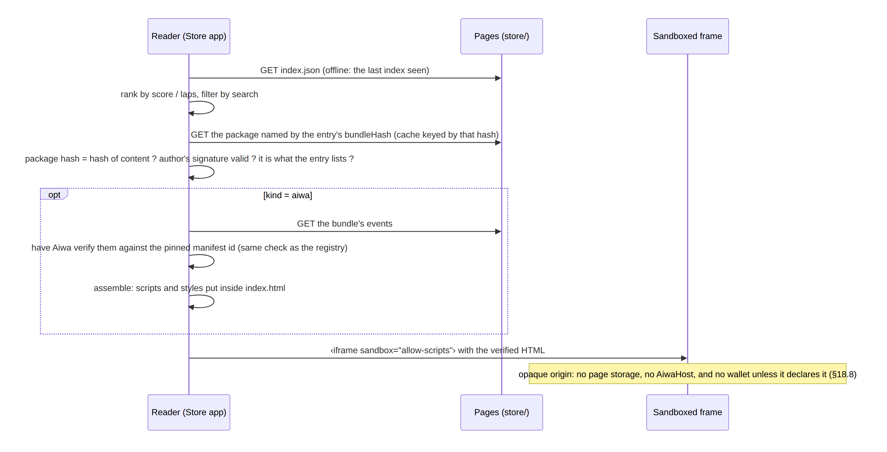

<details>
<summary>The source of this diagram (Mermaid)</summary>

```mermaid
sequenceDiagram
  participant R as Reader (Store app)
  participant PG as Pages (store/)
  participant FR as Sandboxed frame
  R->>PG: GET index.json  (offline: the last index seen)
  R->>R: rank by score / laps, filter by search
  R->>PG: GET the package named by the entry's bundleHash (cache keyed by that hash)
  R->>R: package hash = hash of content ?  author's signature valid ?  it is what the entry lists ?
  opt kind = aiwa
    R->>PG: GET the bundle's events
    R->>R: have Aiwa verify them against the pinned manifest id (same check as the registry)
    R->>R: assemble: scripts and styles put inside index.html
  end
  R->>FR: ‹iframe sandbox="allow-scripts"› with the verified HTML
  Note over FR: opaque origin: no page storage, no AiwaHost, and no wallet unless it declares it (§18.8)
```

</details>
<!-- /diagram -->

A host that serves another file than the one signed is refused. A cached package is never stale (it is content-addressed) and is
checked again like what the network gives. Offline, the last index and the apps already opened still work.

### 18.6 The shell around it (Android)

The web app (store and wallet as one) runs in a WebView, served by the app itself (from its own assets, or from a copy it has downloaded and verified). The page may ask the phone for four things
through one channel, `window.AiwaHost`, which exists only in the page's own origin: **the frame an app runs in does not get it**.

<!-- diagram: yellowpaper-28-347c397f.png -->
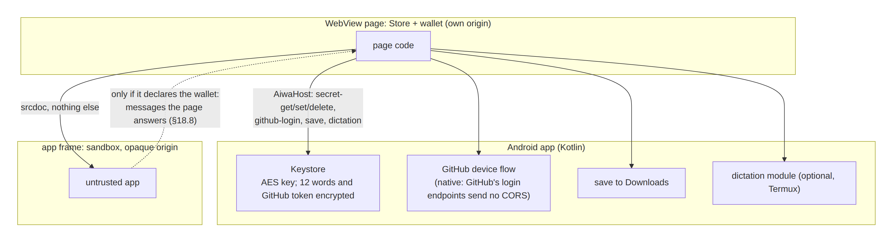

<details>
<summary>The source of this diagram (Mermaid)</summary>

```mermaid
flowchart TB
  subgraph apk["Android app (Kotlin)"]
    KS["Keystore<br/>AES key; 12 words and GitHub token encrypted"]
    DF["GitHub device flow<br/>(native: GitHub's login endpoints send no CORS)"]
    SV["save to Downloads"]
    DM["dictation module (optional, Termux)"]
  end
  subgraph page["WebView page: Store + wallet (own origin)"]
    PGE["page code"]
  end
  subgraph frame["app frame: sandbox, opaque origin"]
    APP["untrusted app"]
  end
  PGE -- "AiwaHost: secret-get/set/delete,<br/>github-login, save, dictation" --> KS
  PGE --> DF
  PGE --> SV
  PGE --> DM
  PGE -- "srcdoc, nothing else" --> APP
  APP -. "only if it declares the wallet:<br/>messages the page answers (§18.8)" .-> PGE
```

</details>
<!-- /diagram -->

The page is not the APK's: the app follows the site. It downloads a release, `release.json` (every file of the page with its SHA-256),
checks every file against its hash (the page is one whole release, never a mix of two), keeps all of it or nothing, and serves it from its
own storage under the same origin, from the next start, if it is newer than the copy inside the APK. There is no signature: what the site
publishes is what the phones run, and the site is published by the repository's GitHub account, which is the key. A signature kept off
GitHub can be added in front of the same download if that account becomes a risk.

<!-- diagram: yellowpaper-29-6d145e28.png -->
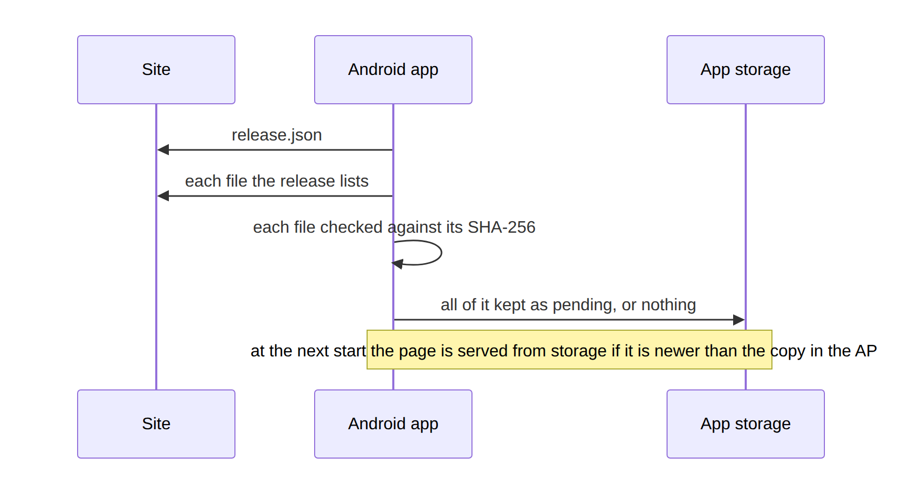

<details>
<summary>The source of this diagram (Mermaid)</summary>

```mermaid
sequenceDiagram
  participant S as Site
  participant A as Android app
  participant D as App storage
  A->>S: release.json
  A->>S: each file the release lists
  A->>A: each file checked against its SHA-256
  A->>D: all of it kept as pending, or nothing
  Note over A,D: at the next start the page is served from storage if it is newer than the copy in the APK
```

</details>
<!-- /diagram -->

The request/response protocol is `{id, command}` → `{id, result}`, `{id, error}` or `{id, progress}`. Android's automatic backup
carries the WebView's storage (the wallet's journal) to a new phone; the secrets are excluded (a Keystore key does not move), so the
12 words are typed once there (§15). The shell is not tested on a real device (Appendix D).

### 18.7 What the store does not solve

Nothing is reviewed. An app can use the network. It reaches the wallet only through the door and only if it declares it (§18.8), with a banner as the only protection. The ranking favours capital and time, not quality. The
figure is a snapshot the author chooses to refresh, so a submission can leave out a burn made after the last epoch shown (§12.4).
Nothing says two authors are two people: the cost of publishing is the mining an author has to show, not an identity.


### 18.8 An app that uses the wallet: the door, and the click duel

**The door.** An app that declares `<meta name="aiwa-wallet" content="pay">` gets a banner ("This app uses your wallet: it can move
your AIWA") and a channel to the page: it posts `{aiwa: 1, id, cmd, args}`, the page answers `{aiwa: 1, id, result | error}` to that
frame only. An app that does not declare it is not answered.

| Command | Answer |
|---|---|
| `whoami` | the player's identity id, address, balance and spendable balance |
| `pay { to, amount }` | a payment of `amount` AIWA to the identity `to`, as an offline bundle (§13.6) signed by a **channel session key**: the first payment to a peer signs one delegation with the wallet's key (§7.5), every later one does not use it |
| `receive { blob }` | appends a payment received, confirms the burns it depends on against Solana (§9.2), returns the balance |
| `showCode { text, title, action }` · `hideCode` | a code on screen (QR and text); with `action`, it answers when that button is pressed |
| `scanCode { title }` | a code read by the camera, or pasted |
| `config` | how to reach a phone nearby (the deployment's STUN servers) |

The door asks nothing of the player and has no cap or expiry: that is the gap named in §17.2.

**The click duel** (`docs/demo-apps/click-duel.html`) is an app that uses it. Two phones side by side, a price per click, 20 seconds.
Nobody signs anything per click: clicks are counted, and at the end the one who clicked **less** pays what they clicked, once.

<!-- diagram: yellowpaper-30-1de12993.png -->
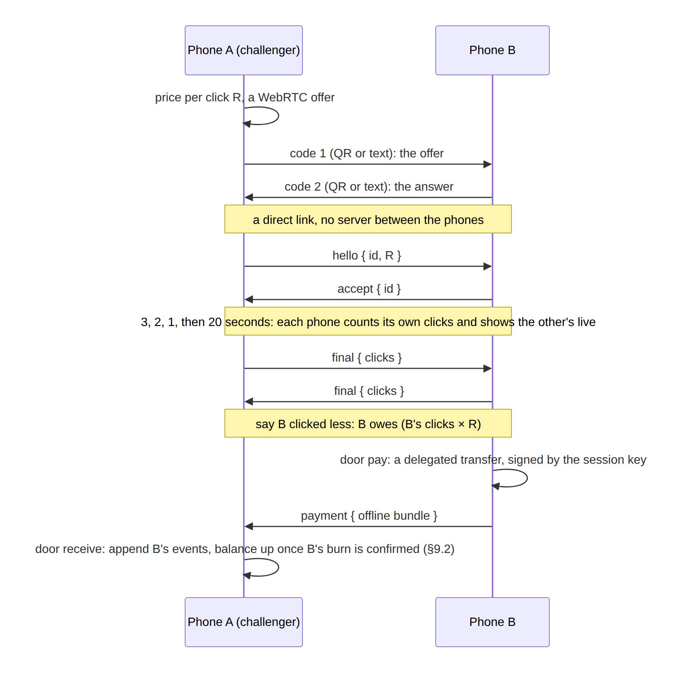

<details>
<summary>The source of this diagram (Mermaid)</summary>

```mermaid
sequenceDiagram
  participant A as Phone A (challenger)
  participant B as Phone B
  A->>A: price per click R, a WebRTC offer
  A->>B: code 1 (QR or text): the offer
  B->>A: code 2 (QR or text): the answer
  Note over A,B: a direct link, no server between the phones
  A->>B: hello { id, R }
  B->>A: accept { id }
  Note over A,B: 3, 2, 1, then 20 seconds: each phone counts its own clicks and shows the other's live
  A->>B: final { clicks }
  B->>A: final { clicks }
  Note over A,B: say B clicked less: B owes (B's clicks × R)
  B->>B: door pay: a delegated transfer, signed by the session key
  B->>A: payment { offline bundle }
  A->>A: door receive: append B's events, balance up once B's burn is confirmed (§9.2)
```

</details>
<!-- /diagram -->

*What it shows.* "Sign once, click many": the player is asked for no signature at all. The wallet signs one delegation the first
time, and the session key signs the payment. The receiver checks the origin of the claim itself (§9.2), so the winner needs no trust
in the loser's phone about the money, only about the **count**.

*What it does not do.* Each phone reports its own count: a modified app can lie, and the live view only lets the other side notice.
The game itself never touches Solana; the wallet does, once per origin, for any AIWA it receives (§9.2): with no connection the payment is received and counts once the phone has been online. There is no escrow: the loser can spend the claim elsewhere before the payment is applied (§13.5). The amount a player can lose
is not capped by anything but their balance. Both are left for later, on purpose: the first demonstrations are between people in
the same room. Finding players nearby (geolocation) is not built. Not tried on real phones: the link between two phones, and the camera in the WebView (a code can always be pasted).

---

# Part VI — Informational mechanisms

Everything in Parts I–V is what a deployment relies on. This part is what the protocol can *say* about other domains without any of it
ever changing what a domain may claim. The store's ranking does not use these mechanisms; `aiwa-lib` exposes them as
`position()` and `observe()`. Except for Mirror's recurring commitment (§8), treat the whole part as **[experimental]**.

## 19. Observation: Causal Tick, hardware roots, relative rate

A domain's own $\mathrm{epoch}_D$ (§6) is unconditional and needs no external observer. Observation is a complementary,
externally-corroborated position. It is **reported, never applied** to any domain's own earned value.

<!-- diagram: yellowpaper-31-d419a6b7.png -->
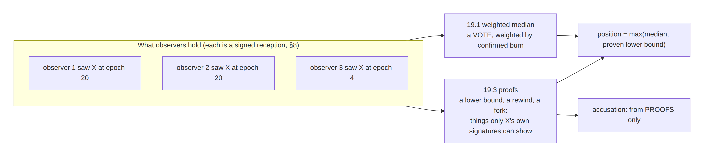

<details>
<summary>The source of this diagram (Mermaid)</summary>

```mermaid
flowchart LR
  subgraph evidence["What observers hold (each is a signed reception, §8)"]
    O1["observer 1 saw X at epoch 20"]
    O2["observer 2 saw X at epoch 20"]
    O3["observer 3 saw X at epoch 4"]
  end
  evidence --> M["19.1 weighted median<br/>a VOTE, weighted by confirmed burn"]
  evidence --> P["19.3 proofs<br/>a lower bound, a rewind, a fork:<br/>things only X's own signatures can show"]
  M --> POS["position = max(median, proven lower bound)"]
  P --> POS
  P --> ACC["accusation: from PROOFS only"]
```

</details>
<!-- /diagram -->

### 19.1 Causal Tick: a weighted median

$$\hat\theta_X = \mathrm{median}_w\big(\{(\mathrm{obs}_i(X), w_i)\}\big),\qquad w_i = \text{the lamports the reader confirmed for } i\ (\S9.2)$$

Sort the estimates by value, walk the cumulative weight, return the first value at or past half the total weight. It is robust while
adversarial weight stays below $\sum w_i / 2$. The weight is the observer's confirmed burn: an observer with no burn has no vote.

### 19.2 Hardware roots (optional)

The evidence interface works on software primitives alone. A domain may strengthen the independence of its observers with
physically provisioned hardware roots. Hardware never computes $\hat\theta_X$, never scales $w_i$ and is never a required input;
at least two distinct, independently issued roots are required for the attestation to count.

### 19.3 Proofs and the median, combined

Observations in Mirror are **references, not opinions**: each resolves to the progression event that fixes its epoch, an event only
$X$'s key can sign. So an observation is also a *proof*. From proofs alone:

- the highest epoch of $X$ that any observer provably received is a **lower bound** (one honest observer establishes it; no number of
  observers who saw less can lower it; nobody but $X$ can raise it);
- a report by $X$ below that bound contradicts $X$'s own signed history: a **rewind**;
- two progression events of $X$, neither an ancestor of the other, are a provable **fork**.

`aiwa-core` combines these with the median (`triangulation.js`, `position.js`, `assessPosition`), **exported and used by
`aiwa-lib`'s `position()`, not wired into `computeCausalTick`**:

- **position** = max(weighted median, proven lower bound): the vote is never reported below what is proven, and with no funded
  observer the proven bound stands alone;
- an **accusation** (rewind or fork) comes from **proofs only**: the median never accuses, because "far from the median" cannot tell
  inflation from legitimate offline progress;
- both rules see the same events. When the reader holds $X$'s history **from epoch 1**, $X$'s progression events are replayed through
  the reducer of §6 (epoch + 1, chained, signed by $X$, proof verified) and only the accepted ones count. Without the genesis nothing can
  be chained, so the check falls back to the signature alone and the result says so. A fork is the one exception, on purpose: a second
  lineage is rejected by the linear chain and is exactly the evidence of one, so forks are read from the signed events.

**What the reference wallet does with it.** It reports, it never applies. `standing()` says, for each other identity the log holds, where it
stands (the higher of the weighted median and what is proven), the proven lower bound, the vote and how many observers made it, whether
it signed two histories (a fork), and its **pace** against this wallet (§19.4). The page shows it under *Who this phone has seen*, and
a fork also as a warning under *Receive* once a bundle has been received. The pace is read from the wallet's own log: two of its own
reception commitments about that identity, and its own epoch when it signed each; it exists only when the wallet progressed between the
two, and it is not signed or sent to anyone. A rewind is not used: it is judged against what a domain reports *now*, and a payment that
travelled slowly reports an old state, so it would accuse honest senders. The registry needs none of this for its own protection: it asks
an author's next submission to contain the witnesses other wallets hold (§12.4), so a fork cannot be hidden from it. The one part that is
not used anywhere is the hardware roots (§19.2): they are a chain of signatures from an origin that issues roots, and nothing in this
repository issues any, so there is nothing to attest; `aiwa-core` takes them as an optional input (`hardwareAttestations`).

**"$X$ signs a fake itself".** A domain may write whatever it likes in its own log. That is not an attack on the protocol: it is an
invalid history, refused by whoever verifies its sequential proof, and left in the DAG as a dead branch nobody counts. It matters
here for one narrow reason: Mirror resolves a commitment's references against the DAG as it is, so *colluders* can sign commitments
citing such an event, and a reader that does not replay the chain would take it into the **estimate** (informational, never applied
to anyone's value). Replaying the chain closes that; a reader without the genesis cannot, and falls back, visibly.

`experiments/triangulation-scenarios.mjs` compares the rules on synthetic worlds that model the threats considered (the target's
progression events are a real chain, the observers' commitments are really signed; the worlds are chosen by their author, so this
is a **comparison, not a proof**):

| World | Weighted median | Proofs alone, log trusted | **Combined** (default) |
|---|---|---|---|
| Honest | 20 | 20 | 20 |
| Funded majority saw only an old state (4); one honest saw 20 | **4**; its check accuses the honest domain | 20 | **20** |
| Unfunded observers saw an old state | 20 | 20 | 20 |
| *Only* unfunded observers, all saw 20 | no tick | 20 | **20** |
| X rewinds to 10; funded majority saw 10; one honest saw 20 | 10; "consistent" | contradicted | **20, accused (rewind)** |
| X holds two unrelated histories at 21 | 21; no notion of a fork | fork | **21, accused (fork)** |
| Observer cites an event that does not exist | 20 | 20 | 20 |
| Only stale observers; X progressed offline to 20 | 4; accused | 4 | 4, *ahead by 16*, not accused |
| A forged event of X (signed by someone else) in the log; funded **minority** cites it | 20 | **999999** | **20** |
| The same, funded **majority** cites it | **999999**; accuses the honest domain | **999999** | **20** |
| X signs a fake far-ahead event itself, no sequential work; funded majority cites it | **999999** | **999999** | **20** (chain replayed, fake rejected) |
| **The same, but the reader holds only epochs 15–20 (no genesis)** | **999999** | **999999** | **999999**, `verification: signature` |

What this shows, and what it does not. The weighted median is a vote: enough weight on an old view moves it, and a funded majority can
move it with an event that should never have counted. Proofs are immune to observers who saw less, and yield rewinds and forks a vote
cannot; the chain replay is what stops either rule from being moved by a fake. The last row is what remains: with colluders and a
reader that cannot replay the chain, the estimate can be fooled, and the result says it fell back to the signature. Other limits
stand: no upper bound (being ahead is reported, not accused); only as fresh as the freshest honest observer; and nothing about
whether observers are distinct actors. Independence is still the open question; this removes the weight from the accusations, not that
assumption.

### 19.4 Relative rate, without a clock

$$w = (\mathrm{observer}, e_O, \mathrm{target}, e_X, \mathrm{sourceEventId}),\qquad \rho = \frac{e_{X,2} - e_{X,1}}{e_{O,2} - e_{O,1}}$$

A purely structural ratio from two successive witnesses, **purely informational**. Composition is unsafe without a freshness bound:
$\rho_{AB}\cdot\rho_{BC} = \rho_{AC}$ holds mathematically, but not across an intermediate domain whose real rate may have drifted
between measurements. `composeRelativeRates` therefore requires the verified epoch gap on the intermediate domain to stay within a
caller-supplied `maxFreshnessGap`, refusing otherwise: a mitigation, never a closure.

### 19.5 What permanently connected machines could do **[not built]**

Hardware roots (§19.2) are about **independence**: attesting that an observer is not backed solely by an actor who can fabricate
identities in software. That is one of three different jobs an always-on machine could do. They need different things from it and
should stay separate in a design even when one box does all three:

| Job | What it does | What must be trusted |
|---|---|---|
| **Keeper** (persistence) | Holds and re-serves content-addressed events and published bundles, so data survives the domains that produced it | Availability only. Integrity costs nothing to check (an id is the hash of the content): a keeper can withhold or lose data, never alter it undetected. Anyone can run one |
| **Witness** (independence) | An observer whose independence is attested by §19.2's chain | The origin's issuance process, or one physical unit |
| **Rendezvous** (bootstrap) | Lets two domains that have never met find each other | Nothing about the data; it sees who is looking for whom |

**Why persistence needs its own answer.** A participant holds only what is relevant to its own state and observed relationships. Nothing
obliges anyone to keep an event; if every domain that held it is gone, it is gone: the event DAG is tamper-evident, not durable.
Blockchains answer this by replicating everything on every full node, paid through issuance or fees; here the globally replicated state is
declined, so durability is left to whoever chooses to hold the data. The archive node (§15) keeps one thing, a wallet's latest backup;
it is the seed of this role, not the role.

**Open, not solved.** Who runs keepers and why (no incentive is specified: accrual is local and unconditional, it pays nobody to store);
how keepers choose what to keep; whether a keeper that holds an event is also a useful observer of it (a stable reference, at the price
of pulling the protocol toward the infrastructure it is built to avoid). There is no rendezvous: the first connection between two peers
is a manual offer/answer exchange. A consequence seen in practice: an application published from one device can be loaded by someone
else only while a copy of its events is reachable, such as a hosted export.

---

# Part VII — Assessment

## 20. Threats and what answers them

| Threat | What answers it | What remains |
|---|---|---|
| An event is forged or altered | the id is the hash of the content; the signature covers the same bytes, `type` included (§4.2) | nothing: any change is detected |
| Someone acts "as" another in a payload | a signature inside the payload, derived to the owner (§5) | a stolen key signs validly |
| An action is replayed or redirected | one-time nonce; every destination is in the signed fields (§5) | — |
| A claim is spent twice | one owner at a time; proofs consumed once (§7.3); the same winner for every reader (§13.4) | offline, the second payee may have believed they were paid until the logs meet (§13.5); only a proof, a limit or trust is left |
| A third party inflates a domain's age to cut its rewards | a progression is signed by the domain itself (§6.1) | — |
| Free identities to make money for free | every identity pays with a burn to accrue (§9) | nothing says two identities are two people |
| A fake burn, or someone else's burn | the reader fetches the finalized transaction itself; must be paid by the domain's own key; counted once (§9.2) | a dishonest RPC endpoint is the reader's problem |
| The creator fee is dodged | a commitment at $T>0$ is refused without the fee confirmed (§11.3) | a fork with its own address is another economy |
| An action is left out of a history | the mining events are one signed chain (§6.5) | an action after the last epoch shown and followed by none |
| A second history is shown | the chain makes it cost the work again; witnesses force it to contain what others hold (§12.4) | no witness, no protection beyond the work |
| A host swaps an app's file | the package hash and the author's signature are checked before it opens (§18.5) | — |
| An app is hostile | sandbox with an opaque origin: no page storage, no secret; no wallet unless it declares it (§17.2) | it can use the network; it is not reviewed; **an app that declares the wallet can spend it**, and only a banner says so (§18.8) |
| A pull request runs attacker code in the registry | the workflow runs `main`'s code and reads the file as data, never executes it (§18.2) | — |
| An old signed package is replayed to the registry | signatures older than 24 h are refused (§18.3) | — |
| A device is lost | a backup signed by the key, a registry baseline, Android's backup, peers (§15) | no backup, no node, no peer: the journal is lost |
| Two valid views of the same history | agreement by the canonical order (§13.4) | a conflict absorbed by a checkpoint stays as decided |

## 21. Limits and open problems

**Not solved.** The human-identity oracle; physical-location verification; absolute global time; Byzantine agreement without
assumptions; detection of every coalition of identities under one real actor (a coalition can produce an internally consistent
history at real cost: the claim is narrower, that fabricated identities cannot fabricate authenticated history *for free*).

**Not specified.**

- **Durability** of data no domain chooses to keep, and who is paid to keep it (§19.5).
- **Rendezvous** between strangers (§19.5).
- **Equal hardware.** An epoch is a fixed amount of sequential work, so a faster (or specialised) machine earns epochs faster. The proof makes
  that work cheap to *check* (§6.4); it does not make it equal to *do*. The reference wallet advances one epoch every 30 s while open, which
  is its own choice, not a protocol cap.
- **A market price** for AIWA. Nothing here implies it is worth anything.
- **Real-time prevention** of a double spend between parties who never exchange events (§13.5).
- **An anchor of a log's head on Solana**, the only way to bound what a snapshot can leave out. **[not built]**

**External dependencies.** Solana is the only one, for the burn and its confirmation. GitHub hosts the registry and Pages in this
deployment; the protocol does not need GitHub, the store does.

**Novelty, stated modestly.** The building blocks are known: a signed, hash-linked log (git, Secure Scuttlebutt), a sequential-work
proof (Wesolowski), burning as a cost, hash-locked vouchers, session keys. No prior-art search has been done. What is unusual is the
combination and its economic design: issuance without consensus (each identity creates its AIWA locally, from verifiable sequential work,
with an external burn as the only gate); work as each identity's own clock (actions bound to the work by the signature, so hiding or
reordering an action costs computation); and a proof any third party checks in milliseconds.

---

# Appendices

## Appendix A. Wire formats

### A.1 The event

```
event = { domain, author, authorPublicKey, parents[], type, payload, createdAt, signature }
id    = SHA( JSON( { domain, author, authorPublicKey, sort(parents), type, canon(payload), createdAt } ) )
signature = Ed25519 over the same bytes, by the key whose SHA is `author`
```

`canon` sorts object keys recursively and keeps array order. A reducer receives `{ id, parents, payload }` with `payload.type` only (§4.4).

### A.2 Signed actions (the payload's own signature, §5)

The signed message is `JSON.stringify` of the listed fields, in this order; a field that is `undefined` is left out, and a *nullable* field
is signed as `null` when absent. The payload also carries `signerPubkey` and `signature`. The delegated form inserts `delegate` before
`nonce` and carries `ownerPubkey` and `delegationSignature`. **These bytes are frozen**: a test pins them.

| Action | Signed fields | Owner field (the signer must derive it) |
|---|---|---|
| `transfer` | `claimId, from, to, nonce, timestamp` | `from` |
| `split` | `claimId, owner, firstAmount, firstId, secondId, nonce, timestamp` | `owner` |
| `voucherRedeem` | `claimId, secret, to, nonce, timestamp` | `to` |
| `accrual` | `domain, b, T, nonce, timestamp, previous` (`T` nullable) | `domain` |
| `claim` | `domain, amount, claimId, nonce, timestamp, previous` (`claimId` nullable) | `domain` |
| `progression` | `domain, epoch, vdfIterations, vdfOutput, nonce, timestamp, previous` | `domain` |
| delegation | `{ delegate, from }`, signed once by the owner | `from` |

A contract's own action (`signedAction`, §16.2) signs *all* its fields plus `nonce` and `timestamp`, keys sorted.

### A.3 Event types

| `type` | Payload (besides the signature fields) | Folded by | Section |
|---|---|---|---|
| `progression` | `domain, epoch, vdfIterations, vdfOutput (y), vdfProof{pi, l}, previous` | progression, accrual | §6 |
| `burn-record` | `domain, signature` (a Solana signature) | accrual | §9 |
| `accrual` | `domain, b, T, previous` | accrual | §10 |
| `claim`, `delegated-claim` | `domain, amount, claimId, previous` | accrual, wallet | §10.3 |
| `transfer`, `delegated-transfer` | `claimId, from, to` | wallet | §7.3 |
| `split`, `delegated-split` | `claimId, owner, firstAmount, firstId, secondId` | wallet | §7.2 |
| `voucher-redeem`, `delegated-voucher-redeem` | `claimId, secret, to` | wallet | §7.4 |
| `contract-payout` | `contractId, claimId, from, to, nonce, signature, …` | wallet + the application's verifier | §16.3 |
| `reception` | `domain, epoch, kind, receivedFrom[{sourceDomain, eventId}]` | mirror | §8 |
| `checkpoint` | the domain's serialized wallet state, as of a set of heads | checkpoint / log | §14.1 |
| `contract-spec` | `name, version, sourceCode, sourceHash, description` | — | §16.4 |
| `bundle.file`, `bundle.manifest` | `path, content`; `name, version, files{path→id}` | bundle | §17 |

### A.4 The store's formats

```
package   = { format:'aiwa-app/1', kind:'code'|'aiwa', id, name, version, description, html | manifestId,
              author (Solana address), bundleHash, authorization }
bundleHash = SHA( JSON([ id, name, version, description, kind, html | manifestId ]) )
authorization = signedAction by the author's key over (publish-app, id, version, bundleHash)

submission = { format:'aiwa-submission/1', kind:'publish'|'refresh',
               publish: package (+ bundle events for kind aiwa), evidence
               refresh: appId, authorization, evidence }
evidence   = { version, domain, afterEpoch, events[], witnesses[] }
baseline   = { domain, epoch, head, state }               kept per author address
index      = { format:'aiwa-store-index/1', apps:[ { id, name, version, description, author, bundleHash, path,
               kind, manifestId?, bundlePath?, score, laps, publishedAt } ] }
```

Files of the registry: `store/index.json`, `store/apps/<id>/<version>.json`, `store/apps/<id>/<version>.bundle.json`,
`store/baselines/<author>.json` (public), `store/state/witnesses.json` (internal, not served), `submissions/<name>.json`.

### A.5 Other messages

| Message | Shape |
|---|---|
| Backup | `{ version: 1, kind: 'aiwa-backup', domain, address, createdAt, epoch, events: [checkpoint] }` |
| Offline bundle | `btoa(encodeURIComponent(JSON.stringify(bundle)))`: text for a QR code, NFC, Bluetooth or a paste |
| Replicator | `HELLO { heads }`, `HELLO_ACK { heads }`, `EVENTS { chunk }`, `ACK` (JSON, UTF-8) |
| Publish hand-off | `#publish=<kind>;<name>;<file raw-deflated, base64url>` (`<kind>`: `code` or `aiwa`; `<name>` without spaces) |
| App door | request `{ aiwa: 1, id, cmd, args }` → `{ aiwa: 1, id, result }` or `{ aiwa: 1, id, error }` between the page and the frame of an app that declares `<meta name="aiwa-wallet">`; commands in §18.8 |
| Host channel | request `{ id, command, … }` → `{ id, result }` / `{ id, error }` / `{ id, progress }`; commands `secret-get`, `secret-set`, `secret-delete`, `github-login`, `save`, `dictation` |
| Channel session key | `HMAC-SHA256(rootSecret, "aiwa-lib-channel-session-v1:" ‖ peerId)` |

## Appendix B. Parameters

| Parameter | Reference value | Where | Changing it is |
|---|---|---|---|
| $\alpha,\ \beta,\ \gamma,\ C$ | $1.1,\ 2.2,\ 3,\ 35937$ | `deployment.json` → `rewardParams` | a new rule set |
| $\mathrm{minQ}$ | $1$ | same | a new rule set |
| $E$ (`epochIterations`) | $10^5$ squarings (≈ 0.5 s) | same | a new rule set |
| $T$ | $[0,\ 0.4]$, chosen at the burn | `MAX_PATIENCE_RATE` | a new rule set |
| Creator fee | address in `deployment.json`, $\mathrm{rateOfT}=0.001$ | `creatorFee` | a new rule set (§11) |
| Wesolowski modulus | the 2048-bit RSA challenge modulus | `wesolowski-vdf.js` | a new rule set |
| Quantities | AIWA: integers of $10^{-18}$; SOL: lamports | `units.js` | — |
| Progress loop | one epoch per 30 s while the wallet is open | `deployment.json` → `progress.intervalMs` | a wallet setting |
| Auto checkpoint | every 5 minutes | `startAutoCheckpoint` | a wallet setting |
| Replicator chunk | 100 events and 64 KiB | `Replicator` | an implementation setting |
| Submission limits | 200 000 events · 200 burns · 50 witnesses · 16 384 bytes per witness · 32 witnesses kept per domain | `SUBMISSION_LIMITS` | a registry setting |
| Store policy | signature ≤ 24 h · one new app per 5 min · ≤ 20 apps per author · submission ≤ 40 MB | `POLICY` | a registry setting |
| App limits | HTML ≤ 512 KB · name ≤ 60 · description ≤ 280 · id `[a-z0-9-]` ≤ 40 · version `x.y.z` | `APP_LIMITS` | a registry setting |
| Bundle limits | ≤ 40 files · ≤ 1 MB · entry `index.html` | `BUNDLE_LIMITS` | a registry setting |
| Network | cluster `devnet`; RPC `https://api.devnet.solana.com` | `deployment.json` | a deployment setting |

## Appendix C. Reference implementation

Five parts, one workspace. Dependencies point one way: `registry` and `apps/web` use `aiwa-lib` and `aiwa-platform`, which use
`aiwa-core`; `aiwa-core` needs only `@noble/curves`, `@noble/hashes`, `@scure/bip39` and, optionally, `@solana/web3.js`. Nothing above
`aiwa-core` may change what counts as a valid state transition.

| Part | What it is |
|---|---|
| `packages/core` | the protocol, pure and without I/O |
| `packages/platform` | transport, replication, storage, bundles, the archive node |
| `packages/lib` | the wallet API (`AIWA`, a thin facade over `ledger`, `mining`, `burns`, `payments`, `observer`, `backup`, `evidence`) and the contract SDK |
| `registry` | validation, ranking, files of the store, the workflow's script |
| `apps/web`, `android` | the store and wallet as one web app; the APK around it |

Where each concept lives:

| Concept | Section | Files |
|---|---|---|
| Identity | §3 | `core/src/identity.js` |
| Event, log, wire adaptation | §4 | `event.js`, `event-log.js`, `adapt-event.js` |
| Signed actions, delegation | §5, §7.5 | `signing.js` (the one place for every signed action), `wallet.js` |
| Sequential proof | §6.2–6.4 | `vdf.js`, `wesolowski-vdf.js`, `succinct-vdf.js`, `bigint-math.js` |
| Progression, the mining chain | §6.1, §6.5 | `progression.js`, `accrual.js` (`chainViolation`) |
| Conservation, vouchers | §7 | `conservation.js`, `wallet.js`; `lib/src/payments.js` (`issueVoucher`, `redeemVoucher`) |
| Channel | §7.5 | `lib/src/channel.js` |
| Mirror, observe | §8 | `mirror.js`; `lib/src/observation.js`, `observer.js` |
| Burn, burn record, backing | §9 | `identity-cost.js`, `solana-wallet.js`, `burn-record.js`; `lib/src/burns.js` |
| Churn calculator | §9.3 | `churn-analysis.js` |
| Accrual | §10 | `reward.js`, `fixed-point-math.js`, `accrual.js`, `units.js` |
| Creator fee | §11 | `accrual.js` (`creatorFeeLamports`, `burnQuote`), `burn-record.js`, `solana-wallet.js`; `lib/src/burns.js` |
| Mining state, evidence, witnesses | §12 | `mining-state.js`, `submission.js`; `lib/src/evidence.js` |
| Canonical order | §13.4 | `canonical-order.js`; `lib/src/ancestors.js`, `ledger.js` |
| Replication, offline bundles | §13.6 | `platform/src/replicator.js`, `transport.js`, `webrtc-transport.js`; `lib/src/offline-bundle.js` |
| Checkpoints | §14 | `checkpoint.js`, `event-log.js` (`pruneBeforeCheckpoint`), `materializer.js` |
| Recovery | §15 | `solana-wallet.js` (`generateBip39Mnemonic`); `lib/src/backup.js`; `platform/src/archive.js`, `archive-server.js`, `node/aiwa-node.js`; `apps/web/src/wallet.js`, `keys.js`; `android/.../SecretStore.kt` |
| Contracts | §16 | `wallet.js` (`contractVerifiers`, `contract-payout`), `contract-registry.js`; `lib/src/contract.js` |
| Bundles | §17 | `platform/src/bundle.js`, `serve-worker.js` |
| The store | §18 | `registry/src/` (`app-package.js`, `bundle.js`, `validate.js`, `rank.js`, `store-files.js`), `.github/workflows/registry.yml`; `apps/web/src/` (`store.js`, `viewer.js`, `app-door.js`, `qr.js`, `assemble.js`, `publish.js`, `github.js`, `host.js`) |
| The shell | §18.6 | `android/app/`, `android/bridge/`, `android/backend/` |
| Causal Tick, hardware roots, relative rate, triangulation | §19 | `causal-tick.js`, `weighted-median.js`, `hardware-attestation.js`, `relative-rate.js`, `triangulation.js`, `position.js` |
| Cross-runtime check | App. D | `core/interop/rust-vdf/`, `core/test/rust-interop.test.mjs` |

**Cross-runtime interoperability.** `core/interop/rust-vdf/` is an independent Rust implementation of the protocol's most fundamental, custom
computations: the sequential proof, the weighted median, the split invariant, Mirror's monotonicity, the relative-rate ratio, Causal Tick's
consistency check, the Wesolowski proof, the big-integer arithmetic and §10's reward formula. The canonical event id is checked against a real
signed event, and `ed25519-dalek` (a different library from the JavaScript's `@noble/curves`) independently *re-signs* the identical message
with the identical secret-key bytes and must reproduce the signature byte for byte: Ed25519 is deterministic (RFC 8032), so two conforming
implementations must produce the *same* signature, not merely one that passes the other's check. The test builds and runs the Rust binary and
compares it with the live JavaScript, including a full year of continuous progression (about 112 million epochs); it skips, never fails,
without a Rust toolchain. It cross-checks the fundamentals; it is not a second implementation of the whole protocol.

## Appendix D. Verification status

**What the tests cover.** 421 tests in `aiwa-core` (including the Rust cross-check when a toolchain is present), 88 in `aiwa-platform`,
113 in `aiwa-lib`, 17 in `aiwa-registry`, 49 in `aiwa-store-web` (25 of them drive the app in Chromium: ranking, the sandbox refusing
`parent.document`, a tampering host, offline use, the wallet starting and restoring by itself, the burn with its fee, publishing both
kinds through a stand-in of the Android host and of GitHub whose pull request is given to the real registry code, an app using the SDK, an app using the wallet through the door, a click duel between two pages that pays the winner, two pages linking by two codes and each showing where the other stands, and a QR code read by the page from a fake camera),
111 for the dictation backend. `node scripts/devnet-check.mjs --fake` plays the whole path (burn, record, mine, evidence, registry) against
a stand-in Solana that decodes the real transaction the wallet builds, 11 checks; it also runs in CI. Every part is testable on its own,
none needs a hosted server.

**Not demonstrated.**

- No burn on the real Solana network, devnet or mainnet. `scripts/devnet-check.mjs` does it (burn at $T=0.4$ with a creator address made for
  the run, the creator account read on chain, the registry's own verification, the fail-closed check) but needs a devnet wallet funded once
  (the faucet refuses shared CI runners) whose phrase is the repository secret `DEVNET_PHRASE`.
- No run on a real phone: the WebView host, the Keystore, GitHub's device login against the real GitHub (it needs an OAuth App with Device
  Flow whose Client ID goes in `deployment.json`), Android's automatic backup carrying the journal to a new phone, the Termux backend, the
  widget, the page updating itself from the site (the hash checks are unit-tested on a JVM against a release written by the Node
  side; the download, the swap and the serving from app storage have never run on a device). The Kotlin that is not plain JVM is compiled in CI only.
- No pull request opened by the Store's sheet on GitHub, end to end; the registry workflow has not run on GitHub with a real pull request;
  the site needs GitHub Pages enabled to be served.
- The click duel (§18.8) and the wallet's *Link with another phone* (§13.6) between two real phones: the camera in the Android WebView (written, compiled in CI, never run; in Chromium the scan is tested against a fake camera) and the WebRTC link between two phones, which a phone behind a restrictive network may not get (STUN only, no relay). Both are tested between two pages of one Chromium, where linking found two real bugs (a message over 256 KiB closes the channel; the answering side never saw its channel open).
- Economic parameters are not validated in the field; no prior-art search; the creator fee and the store have not had a legal review.
