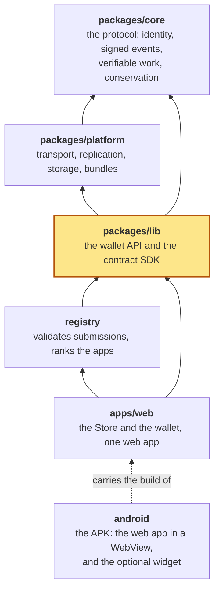

# aiwa-lib

The public API for apps and wallets, composed from [aiwa-core](../core) and [aiwa-platform](../platform).

Where it sits in the repository (highlighted):



```
npm test
```

## The wallet (`AIWA`)

```js
import { AIWA } from 'aiwa-lib';

const aiwa = new AIWA({ rewardParams });
await aiwa.connect();                       // a new identity from 12 words; aiwa.recoveryPhrase shows them on request
await aiwa.burn(lamports, connection, { T });   // burn SOL (and pay the creator fee, if the deployment has one); committed as capital in the same action
aiwa.burnQuote(lamports, T);                // what the burn will do, to show before the user burns
await aiwa.startProgressLoop();             // the device works epochs; claimable() grows
await aiwa.claim(await aiwa.claimable());
await aiwa.send(recipientId, '1.0');        // also works fully offline, by bundle (file, QR, text)
```

| Area | API |
|---|---|
| Recovery | `recoveryPhrase`, `recoveryKey`, `exportBackup` / `importBackup`, `adoptState`, `archiveNow` / `restoreFromArchive` / `startAutoArchive` |
| Evidence for a verifier | `submissionEvidence({ afterEpoch })`, `witnesses` |
| Delegation and vouchers | `openChannel` / `requestChannel`, `issueVoucher` / `redeemVoucher` |

## The contract SDK

A guide with a worked example: [docs/CONTRACTS.md](../../docs/CONTRACTS.md).

`defineContract({ initialState, handlers })`, `Contract`, `signedAction`, `verifySignedAction`: rules that anyone replays from the events they hold. An action is proved by a signature placed inside the action itself, never by the outer author field.

## When two branches contradict each other

The wallet and `Contract.state()` fold events in aiwa-core's canonical order, so a conflict (one voucher redeemed twice, one balance spent twice) has the same winner for every reader. A wallet that already folded part of its log and then receives a concurrent branch folds again from its last checkpoint. See `test/convergence.test.mjs` and the yellow paper §13.4.
