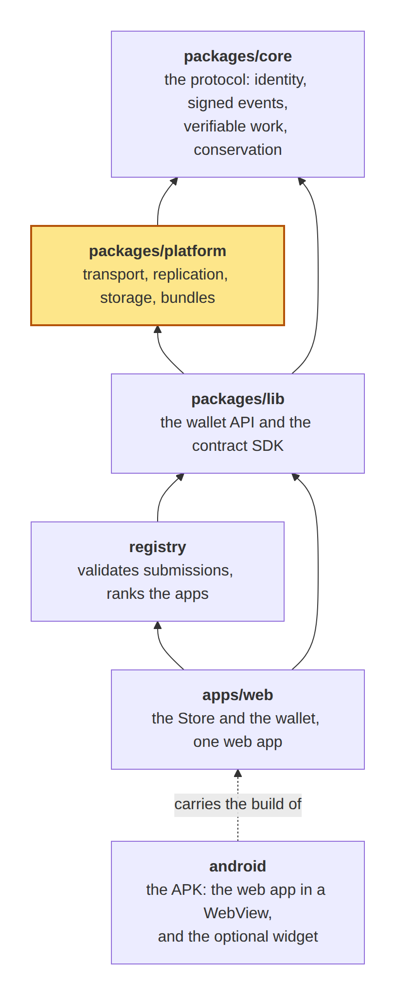
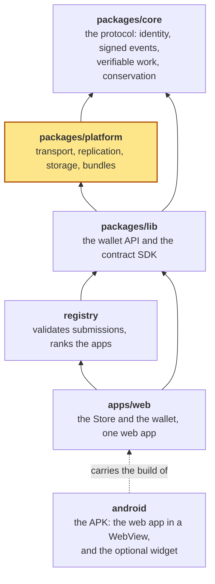

# aiwa-platform

Distribution for [aiwa-core](../core): moving and keeping signed events. It has no protocol logic of its own.

Where it sits in the repository (highlighted):

<!-- diagram: pkg-platform-01-6c527f32.png -->


<details>
<summary>The source of this diagram (Mermaid)</summary>



</details>
<!-- /diagram -->

```
npm test        # 88 tests
```

## What is in it

| | |
|---|---|
| `WebrtcTransport`, `LoopbackTransport`, `signaling-codec.js` | a direct peer-to-peer link with no relay and no signaling server; the first handshake travels by any means (a pasted link, a QR code) |
| `Replicator`, `Introducer` | sync an event log between connected peers; ask a connected peer to introduce another |
| `capability.js`, `GuardedDataStore`, `GraphStore` | capability-gated storage, a graph-shaped data store |
| `bundle.js`, `serve-worker.js` | publish an application (one or many files) as signed, content-addressed events; serve it from the log |
| `archive.js`, `archive-server.js`, `node/aiwa-node.js` | the archive node: an always-on holder of wallets' backups (HTTP, owner-only writes, newest wins, public reads) |

## The archive node

```
node packages/platform/node/aiwa-node.js            # listens on a port
node packages/platform/node/aiwa-node.js --tunnel   # also opens a public https address (needs cloudflared)
```

A wallet pushes its backup (a checkpoint signed by its own key) to the nodes it knows and asks them for it after losing a device. It needs no trust in a node: a backup is signed by the wallet's key, so a node can only withhold or forget. Run several.

## Not included on purpose

Automatic discovery between strangers: the first connection between two peers is made by hand. See the yellow paper §19.5.
